# Implementation Playbook — Nexora Finance Intelligence Platform

> **Deliverable 2 of 9** in the Sin City Analytics Operational Delivery Framework. This document **owns the canonical 10-phase delivery methodology**. All sibling documents reference the phase model, gate criteria, and RACI defined here.

## Document Control

| Field | Value |
|---|---|
| **Document** | 02 — Implementation Playbook |
| **Version** | 1.0 |
| **Owner** | Sin City Analytics Delivery |
| **Audience** | Delivery Leads, Solution Architects, Data Engineers, Finance Configuration Analysts, Customer Success, Client Sponsors |
| **Last Updated** | 2026-06-13 |
| **Status** | Active |
| **Supersedes** | None (initial canonical release) |
| **Related** | 01-financial-intelligence-assessment-framework · 03-client-onboarding-playbook · 04-solution-design-framework · 07-multi-tenant-client-operating-model · 09-sales-to-implementation-handoff |

---

## Purpose

This playbook is the authoritative delivery methodology for standing up the **Finance Intelligence Platform (codename Nexora)** for a client. It exists to make every implementation repeatable, predictable, and outcome-driven — moving a client from **financial reporting to decision intelligence**.

Nexora is not a report generator. It behaves like a finance analyst. Every implementation must therefore prove not that dashboards render, but that the platform reliably executes the default product flow:

```
User Question → Intent Detection → Relevant Data Retrieval → AI (Claude) Analysis → Direct Answer
```

The playbook defines ten sequential phases, the stage-gates that govern progression, the division of responsibility between the client and Sin City Analytics, and the measurable criteria that define "done" for each phase. It is written for direct operational use: a Delivery Lead should be able to run a project end-to-end from this document, and the templates herein should be copied directly into client engagement workspaces.

A core onboarding principle anchors the entire method: **onboarding a new tenant is a configuration exercise, not an engineering exercise.** The `ClientConfig` object is the single source of truth per tenant. A correctly executed implementation introduces **zero client-specific code changes** to the platform.

---

## 1. Methodology Overview

### 1.1 The 10-Phase Model

| # | Phase | Primary Outcome | Owning Discipline | Gate |
|---|---|---|---|---|
| 1 | **Discovery & Assessment** | Validated scope, success metrics, prioritized decision questions | Delivery Lead + Solution Architect | **G1 — Scope Lock** |
| 2 | **Data Assessment & Architecture** | Source inventory, target store decision (Databricks vs SQLite), data model mapping | Solution Architect + Data Engineer | **G2 — Architecture Approved** |
| 3 | **Connection Layer & Integration** | Working data pipeline (`ingestFile()` and/or live connectors) delivering typed entities | Data Engineer | **G3 — Data Flowing** |
| 4 | **Data Validation & Governance** | 8 validators tuned; thresholds and quarantine rules agreed; data trusted | Data Engineer + Data Quality Advisor | **G4 — Data Trusted** |
| 5 | **Finance Intelligence Configuration** | Authored `ClientConfig`; modules enabled; agents configured with guardrails | Finance Config Analyst + Solution Architect | **G5 — Intelligence Live** |
| 6 | **Dashboard & Executive Experience Setup** | Recharts dashboards, executive reporting templates, agent workspaces | Finance Config Analyst + Frontend | **G6 — Experience Accepted** |
| 7 | **User Access & Security** | Clerk orgs, roles, `clientId` row-level isolation, permission map enforced | Platform Engineer + Security | **G7 — Access Secured** |
| 8 | **Training & Adoption** | Trained user cohorts, enablement assets, adoption baseline | Customer Success | **G8 — Users Ready** |
| 9 | **Go Live** | Production cutover, hypercare, signed acceptance | Delivery Lead | **G9 — Production Accepted** |
| 10 | **Optimization & Expansion** | Adoption uplift, module/connector expansion, renewal posture | Customer Success + Account | **G10 — Value Realized** |

### 1.2 Indicative Timeline

Durations are indicative for a **mid-market single-tenant engagement**. Enterprise, multi-entity, or multi-tenant rollouts scale Phases 2–4 and 7. See §13 for sizing modifiers.

```
WEEK  1    2    3    4    5    6    7    8    9    10   11   12
      |----|----|----|----|----|----|----|----|----|----|----|----|
P1  [==] Discovery & Assessment
        G1
P2     [===] Data Assessment & Architecture
            G2
P3        [====] Connection Layer & Integration
                G3
P4              [===] Data Validation & Governance
                    G4
P5                 [====] Finance Intelligence Configuration
                        G5
P6                    [====] Dashboard & Executive Experience
                            G6
P7                       [===] User Access & Security
                             G7
P8                          [===] Training & Adoption
                                G8
P9                             [==] Go Live + Hypercare
                                  G9
P10                              [============>] Optimization & Expansion (continuous)
                                              G10 (recurring QBR)
```



```mermaid
flowchart LR
    P1[1. Discovery &<br/>Assessment] -->|G1| P2[2. Data Assessment<br/>& Architecture]
    P2 -->|G2| P3[3. Connection Layer<br/>& Integration]
    P3 -->|G3| P4[4. Data Validation<br/>& Governance]
    P4 -->|G4| P5[5. Finance Intelligence<br/>Configuration]
    P5 -->|G5| P6[6. Dashboard & Executive<br/>Experience Setup]
    P6 -->|G6| P7[7. User Access<br/>& Security]
    P7 -->|G7| P8[8. Training<br/>& Adoption]
    P8 -->|G8| P9[9. Go Live]
    P9 -->|G9| P10[10. Optimization<br/>& Expansion]
    P10 -->|G10 recurring| P10
```

### 1.3 Stage-Gate Governance Model

Each phase terminates in a formal gate. A gate is a **go / conditional-go / no-go** decision made jointly by the Sin City Analytics Delivery Lead and the Client Sponsor.

| Gate Outcome | Definition | Action |
|---|---|---|
| **Go** | All success criteria met; no open critical risks | Proceed to next phase |
| **Conditional Go** | Criteria met except for items with an agreed, dated remediation plan and an owner | Proceed in parallel; track remediation to closure before the *next* gate |
| **No-Go** | One or more exit criteria unmet with no viable mitigation | Hold; remediate; re-convene gate |

**Gate discipline rules:**
- No phase begins until the prior gate is Go or Conditional Go (recorded in writing).
- A gate cannot be self-certified by a single party; it requires dual sign-off (Delivery Lead + Client Sponsor).
- Conditional-Go items are tracked on the engagement RAID log and reviewed at every subsequent gate until closed.
- **G4 (Data Trusted) is a hard gate.** No configuration of agents or executive reporting proceeds on untrusted data — this directly protects the BASE_GUARDRAIL that agents never fabricate or present low-confidence numbers as fact.

### 1.4 Reusable Gate Sign-Off Template

```
GATE: [G#] — [Gate Name]
Engagement: [CLIENT_NAME] · clientId: [CLIENT_ID]
Phase reviewed: [PHASE_NAME]
Review date: [YYYY-MM-DD]

Success criteria status:
  [ ] [CRITERION_1] — Met / Not Met / N/A — Evidence: [LINK_OR_NOTE]
  [ ] [CRITERION_2] — Met / Not Met / N/A — Evidence: [LINK_OR_NOTE]

Open risks / RAID items: [SUMMARY]
Conditional-Go items (if any):
  - [ITEM] · Owner: [NAME] · Due: [YYYY-MM-DD]

Decision:  ☐ Go   ☐ Conditional Go   ☐ No-Go

Sin City Analytics — Delivery Lead: [NAME] / [DATE]
Client — Sponsor:                   [NAME] / [DATE]
```

---

## 2. Phase 1 — Discovery & Assessment

> Establish what decisions the client needs to make better, what data exists to support them, and what success looks like. This phase converts a sales-stage opportunity into a delivery-ready engagement.

### Objectives
- Translate business pain into a prioritized set of **decision questions** the platform must answer (e.g., "Where is my forecast drifting against budget by cost center?").
- Confirm scope: which **modules** and **agents** are in scope for Phase 1 of the rollout.
- Define measurable success metrics tied to *decisions accelerated*, not features shipped.
- Confirm the engagement model, governance cadence, and named roles on both sides.

### Inputs
- Sales-to-Implementation handoff package (see `09-sales-to-implementation-handoff.md`).
- Financial Intelligence Assessment output (see `01-financial-intelligence-assessment-framework.md`).
- Signed statement of work, commercial scope, and pricing model (`06-pricing-framework.md`).
- Client org chart, finance operating calendar, and fiscal year definition.

### Activities
- Run a structured discovery workshop with Finance leadership to capture and rank decision questions.
- Map each in-scope decision question to the platform module that serves it: `financial reporting`, `forecast`, `actuals`, `budget`, `executive_reporting`, `headcount`, `vendors`, `external_labor`, `cloud_spend`, `agents`.
- Identify which **AI finance agents** map to the client's roles: CFO Advisor (`cfo`), FP&A Specialist (`fpa`), Procurement Advisor (`procurement`), Workforce Finance (`headcount`), External Labor Advisor (`external-labor`), Finance Business Partner (`finance-bp`), Data Quality Advisor (`validation`).
- Capture fiscal calendar: `fiscalYearStart`, `reportingPeriods`, `forecastCycles` (e.g. `3+9`, `6+6`, `9+3`).
- Draft the success metrics scorecard and the RAID log.

### Outputs
- **Decision Question Register** (ranked, mapped to modules and agents).
- **Scope Statement** — in-scope modules, agents, source systems, and exclusions.
- **Success Metrics Scorecard**.
- **Engagement Charter** — roles, governance cadence, gate schedule.

### Risks & Mitigations
| Risk | Mitigation |
|---|---|
| Scope drift from "answer my finance questions" to "build every dashboard" | Anchor on the ranked Decision Question Register; defer un-ranked items to Phase 10 |
| Client expects a report generator | Reframe in workshop on the default flow (Question → Direct Answer); demo agent Q&A early |
| Sponsor unavailable / undefined | No-Go on G1 until a named, empowered Client Sponsor is confirmed |

### Success Criteria (Gate G1 — Scope Lock)
- ≥ 10 ranked decision questions documented and signed by the Client Sponsor.
- Every in-scope module and agent explicitly listed and accepted.
- Fiscal calendar (`fiscalYearStart`, `reportingPeriods`, `forecastCycles`) confirmed in writing.
- Success Metrics Scorecard approved by both parties.

### Estimated Timeline
1–1.5 weeks.

### Client Responsibilities
- Provide an empowered Sponsor and finance SMEs for the discovery workshop.
- Supply org chart, fiscal calendar, and the list of decisions they want to improve.

### Sin City Analytics Responsibilities
- Facilitate discovery; produce all Phase 1 deliverables.
- Map decisions to canonical modules/agents; challenge "report generator" framing.

### Required Deliverables
- Decision Question Register · Scope Statement · Success Metrics Scorecard · Engagement Charter · RAID log (initialized).

---

## 3. Phase 2 — Data Assessment & Architecture

> Determine where the client's financial data lives, where Nexora will store it, and how source fields map to the Nexora data model.

### Objectives
- Inventory all source systems for in-scope modules.
- Decide the **primary store**: Databricks SQL (Delta) for production, with **SQLite fallback** for demo/low-volume.
- Map source fields to the Nexora **dims and facts**.
- Define the tenant data-isolation approach via `clientId`.

### Inputs
- Phase 1 Scope Statement and Decision Question Register.
- Sample data extracts from each source system.
- Client data security and residency requirements.

### Activities
- Build the **Source-to-Target Inventory**, one row per source system per in-scope data type.
- Select the store: **Databricks SQL (Delta)** primary; **SQLite** fallback. Record the rationale and connection model.
- Map every source field to the data model:
  - **Dimensions:** Account, CostCenter, Department, BusinessUnit, TimePeriod.
  - **Facts:** ActualEntry, BudgetEntry, ForecastEntry, HeadcountRecord, ExternalLaborRecord, VendorSpendRecord, KPIRecord.
- Confirm that every record will carry the **mandatory envelope fields**: `clientId`, `period` (ISO month, e.g. `2026-06`), `source`, `validationStatus`.
- Define the `clientId` row-level isolation strategy (one partition key per tenant).
- Assess data volume, refresh cadence, and history depth to size the store and refresh model.

### Outputs
- **Source-to-Target Inventory** and **Field Mapping Specification**.
- **Storage Architecture Decision Record** (Databricks vs SQLite, with rationale).
- **Data Refresh & History Plan**.

### Field Mapping Template
```
DATA TYPE: [gl-actuals | budget | forecast | headcount | vendors | external-labor]
SOURCE SYSTEM: [QuickBooks | NetSuite | Workday HCM | VMS | Coupa | Adaptive | CSV/Excel]
TARGET ENTITY: [ActualEntry | BudgetEntry | ...]
| Source Field      | Target Field        | Transform / Notes        |
|-------------------|---------------------|--------------------------|
| [SRC_COL]         | period_id           | normalize to ISO month   |
| [SRC_COL]         | cost_center_id      | must exist in ClientConfig|
| [SRC_COL]         | account code        | must exist in chartOfAccounts |
Envelope: clientId=[CLIENT_ID] · source=[SOURCE] · validationStatus=pending
```

### Risks & Mitigations
| Risk | Mitigation |
|---|---|
| Source fields don't map cleanly to dims/facts | Resolve in mapping spec now; mappers support `snake_case`/`camelCase` aliasing but unrecognized columns are silently dropped |
| Databricks not provisioned in time | Begin on SQLite fallback; cut over before G9 — store choice is config, not code |
| Inconsistent period formats across sources | Standardize to ISO month in the mapping transform layer |
| Cost centers / accounts in source not in client master | Feed the gap list into Phase 5 `ClientConfig` authoring |

### Success Criteria (Gate G2 — Architecture Approved)
- 100% of in-scope source systems inventoried.
- Field mapping complete for every in-scope data type; no unmapped mandatory fields.
- Store decision recorded and approved; `clientId` isolation strategy agreed.
- Mandatory envelope fields confirmed present for every entity.

### Estimated Timeline
1–2 weeks (parallels late Phase 1).

### Client Responsibilities
- Provide representative sample extracts and system access for assessment.
- Confirm data residency/security constraints; nominate a data SME.

### Sin City Analytics Responsibilities
- Produce mapping spec and architecture decision record.
- Recommend store; design isolation model.

### Required Deliverables
- Source-to-Target Inventory · Field Mapping Specification · Storage Architecture Decision Record · Data Refresh & History Plan.

---

## 4. Phase 3 — Connection Layer & Integration

> Stand up the working data pipeline that turns client source data into typed Nexora entities — via file ingestion today and live connectors where licensed and available.

### Objectives
- Establish a reliable, repeatable path from source data to typed entities in the store.
- Operationalize the ingestion pipeline: **File → Parser → Mapper → Validator → Writer/Store**.
- Stand up live connectors where in scope; otherwise confirm CSV/Excel ingestion as the production path.

### Inputs
- Phase 2 Field Mapping Specification and Storage Architecture Decision.
- Source extracts or connector credentials (scoped, read-only where possible).

### Activities
- Configure ingestion using the orchestrator `ingestFile(content, filename, options)` with `{ dataType, period, clientId, source }`.
  - Supported `dataType` values: `gl-actuals`, `budget`, `forecast`, `headcount`, `vendors`, `external-labor`.
- Verify parser coverage (`csv.parser.ts`, `xlsx.parser.ts`) and mapper coverage (`gl.mapper.ts`, `budget.mapper.ts`, `forecast.mapper.ts`, `headcount.mapper.ts`, `vendor.mapper.ts`, `external-labor.mapper.ts`).
- Configure the **connector registry** for in-scope live integrations. **Live today:** CSV/Excel upload and **Databricks SQL**. **Staged on roadmap:** QuickBooks, NetSuite, Workday HCM, Beeline/Fieldglass (VMS), Coupa, Workday Adaptive Planning — confirm status per client and set expectations accordingly.
- Run end-to-end ingestion for each in-scope data type and reconcile `rowsParsed` / `rowsMapped` against source row counts.
- Confirm the **Databricks SQL (Delta)** writer (or SQLite fallback) persists typed entities with the full envelope (`clientId`, `period`, `source`, `validationStatus`).

### Connector Status Reference
| Connector key | System | Status | Production Path This Engagement |
|---|---|---|---|
| `databricks` | Databricks SQL | **Live** | [Y/N] |
| (file upload) | CSV / Excel | **Live** | [Y/N] |
| `quickbooks` | QuickBooks Online | Roadmap | CSV/Excel interim |
| `netsuite` | NetSuite | Roadmap | CSV/Excel interim |
| `workday` | Workday HCM | Roadmap | `headcount.csv` interim |
| `vms` | Beeline / Fieldglass | Roadmap | `external-labor.csv` interim |
| `coupa` | Coupa | Roadmap | vendor CSV interim |
| `adaptive` | Workday Adaptive Planning | Roadmap | budget CSV interim |

### Outputs
- **Working ingestion pipeline** for every in-scope data type.
- **Ingestion Runbook** (how to load each data type, expected row counts).
- **Reconciliation Report** (source rows vs mapped rows vs stored rows).

### Risks & Mitigations
| Risk | Mitigation |
|---|---|
| Client expects a roadmap connector to be live | Set expectations in this phase; use CSV/Excel interim path; record on RAID |
| Silent column drop (unrecognized columns default to empty/zero) | Inspect `result.warnings` after each run; reconcile counts; correct mapping |
| Databricks credentials over-privileged | Use read-only scoped tokens; secrets in env only, never in source |
| Row count mismatch source vs stored | Triage via Reconciliation Report before progressing to G3 |

### Success Criteria (Gate G3 — Data Flowing)
- Every in-scope data type ingests successfully end-to-end into the production store.
- Reconciliation: stored row counts match source within agreed tolerance; all warnings triaged.
- Connector status confirmed and documented per data type.
- Ingestion Runbook published.

### Estimated Timeline
1.5–2.5 weeks.

### Client Responsibilities
- Provide production-representative extracts and/or connector credentials.
- Confirm refresh ownership (who produces the next period's load).

### Sin City Analytics Responsibilities
- Configure orchestrator, connectors, and writer; produce runbook and reconciliation.
- Validate envelope completeness on every load.

### Required Deliverables
- Working ingestion pipeline · Ingestion Runbook · Reconciliation Report · Connector Status Reference (completed).

---

## 5. Phase 4 — Data Validation & Governance

> Make the data trustworthy. Tune the 8 validators, set thresholds, define quarantine rules, and establish the governance loop. This is a hard gate: no intelligence is configured on untrusted data.

### Objectives
- Run and tune all **8 validators** against client data.
- Set client-specific thresholds and define **error (blocking/quarantine)** vs **warning (allow-with-review)** handling.
- Establish a data governance loop owned jointly with the Data Quality Advisor (`validation`) agent.

### Inputs
- Phase 3 stored entities and reconciliation report.
- Phase 2 mapping spec; Phase 5 draft `ClientConfig` reference sets (cost centers, accounts, departments).

### Activities
- Execute validation via `runValidation(dataType, period, rows, config)` (called as the third step of the orchestrator: parse → map → **validate** → store).
- Tune the **8 validators**:

| Validator | Checks | Severity Default |
|---|---|---|
| `required-fields` | Missing/empty required columns | **Error (block/quarantine)** |
| `period` | ISO month format + within `reportingPeriods` | **Error** |
| `cost-center` | Cost center exists in `ClientConfig.costCenters` | Warning (review) |
| `account` | GL code/name exists in `chartOfAccounts` | Warning (review) |
| `department` | Department name exists in `ClientConfig.departments` | Warning (review) |
| `duplicate` | Duplicate primary-key combinations within upload | **Error** |
| `anomaly` | Negative amounts; statistical outliers **Z > 3.0** | Warning (review) |
| `alignment` | Actuals-vs-budget variance threshold; forecast drift | Warning (review) |

- Set client-specific **thresholds**: variance threshold and forecast-drift sensitivity for `alignment`; anomaly Z-score (default 3.0) for `anomaly`.
- Define **quarantine rules**: any record with ≥ 1 error is quarantined and not stored; records with only warnings store with `validationStatus` flagged for review.
- Stand up the governance loop: who reviews quarantined records, who approves warning overrides, and the cadence — front this with the Data Quality Advisor (`validation`) agent.

### Outputs
- **Validation Threshold Configuration** (per data type).
- **Quarantine & Exception Handling Policy**.
- **Data Quality Baseline Report** (error/warning rates per data type).

### Risks & Mitigations
| Risk | Mitigation |
|---|---|
| High warning volume erodes trust | Tune thresholds with client; resolve master-data gaps (cost centers/accounts) in `ClientConfig` |
| Quarantined records silently lost | Quarantine policy mandates a review queue and owner; nothing dropped without disposition |
| Thresholds set too loose → bad numbers reach agents | G4 is a hard gate; baseline error rate must clear agreed bar before G5 |
| Forecast drift / variance flags ignored | Route `alignment` warnings into the governance loop with named owner |

### Success Criteria (Gate G4 — Data Trusted, HARD GATE)
- All 8 validators run on every in-scope data type for at least one full period.
- Thresholds and quarantine rules documented and signed.
- Error rate within agreed tolerance; all quarantined records have a disposition.
- Data Quality Baseline Report accepted by Client Sponsor.

### Estimated Timeline
1–1.5 weeks (parallels late Phase 3).

### Client Responsibilities
- Adjudicate master-data gaps (unknown cost centers, accounts, departments).
- Approve thresholds and the quarantine/exception policy.

### Sin City Analytics Responsibilities
- Run validators; tune thresholds; author quarantine policy and baseline report.
- Configure governance loop with the `validation` agent.

### Required Deliverables
- Validation Threshold Configuration · Quarantine & Exception Handling Policy · Data Quality Baseline Report.

---

## 6. Phase 5 — Finance Intelligence Configuration

> Author the tenant's single source of truth (`ClientConfig`), enable licensed modules, and configure the AI finance agents with their guardrails. This is where Nexora becomes the client's finance analyst.

### Objectives
- Author the complete `ClientConfig` for the tenant — **zero code changes**.
- Enable only the **licensed modules** and **configured agents**.
- Confirm the **BASE_GUARDRAILS** are active and the default flow returns direct answers.

### Inputs
- Phase 1 scope (modules, agents, fiscal calendar).
- Phase 2 dims/facts mapping; Phase 4 trusted data and thresholds.

### Activities
- Author `ClientConfig` (the single source of truth per tenant) with:
  - Identity & branding: `clientId`, `clientName`, `logoPath`, `primaryColor`.
  - Fiscal: `fiscalYearStart`, `reportingCurrency`, `reportingPeriods`, `forecastCycles`.
  - Org structure: `businessUnits`, `costCenters`, `departments`, `chartOfAccounts`.
  - Capability: `activeModules`, `agents`.
- Enable **modules** via `activeModules` (only what is licensed): `actuals`, `budget`, `forecast`, `headcount`, `vendors`, `external_labor`, `cloud_spend`, `executive_reporting`, `agents`.
- Configure **agents** via the `agents` array — enable per client role:

| Agent key | Agent | Typical Trigger Decision |
|---|---|---|
| `cfo` | CFO Advisor | Enterprise financial position, scenario calls |
| `fpa` | FP&A Specialist | Variance, forecast, budget questions |
| `procurement` | Procurement Advisor | Vendor spend, contract optimization |
| `headcount` | Workforce Finance | Headcount cost, plan vs actual |
| `external-labor` | External Labor Advisor | SOW / contractor spend |
| `finance-bp` | Finance Business Partner | Cost-center-scoped partnering |
| `validation` | Data Quality Advisor | Data trust, anomaly explanation |

- Confirm **BASE_GUARDRAILS** are enforced for all enabled agents: never fabricate numbers; separate fact from interpretation; cite source per claim; flag low-confidence data; recommend follow-ups; escalate when out of scope.
- Verify the end-to-end **default flow**: pose representative decision questions from the Phase 1 register and confirm Intent Detection → Relevant Data Retrieval → Claude Analysis → Direct Answer (with citations).
- Confirm validators are reading the *authored* `ClientConfig` reference sets (closes the loop with Phase 4).

### Outputs
- **Authored `ClientConfig`** for the tenant.
- **Agent Configuration & Guardrail Confirmation**.
- **Decision-Question Verification Log** (each Phase 1 question answered correctly).

### `ClientConfig` Authoring Checklist Template
```
clientId:          [CLIENT_ID]        # DB partition key — must match ingestion
clientName:        [CLIENT_NAME]
logoPath:          /[LOGO_FILE]
primaryColor:      [#HEX]
fiscalYearStart:   [MONTH]
reportingCurrency: [USD]
reportingPeriods:  [2026-01 .. 2026-12]
forecastCycles:    [3+9, 6+6, 9+3]
businessUnits:     [ ... ]
costCenters:       [ ... ]            # must match validator reference set
departments:       [ ... ]
chartOfAccounts:   [ ... ]
activeModules:     [ licensed only ]
agents:            [ enabled per role + guardrails ON ]
```

### Risks & Mitigations
| Risk | Mitigation |
|---|---|
| Modules enabled beyond license | Cross-check `activeModules` against commercial scope before G5 |
| `ClientConfig` org structure drifts from validator reference sets | Single-source `ClientConfig`; validators read it directly — author once, both consume |
| Agent answers with un-cited or fabricated figures | Verify BASE_GUARDRAILS on every enabled agent; reject any un-cited claim in the Verification Log |
| Tenant misconfigured as code change | Enforce config-only onboarding; any code change is a No-Go |

### Success Criteria (Gate G5 — Intelligence Live)
- `ClientConfig` complete and validated; zero client-specific code changes.
- Only licensed modules and agreed agents enabled.
- BASE_GUARDRAILS confirmed active on all enabled agents.
- ≥ 90% of Phase 1 decision questions return correct, cited direct answers in the Verification Log.

### Estimated Timeline
1.5–2 weeks.

### Client Responsibilities
- Confirm final org structure, chart of accounts, and module/agent licensing.
- Review the Decision-Question Verification Log.

### Sin City Analytics Responsibilities
- Author `ClientConfig`; configure modules and agents; confirm guardrails.
- Run and document the decision-question verification.

### Required Deliverables
- Authored `ClientConfig` · Agent Configuration & Guardrail Confirmation · Decision-Question Verification Log.

---

## 7. Phase 6 — Dashboard & Executive Experience Setup

> Build the visual and narrative surface: Recharts dashboards, executive reporting templates, and AI agent chat workspaces — all reading from the configured tenant.

### Objectives
- Configure the dashboard and executive experience for the enabled modules.
- Stand up agent chat workspaces for the enabled agents.
- Ensure all surfaces draw exclusively from trusted, configured data.

### Inputs
- Phase 5 authored `ClientConfig`, enabled modules, configured agents.
- Phase 1 decision questions (to ensure surfaces answer real questions).

### Activities
- Configure **Recharts** dashboards per enabled module (`actuals`, `budget`, `forecast`, `headcount`, `vendors`, `external_labor`, `cloud_spend`).
- Configure **executive reporting** templates (`executive_reporting`) — narrative CFO/CIO reporting that summarizes decisions, *not* boilerplate. Templates must respect the principle: direct questions get direct answers, not auto-generated executive summaries unless requested.
- Stand up **agent workspaces** (`agents`) for each enabled agent so users can pose decision questions conversationally.
- Apply branding from `ClientConfig` (`logoPath`, `primaryColor`, `clientName`) across the experience.
- UX validation: confirm every dashboard, template, and workspace renders against the tenant's real data and matches the Decision Question Register.

### Outputs
- **Configured module dashboards** (Recharts).
- **Executive reporting templates**.
- **Agent chat workspaces** (per enabled agent).
- **Experience Acceptance Pack** (screens mapped to decision questions).

### Risks & Mitigations
| Risk | Mitigation |
|---|---|
| Dashboards become the product (report-generator drift) | Keep agent Q&A primary; dashboards support, not replace, direct answers |
| Executive templates default to verbose summaries | Configure for direct-answer narrative; summaries only on request |
| Surfaces show stale/fallback data | Confirm all surfaces bind to the production store and current `period` |
| Branding inconsistent | Drive all branding from `ClientConfig`, never hard-coded |

### Success Criteria (Gate G6 — Experience Accepted)
- Every enabled module has a working dashboard bound to tenant data.
- Executive reporting templates produce direct, accurate narratives.
- Agent workspaces live for every enabled agent and answer Phase 1 questions.
- Experience Acceptance Pack signed by Client Sponsor.

### Estimated Timeline
1.5–2 weeks (overlaps Phase 5).

### Client Responsibilities
- Review dashboards/templates against real decision questions; provide UX feedback.
- Approve branding and the Experience Acceptance Pack.

### Sin City Analytics Responsibilities
- Configure dashboards, templates, and workspaces; apply branding.
- Map every surface to a decision question.

### Required Deliverables
- Configured dashboards · Executive reporting templates · Agent workspaces · Experience Acceptance Pack.

---

## 8. Phase 7 — User Access & Security

> Lock down the platform: Clerk organizations as tenants, role-based permissions, and `clientId` row-level isolation enforced end-to-end.

### Objectives
- Implement authentication and multi-tenant isolation.
- Map users to the four roles and enforce the permission map.
- Verify `clientId` row-level isolation across all data access.

### Inputs
- Phase 5 `ClientConfig` (`clientId`); Phase 1 user roster.
- Client identity/SSO requirements.

### Activities
- Configure **Clerk** with **Organizations = tenants**; map the Clerk org to the tenant `clientId` via org metadata.
- Apply `middleware.ts` route protection and map Clerk org roles to the `UserRole` model via `publicMetadata`.
- Assign users to roles and enforce the **permission map**:

| Role | Description |
|---|---|
| `admin` | Full access — config, data management, all reports |
| `finance_user` | Upload data, run agents, view all reports; no config, no data clear |
| `executive` | Read-only dashboards + agent chat; no upload, no config |
| `read_only` | No access to agents, reports, or upload |

| Permission | admin | finance_user | executive | read_only |
|---|---|---|---|---|
| `canViewAllCostCenters` | ✓ | ✓ | ✓ | — |
| `canUploadData` | ✓ | ✓ | — | — |
| `canRunAgents` | ✓ | ✓ | ✓ | — |
| `canViewExecutiveReports` | ✓ | ✓ | ✓ | — |
| `canManageConfig` | ✓ | — | — | — |
| `canClearData` | ✓ | — | — | — |
| `canViewValidationResults` | ✓ | ✓ | — | — |

- Enforce `hasPermission(userRole, permission)` checks in API route handlers and page-level guards.
- Verify **`clientId` row-level isolation**: a user in one tenant cannot read another tenant's records.
- Confirm secrets handling: all credentials in environment variables (never in source); Databricks tokens read-only/scoped.

### Outputs
- **Configured Clerk tenant** (org = tenant, roles mapped).
- **Access Control Matrix** (users → roles → permissions).
- **Isolation Test Report** (cross-tenant access denied).

### Risks & Mitigations
| Risk | Mitigation |
|---|---|
| Cross-tenant data leakage | Mandatory isolation test before G7; deny-by-default on missing `clientId` |
| Over-privileged users | Apply least-privilege from the permission map; default new users to `read_only` |
| Secrets in source / over-broad tokens | Env-only secrets; read-only scoped Databricks tokens; review before gate |
| Route guards missing on a page | Audit every route for `hasPermission` / middleware coverage |

### Success Criteria (Gate G7 — Access Secured)
- Clerk org configured; `clientId` bound to org metadata.
- All users assigned least-privilege roles; permission map enforced in code.
- Isolation Test Report shows zero cross-tenant access.
- No secrets in source; tokens scoped read-only.

### Estimated Timeline
1–1.5 weeks (overlaps Phase 6).

### Client Responsibilities
- Provide user roster with role assignments; confirm SSO/identity requirements.
- Approve the Access Control Matrix.

### Sin City Analytics Responsibilities
- Configure Clerk, roles, permissions, and isolation.
- Run isolation tests; audit secrets and route guards.

### Required Deliverables
- Configured Clerk tenant · Access Control Matrix · Isolation Test Report.

---

## 9. Phase 8 — Training & Adoption

> Make users self-sufficient. Train each cohort to ask the platform their real finance questions and trust the cited answers.

### Objectives
- Train each user cohort on its role-appropriate workflows.
- Establish the adoption baseline and enablement assets.
- Drive the cultural shift from "pull a report" to "ask a question."

### Inputs
- Phase 6 accepted experience; Phase 7 provisioned users.
- Phase 1 decision questions (as training scenarios).

### Activities
- Deliver role-based training:
  - **Executives** (`executive`): agent chat + executive reporting interpretation.
  - **Finance users** (`finance_user`): data upload via `ingestFile()`, agent use, dashboards, validation review.
  - **Admins** (`admin`): `ClientConfig` stewardship, user management, data governance.
- Train on the **default flow** explicitly: how to ask a decision question and read a cited, fact-vs-interpretation answer; how to recognize low-confidence flags and follow-up recommendations.
- Build enablement assets: quick-start guides, an agent prompt library seeded from the Decision Question Register, and a data-load runbook.
- Capture an **adoption baseline** (logins, questions asked per role, dashboards viewed) to measure against in Phase 10.

### Outputs
- **Trained user cohorts** (sign-in sheet / completion record).
- **Enablement asset pack** (quick-starts, prompt library, runbook).
- **Adoption Baseline**.

### Risks & Mitigations
| Risk | Mitigation |
|---|---|
| Users revert to old reporting tools | Train on real decision questions; show speed-to-answer advantage |
| Distrust of AI answers | Emphasize citations and guardrails; show source-per-claim in training |
| Low engagement post-training | Seed prompt library; schedule Phase 10 office hours |

### Success Criteria (Gate G8 — Users Ready)
- ≥ 90% of nominated users trained per role.
- Enablement pack delivered and acknowledged.
- Adoption baseline captured.
- Users can independently complete a role-appropriate decision-question workflow.

### Estimated Timeline
1–1.5 weeks (overlaps Phases 6–7).

### Client Responsibilities
- Ensure user attendance; nominate internal champions.

### Sin City Analytics Responsibilities
- Deliver training; produce enablement assets; capture baseline.

### Required Deliverables
- Training completion record · Enablement asset pack · Adoption Baseline.

---

## 10. Phase 9 — Go Live

> Cut over to production, run hypercare, and obtain formal acceptance.

### Objectives
- Execute production cutover with a verified rollback path.
- Run hypercare and resolve launch issues.
- Obtain signed production acceptance.

### Inputs
- All prior gate sign-offs (G1–G8).
- Final production data load; production Clerk + store configuration.

### Activities
- Run the **Go-Live Checklist**: final period data loaded and reconciled; validators green; `ClientConfig` finalized; Clerk/roles/isolation verified in production; Vercel production deploy confirmed; branding correct.
- Confirm cutover from any SQLite fallback to **Databricks SQL (Delta)** production store (if applicable).
- Execute production deploy on **Vercel**; smoke-test the default flow against live data.
- Enter **hypercare** (typically 1–2 weeks): triage queue, daily standup, SLA on launch defects.
- Run final decision-question acceptance test with the Client Sponsor.

### Go-Live Checklist Template
```
[ ] Final in-scope period loaded + reconciled (Phase 3/4)
[ ] All 8 validators green within tolerance; quarantine queue clear
[ ] ClientConfig finalized (modules/agents/branding) — no code changes
[ ] Agents answer Phase 1 questions with citations + guardrails
[ ] Clerk org live; roles + permission map enforced; isolation verified
[ ] Secrets in env; Databricks token read-only
[ ] Vercel production deploy green; smoke test passed
[ ] Rollback path documented and tested
[ ] Sponsor acceptance signed
```

### Outputs
- **Production environment live**.
- **Go-Live Checklist (completed)**.
- **Signed Acceptance Certificate**.
- **Hypercare Log**.

### Risks & Mitigations
| Risk | Mitigation |
|---|---|
| Cutover data load fails / mismatches | Reconcile before cutover; keep fallback store warm until G9 signed |
| Production deploy regression | Vercel deploy verified green; documented, tested rollback path |
| Launch-day defect overwhelms users | Hypercare triage queue + SLA; daily standup |
| Acceptance ambiguity | Acceptance tied to decision-question test, not feature checklist |

### Success Criteria (Gate G9 — Production Accepted)
- Production live on Vercel + Databricks (or agreed store); smoke test passed.
- Go-Live Checklist 100% complete.
- Hypercare defects within SLA; no open critical issues.
- Signed Acceptance Certificate from Client Sponsor.

### Estimated Timeline
0.5–1 week cutover + 1–2 weeks hypercare.

### Client Responsibilities
- Approve cutover window; provide final data; sign acceptance.

### Sin City Analytics Responsibilities
- Execute cutover and deploy; run hypercare; manage rollback.

### Required Deliverables
- Completed Go-Live Checklist · Signed Acceptance Certificate · Hypercare Log.

---

## 11. Phase 10 — Optimization & Expansion

> Convert a live deployment into sustained, growing value. Continuous, not time-boxed.

### Objectives
- Drive adoption uplift against the Phase 8 baseline.
- Expand modules, agents, and connectors as the client matures.
- Sustain data trust and protect renewal.

### Inputs
- Phase 8 Adoption Baseline; Phase 9 acceptance; ongoing usage telemetry.
- Phase 1 deferred decision questions and un-ranked backlog.

### Activities
- Run recurring **Quarterly Business Reviews (QBRs)** measuring adoption and decisions accelerated vs baseline.
- Expand capability: enable additional **modules** (e.g. `cloud_spend`, `external_labor`) and **agents** by editing `ClientConfig` — still zero code.
- Activate roadmap **connectors** as they go live (QuickBooks, NetSuite, Workday HCM, VMS, Coupa, Adaptive), replacing interim CSV/Excel loads.
- Continuous data governance: monitor validator error/warning trends with the `validation` agent; re-tune `anomaly` (Z) and `alignment` thresholds as the business changes.
- Feed the deferred Decision Question backlog into expansion scoping.

### Outputs
- **QBR pack** (adoption + value realized).
- **Expansion Roadmap** (next modules / agents / connectors).
- **Optimization Backlog**.

### Risks & Mitigations
| Risk | Mitigation |
|---|---|
| Adoption plateaus | QBR-driven interventions; prompt library refresh; champion enablement |
| Data drifts out of `ClientConfig` sync | Governance loop maintains org structure / chart of accounts currency |
| Expansion treated as a new build | Reaffirm config-only model; expansion edits `ClientConfig` and licenses |
| Stale thresholds raise noise | Periodic threshold re-tuning via `validation` agent |

### Success Criteria (Gate G10 — Value Realized, recurring at each QBR)
- Measurable adoption uplift vs Phase 8 baseline.
- ≥ 1 expansion opportunity (module/agent/connector) identified per QBR.
- Data trust sustained (validator trends within tolerance).
- Renewal/expansion posture confirmed with Account.

### Estimated Timeline
Continuous; QBR cadence quarterly.

### Client Responsibilities
- Participate in QBRs; prioritize the expansion backlog.

### Sin City Analytics Responsibilities
- Run QBRs; maintain governance; deliver expansion via config; manage renewal.

### Required Deliverables
- QBR pack · Expansion Roadmap · Optimization Backlog.

---

## 12. RACI Summary — All 10 Phases

**Legend:** R = Responsible · A = Accountable · C = Consulted · I = Informed
**SCA roles:** DL = Delivery Lead · SA = Solution Architect · DE = Data Engineer · FCA = Finance Config Analyst · PE = Platform/Security Eng · CS = Customer Success · ACC = Account.
**Client roles:** SP = Sponsor · FIN = Finance SME · IT = Client IT/Data.

| Phase | DL | SA | DE | FCA | PE | CS | ACC | Client SP | Client FIN | Client IT |
|---|---|---|---|---|---|---|---|---|---|---|
| 1 Discovery & Assessment | A/R | R | C | C | I | C | C | A (client) | R | I |
| 2 Data Assessment & Architecture | A | R | R | C | C | I | I | C | C | R |
| 3 Connection Layer & Integration | A | C | R | C | C | I | I | I | C | R |
| 4 Data Validation & Governance | A | C | R | C | I | I | I | C | R | C |
| 5 Finance Intelligence Configuration | A | R | C | R | I | I | I | C | R | I |
| 6 Dashboard & Executive Experience | A | C | I | R | I | C | I | C | R | I |
| 7 User Access & Security | A | C | I | I | R | I | I | C | I | R |
| 8 Training & Adoption | A | I | I | C | I | R | C | C | R | I |
| 9 Go Live | A/R | C | R | C | C | C | I | A (client) | C | C |
| 10 Optimization & Expansion | C | C | C | C | I | R | A | C | R | I |

> Note: Accountability for **gate acceptance** is always shared — the SCA Delivery Lead is accountable for delivery readiness; the Client Sponsor is accountable for client-side acceptance. Both signatures are required to clear a gate (see §1.3–1.4).

---

## 13. Engagement Sizing Modifiers

| Factor | Effect on Timeline | Phases Most Affected |
|---|---|---|
| Multi-entity / multi-currency | +30–50% | 2, 4, 5 |
| Live connectors (vs CSV/Excel) in scope | +1–2 weeks per connector | 3 |
| Multi-tenant rollout (multiple `clientId`) | +1–2 weeks | 2, 5, 7 |
| All 9 modules + 7 agents enabled | +1–2 weeks | 5, 6, 8 |
| Databricks not pre-provisioned | Use SQLite fallback; cut over before G9 | 2, 9 |
| High data-quality remediation | +1–2 weeks | 4 |

---

## 14. Appendix — Phase / Gate / Deliverable Quick Reference

| Phase | Gate | Single Most Important Exit Test | Headline Deliverable |
|---|---|---|---|
| 1 | G1 Scope Lock | Ranked decision questions signed | Decision Question Register |
| 2 | G2 Architecture Approved | Every field mapped; store chosen | Field Mapping Specification |
| 3 | G3 Data Flowing | End-to-end ingest reconciles | Ingestion Runbook |
| 4 | G4 Data Trusted *(hard)* | 8 validators green within tolerance | Data Quality Baseline Report |
| 5 | G5 Intelligence Live | ≥90% decision questions answered + cited | Authored `ClientConfig` |
| 6 | G6 Experience Accepted | Surfaces answer real questions | Experience Acceptance Pack |
| 7 | G7 Access Secured | Zero cross-tenant access | Isolation Test Report |
| 8 | G8 Users Ready | Users self-serve a decision question | Enablement Asset Pack |
| 9 | G9 Production Accepted | Signed acceptance on live system | Acceptance Certificate |
| 10 | G10 Value Realized | Adoption uplift vs baseline | QBR Pack |

---

*End of Deliverable 2 — Implementation Playbook. This document owns the canonical 10-phase methodology referenced by all sibling documents in the Sin City Analytics Operational Delivery Framework.*
