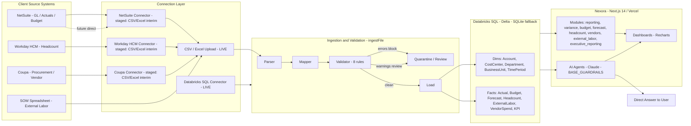
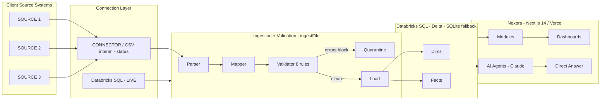

# Solution Design Framework

**Sin City Analytics · Finance Intelligence Platform (codename Nexora)**

Deliverable 04 of the 9-part Operational Delivery Framework

---

## Document Control

| Field | Value |
|---|---|
| **Document** | 04 — Solution Design Framework |
| **Version** | 1.0 |
| **Owner** | Sin City Analytics — Solutions Architecture |
| **Audience** | Engagement Solution Architect, Delivery Lead, Client Finance Sponsor, Account Executive, Implementation Engineering |
| **Last Updated** | 2026-06-13 |
| **Status** | Active |
| **Classification** | Confidential — Client Engagement Material |
| **Upstream Input** | `01-financial-intelligence-assessment-framework.md` (Discovery) |
| **Downstream Consumers** | `05-proposal-template.md`, `02-implementation-playbook.md`, `09-sales-to-implementation-handoff.md` |

---

## Purpose

The Solution Design Framework is the artifact Sin City Analytics produces **after discovery and before the proposal**. It converts the findings of the Financial Intelligence Assessment (Deliverable 01) into a concrete, defensible, target-state design for the client's Finance Intelligence Platform tenant.

It exists to do three things, precisely:

1. **Commit to a recommended architecture** — not a menu of options, but a single opinionated target state mapping the client's source systems to Nexora connectors, ingestion, validation, the Databricks store, and the modules, agents, and dashboards that answer their questions.
2. **Tie every recommendation back to a discovered pain point** — no module, agent, or connector appears in this document unless it resolves a pain point carried forward from discovery. This is the traceability spine the proposal (Deliverable 05) and the implementation playbook (Deliverable 02) both depend on.
3. **Sequence the work onto the canonical 10 implementation phases** with indicative durations and measurable expected outcomes, so the client sees not just *what* we will build but *when value lands*.

This document is **design, not pricing and not contract**. Effort and commercials live in Deliverables 05 and 06. The design here must be technically buildable on the platform as it exists today, with roadmap-staged capabilities clearly flagged as future-state.

> **Platform north star.** Nexora behaves like a finance analyst, not a report generator. Every design decision in this framework is judged against one flow:
> **Question → Relevant Data → AI (Claude) Analysis → Direct Answer.**
> If a recommendation does not shorten or strengthen that path, it does not belong in the design.

---

## How to Use This Document

The body (Sections 1–12) is a **worked example** for an illustrative client, **Meridian Consumer Brands**, so the Solution Architect can see the expected depth, voice, and traceability. Each section opens with a short *How to fill it* note, then the worked content.

The **Reusable Template** at the end of the document is the same framework rendered as a blank, copy-per-engagement fill-in form, complete with placeholders, scoring scales, and decision tables.

**Illustrative client used throughout the worked example:**

| Attribute | Value |
|---|---|
| Client | Meridian Consumer Brands (MCB) |
| Industry | Mid-market CPG, ~$420M revenue |
| Finance team | 14 FTE (1 VP Finance, 3 FP&A, 4 accounting, 2 procurement, 4 ops finance) |
| Source systems | NetSuite (GL/ERP), Workday HCM, Coupa (procurement), spreadsheets everywhere |
| Sponsor | VP Finance |
| Trigger | Monthly close takes 11 business days; board asks questions the team can't answer in-meeting |

---

## 1. Current State

**How to fill it.** Summarize, in business terms, how the client's finance function operates *today* — systems of record, how data moves, how reporting and analysis happen, who does what, and where the manual labor concentrates. Pull directly from the Discovery deliverable's current-state map. Do not editorialize here; Section 2 is where pain is named. Keep it factual so the client recognizes themselves.

**Worked example — Meridian Consumer Brands.**

MCB runs a fragmented finance stack with no analytical layer. NetSuite is the GL system of record. Workday HCM owns headcount and compensation. Coupa owns purchase orders and AP. There is no warehouse — every cross-system question is answered by exporting CSVs and reconciling them by hand in spreadsheets.

| Dimension | Current State |
|---|---|
| **Systems of record** | NetSuite (GL, actuals, budget), Workday HCM (headcount, comp), Coupa (PO, vendor spend) |
| **Analytical layer** | None. Excel is the de-facto warehouse and BI tool. |
| **Close process** | 11 business days; 4 of those are manual consolidation and variance write-up |
| **Forecasting** | Annual budget in NetSuite; reforecast is a quarterly spreadsheet exercise, no cycle discipline |
| **Reporting** | Monthly board pack hand-built in PowerPoint from ~30 linked workbooks |
| **Data ownership** | Implicit. FP&A "owns" the master workbook; no documented lineage |
| **Headcount finance** | Reconciled manually between Workday and NetSuite cost centers; frequent drift |
| **Vendor / procurement** | Coupa reports exported monthly; no spend categorization beyond GL account |
| **External labor / SOW** | Tracked in a standalone spreadsheet; not reconciled to AP |
| **Decision support** | Reactive. Analysis happens *after* questions are asked, often days later |

**Current data flow (as-is):**

```text
  NetSuite ──┐
  Workday  ──┤── CSV export ──► Analyst's laptop ──► linked Excel workbooks ──► PowerPoint board pack
  Coupa    ──┘                    (manual reconcile)      (no lineage)          (stale on delivery)
```

---

## 2. Pain Points

**How to fill it.** Carry forward the discovery pain-point taxonomy verbatim. Classify every pain into one of five categories — **process, data, tooling, talent, decision-latency** — and score it on **Severity × Frequency** using the scales below. The product (Severity × Frequency) yields a **Pain Index (1–25)** that drives prioritization in Sections 3, 6, and 10. Pains scoring ≥ 12 are "primary" and must each be answered by a named recommendation downstream.

**Scoring scales (shared with Deliverable 01):**

| Score | Severity | Frequency |
|---|---|---|
| 1 | Cosmetic / annoyance | Rare (less than quarterly) |
| 2 | Slows work, workaround exists | Occasional (monthly) |
| 3 | Material rework or risk | Regular (every close) |
| 4 | Blocks a decision or deliverable | Frequent (weekly) |
| 5 | Causes wrong decisions / audit risk | Constant (daily) |

**Worked example — Meridian Consumer Brands pain register.**

| # | Pain Point | Category | Sev | Freq | Pain Index | Tier |
|---|---|---|---|---|---|---|
| P1 | 11-day close; 4 days lost to manual consolidation | Process | 4 | 3 | **12** | Primary |
| P2 | Cross-system questions take days because there is no warehouse | Data | 5 | 4 | **20** | Primary |
| P3 | Board asks questions finance cannot answer in the meeting | Decision-latency | 5 | 3 | **15** | Primary |
| P4 | Variance write-up is manual and inconsistent month to month | Process | 3 | 3 | **9** | Secondary |
| P5 | Reforecast has no cycle discipline; numbers drift | Process | 4 | 2 | **8** | Secondary |
| P6 | Headcount-to-GL reconciliation drifts between Workday and NetSuite | Data | 3 | 3 | **9** | Secondary |
| P7 | Vendor spend not categorized beyond GL account; no leverage in negotiations | Tooling | 3 | 2 | **6** | Tertiary |
| P8 | External-labor/SOW spend invisible against AP | Data | 4 | 2 | **8** | Secondary |
| P9 | One analyst is the single point of failure for the master workbook | Talent | 4 | 3 | **12** | Primary |

**Primary pains (Index ≥ 12):** P2, P3, P1, P9. These four define the spine of the recommended solution.

---

## 3. Opportunity Areas

**How to fill it.** For each primary and secondary pain, state the opportunity in outcome language — what becomes *possible* once the pain is removed. Group opportunities into themes so the proposal can frame value at the right altitude. Each opportunity must trace to one or more pain IDs.

**Worked example — Meridian Consumer Brands.**

| Opportunity Area | Resolves | Outcome Statement |
|---|---|---|
| **O1 — Single source of finance truth** | P2, P6, P8 | One governed Databricks store unifies GL, headcount, and procurement so any cross-system question is answerable from one place. |
| **O2 — Analyst-in-the-loop answers** | P3, P2 | AI agents answer board and exec questions directly from live data, with cited sources, in seconds — not days. |
| **O3 — Compressed, repeatable close** | P1, P4 | Automated consolidation and validation cut manual close work; variance narrative is generated, not hand-typed. |
| **O4 — Forecast discipline** | P5 | Structured 3+9 / 6+6 / 9+3 forecast cycles replace ad-hoc reforecasts and surface drift early. |
| **O5 — Resilient finance operations** | P9 | Knowledge moves from one analyst's workbook into a configured, governed platform — removing the single point of failure. |
| **O6 — Spend leverage** | P7 | Vendor and procurement data structured for category-level analysis to support negotiation. |

---

## 4. Recommended Architecture

**How to fill it.** Render the **target state** as a layered diagram: client source systems → Nexora connectors → ingestion & validation → Databricks store → modules / agents / dashboards. Mark anything roadmap-staged as future-state and show the interim CSV/Excel path where a connector is not yet live. The architecture must be buildable on the platform as it exists today (Next.js 14 / TypeScript / Tailwind / Recharts; Databricks SQL primary, SQLite fallback; Vercel).

**Worked example — Meridian Consumer Brands target-state architecture.**



**ASCII fallback (for environments without mermaid):**

```text
SOURCES            CONNECTORS          INGEST+VALIDATE         DATABRICKS (Delta)        NEXORA APP
-------            ----------          ---------------         ------------------        -----------
NetSuite ───┐      [CSV/Excel:LIVE] ── Parser→Mapper→          Dims:                     Modules ──┐
Workday  ───┤────► [DBX SQL: LIVE ] ── Validator(8)            Acct/CC/Dept/BU/Time      Agents  ──┼─► Direct
Coupa    ───┘      [NS/WD/CP: STAGED                 ├─block→ Quarantine    Facts:        Dashboards┘   Answer
SOW xlsx ──────►    via CSV interim] ──              └─clean→ Load ─────────► Actual/Budget/Forecast/
                                                                              HC/ExtLabor/Vendor/KPI
```

**Architecture rationale.** Because NetSuite, Workday, and Coupa connectors are roadmap-staged (not live today), MCB launches on the **CSV/Excel + Databricks** path that is live now. Each source exports to a mapped CSV/Excel template; `ingestFile()` runs Parser → Mapper → Validator → Store on every load. Databricks SQL (Delta) is the primary store with SQLite as fallback. When the native connectors ship, the interim CSV path is retired source-by-source with no change to the downstream model — the dims/facts schema is connector-agnostic by design.

---

## 5. Recommended Integrations

**How to fill it.** Decide which connectors to **enable now** versus **later**, honestly reflecting which are live on the platform today versus roadmap-staged. Where a connector is staged, specify the **CSV/Excel interim** template that carries the source until the connector lands. Every integration must feed a fact or dimension the design actually uses.

**Connector availability reference (platform canon):**

| Connector | Platform Status | Feeds |
|---|---|---|
| CSV / Excel Upload | **Live** | Any dim/fact via mapped template |
| Databricks SQL | **Live** | Direct query/load of facts |
| QuickBooks | Roadmap-staged | Actuals, Budget |
| NetSuite | Roadmap-staged | Actuals, Budget, Accounts |
| Workday HCM | Roadmap-staged | Headcount |
| Beeline / Fieldglass (VMS) | Roadmap-staged | External labor / SOW |
| Coupa | Roadmap-staged | Vendor spend, procurement |
| Workday Adaptive Planning | Roadmap-staged | Forecast, Budget |

**Worked example — Meridian Consumer Brands integration plan.**

| Source | Connector at Launch | Mechanism | Phase to Native Connector |
|---|---|---|---|
| NetSuite (GL/actuals/budget) | CSV/Excel interim | Monthly mapped export → `ingestFile()` | When NetSuite connector ships (Phase 10 expansion) |
| Workday HCM (headcount) | CSV/Excel interim | Monthly mapped export → `ingestFile()` | When Workday HCM connector ships |
| Coupa (vendor/procurement) | CSV/Excel interim | Monthly mapped export → `ingestFile()` | When Coupa connector ships |
| SOW external labor | CSV/Excel | Mapped spreadsheet → `ingestFile()` | Beeline/Fieldglass when VMS connector ships |
| Existing Databricks (if client has one) | Databricks SQL | Read-only token query | Live at launch |

**Decision rule applied:** *Enable a native connector now only if it is live on the platform; otherwise enable CSV/Excel interim with a documented mapping template and place the native connector on the roadmap.* For MCB, all three ERP/HCM/procurement systems are staged, so all three launch on the interim path. This is a deliberate, low-risk launch posture, not a limitation — the model layer is identical.

---

## 6. Recommended Skills (AI Agents)

**How to fill it.** Select which of the **7 AI agents** to enable for this client. Each agent enabled must be justified by a specific pain ID and the question pattern it answers. Do not enable agents the client has no data or use case for. Confirm all enabled agents operate under **BASE_GUARDRAILS** (no fabricated numbers; separate fact from interpretation; cite source; flag low-confidence; offer follow-ups; escalate).

**Agent catalog (platform canon):**

| Agent (key) | Answers | Module dependency |
|---|---|---|
| CFO Advisor (`cfo`) | Executive, cross-functional finance questions | executive_reporting, all facts |
| FP&A Specialist (`fpa`) | Variance, budget, forecast questions | variance, budget, forecast |
| Procurement Advisor (`procurement`) | Vendor spend, category, savings | vendors |
| Workforce Finance (`headcount`) | Headcount cost, plan vs actual | headcount |
| External Labor Advisor (`external-labor`) | SOW / contingent spend | external_labor |
| Finance Business Partner (`finance-bp`) | Departmental / BU partnering questions | reporting, variance |
| Data Quality Advisor (`validation`) | Data trust, validation status, lineage | validation layer |

**Worked example — Meridian Consumer Brands agent enablement.**

| Agent | Enable? | Resolves Pain | Why |
|---|---|---|---|
| CFO Advisor (`cfo`) | **Yes** | P3, P2 | Directly answers the board/exec questions finance can't answer in-meeting; the headline use case. |
| FP&A Specialist (`fpa`) | **Yes** | P4, P5 | Generates variance narrative and forecast-drift analysis, replacing manual write-up. |
| Workforce Finance (`headcount`) | **Yes** | P6 | Resolves headcount-to-GL drift; answers comp/plan-vs-actual questions. |
| Finance Business Partner (`finance-bp`) | **Yes** | P9 | Moves departmental partnering knowledge off one analyst's workbook into the platform. |
| Data Quality Advisor (`validation`) | **Yes** | P2, P6 | Builds trust during launch by surfacing validation status and lineage; essential while on CSV interim. |
| Procurement Advisor (`procurement`) | **Later** | P7 | Tertiary pain; enable in Phase 10 once Coupa data is categorized. |
| External Labor Advisor (`external-labor`) | **Later** | P8 | Enable once SOW data is reconciled to AP and trustworthy. |

**Launch set:** `cfo`, `fpa`, `headcount`, `finance-bp`, `validation`. **Deferred:** `procurement`, `external-labor`.

---

## 7. Recommended Dashboards

**How to fill it.** Specify which **modules** to activate and which **Recharts views** and **executive reporting templates** the client gets. Tie each dashboard to a persona and a pain. Remember: the platform leads with direct answers, so dashboards support exploration and the board pack — they are not the primary interface.

**Worked example — Meridian Consumer Brands dashboard plan.**

| Module (key) | Enable? | Primary Recharts views | Persona | Resolves |
|---|---|---|---|---|
| Financial reporting | **Yes** | P&L trend line, BU/dept breakdown bars | Finance user | P1, P9 |
| Variance (`actuals`) | **Yes** | Budget-vs-actual waterfall, variance heat table | FP&A | P4 |
| Budget (`budget`) | **Yes** | Budget composition stacked bars | FP&A | P4 |
| Forecast (`forecast`) | **Yes** | 3+9 / 6+6 / 9+3 cycle lines, drift band | FP&A | P5 |
| Headcount (`headcount`) | **Yes** | Headcount cost trend, plan-vs-actual | Workforce finance | P6 |
| Executive reporting (`executive_reporting`) | **Yes** | Board-pack template, KPI scorecard | CFO / Board | P3 |
| Vendors (`vendors`) | **Later** | Spend-by-category treemap | Procurement | P7 |
| External labor (`external_labor`) | **Later** | SOW burn-down | Ops finance | P8 |
| Cloud spend (`cloud_spend`) | **No** | — | — | Not applicable to MCB |

**Executive reporting templates at launch:** Monthly Board Pack (replaces the 30-workbook PowerPoint build), CFO KPI Scorecard. Generated from live data so the board pack is never stale on delivery — directly answering P3.

---

## 8. Recommended Governance Model

**How to fill it.** Define validation thresholds, quarantine rules, data ownership (RACI), and change control on ClientConfig. The 8 validators are fixed in the platform; what you tune per client is thresholds, which warnings are reviewed vs. waived, and who owns each data domain. Errors block ingestion; warnings route to review.

**The 8 validators (platform canon):**

| # | Validator | Severity | Default Behavior |
|---|---|---|---|
| 1 | Required-fields | Error | Block |
| 2 | Period | Error | Block |
| 3 | Cost-center | Error | Block |
| 4 | Account | Error | Block |
| 5 | Department | Warning | Review |
| 6 | Duplicate | Error | Block |
| 7 | Anomaly (negatives, Z > 3) | Warning | Review |
| 8 | Alignment (variance, forecast drift) | Warning | Review |

**Worked example — Meridian Consumer Brands governance.**

**Validation thresholds:**

| Setting | MCB Value | Rationale |
|---|---|---|
| Anomaly Z-score threshold | Z > 3 (platform default) | No reason to loosen at launch; revisit after 3 closes. |
| Negative-value handling | Flag for review, do not block | CPG has legitimate credits/returns. |
| Alignment variance tolerance | ±5% budget-vs-actual flagged | Matches MCB's internal materiality. |
| Forecast drift tolerance | ±8% cycle-over-cycle flagged | Surfaces P5 drift early. |
| Duplicate key | clientId + period + account + costCenter | Prevents double-load during manual CSV interim. |

**Quarantine rules.** Any record failing an Error validator is quarantined and never reaches the store; the load reports a blocked count and reasons. Warning-level records load but are tagged `validationStatus = review` and surfaced to the Data Quality Advisor agent. While MCB is on the CSV interim path, quarantine review is a named step in the monthly close runbook.

**Data ownership (RACI):**

| Data Domain | Owner (A) | Steward (R) | Consulted (C) |
|---|---|---|---|
| GL / Actuals / Budget | VP Finance | FP&A Lead | Controller |
| Headcount | VP Finance | HRIS Analyst | People Ops |
| Vendor / Procurement | Procurement Mgr | AP Lead | FP&A |
| External labor / SOW | Ops Finance Lead | PMO | Procurement |
| ClientConfig | Sin City Delivery Lead | Solution Architect | VP Finance |

**Change control on ClientConfig.** ClientConfig is the single source of truth per tenant (branding, fiscal year, periods, forecast cycles, BUs, cost centers, departments, chart of accounts, active modules, enabled agents). All changes are made by the Sin City Delivery Lead via PR, reviewed by the Solution Architect, and signed off by the client data owner. No ad-hoc edits. Config changes are versioned and logged.

---

## 9. Recommended Security Model

**How to fill it.** Map the client's personas onto the four platform roles, confirm clientId row-level isolation (live today), lay out the **target-state** Clerk organization setup (Orgs = tenants — roadmap, not installed today), and specify token scoping. Default to least privilege; default Databricks tokens to read-only. Apply the same discipline used for staged connectors in Sections 4–5: flag the Clerk identity layer as future-state and do not present role-to-route enforcement as buildable today.

> **Platform status flag — read before designing the security model.** As with staged connectors, the design must separate what is **live today** from what is **target-state**. **Live today:** `clientId` row-level isolation — every dim/fact row carries `clientId` and all queries are scoped by it. **Target-state (roadmap, not yet installed):** Clerk Organizations as tenants, org-membership role mapping to platform roles, and route-guarded enforcement. Today the auth middleware is a **stub**, `/api/agent` is **public**, and route guards are **deferred**. Design the persona-to-role mapping and Clerk org model so it is ready to activate when Clerk lands — but do not represent Clerk-based access enforcement as operative at Go Live unless it has shipped.

**Platform roles and permission posture (canon):**

| Role | Posture |
|---|---|
| `admin` | Full tenant config + data + user management |
| `finance_user` | Read/write data, run agents, build views |
| `executive` | Read dashboards, run agents, no config |
| `read_only` | Read dashboards only |

**Worked example — Meridian Consumer Brands persona mapping.**

| MCB Persona | Headcount | Platform Role | Notes |
|---|---|---|---|
| VP Finance (sponsor) | 1 | `admin` | Owns ClientConfig sign-off |
| FP&A team | 3 | `finance_user` | Build views, run `fpa` agent |
| Accounting / ops finance | 6 | `finance_user` | Ingestion + review |
| CFO | 1 | `executive` | Runs `cfo` agent, reads board pack |
| Board members | 5 | `read_only` | Board-pack dashboards only |

**Isolation and identity.** The two mechanisms below are at different maturity levels — kept distinct deliberately, the same way staged connectors are separated from live ones in Sections 4–5.

*Live today (implemented):*

- **clientId row-level isolation.** Every dim and fact row carries `clientId`; all queries are scoped by it. MCB data is never co-mingled with other tenants. This is the isolation mechanism operative today — mandatory, non-negotiable, and active independent of the identity layer.

*Target-state (roadmap — NOT installed today):*

- **Clerk org setup (future-state).** Clerk is the **target** identity/access layer; it is **not installed today** — the auth middleware is currently a **stub**, `/api/agent` is **public**, and route guards are **deferred**. When Clerk ships, one Clerk Organization = the MCB tenant, users invited into the org inherit the tenant `clientId`, and roles assigned at the org-membership level map to the four platform roles above. Design the mapping now so it is ready to activate; do not rely on Clerk-based role-to-route enforcement at Go Live until it has shipped. Until then, access control on the not-yet-guarded surface is an operational control, not a platform-enforced one.

*Spanning both:*

- **Token scoping.** Databricks access uses a **read-only** token where the client's warehouse is queried directly. The CSV interim path uses no standing client credentials. All data treated as confidential.

```text
TARGET-STATE (Clerk roadmap — not installed today; middleware stub, /api/agent public, guards deferred)
Clerk Org "Meridian Consumer Brands"  ──►  clientId = mcb_001
  ├─ admin        (VP Finance)        ──►  full config + data + users
  ├─ finance_user (FP&A, accounting)  ──►  read/write data, run agents
  ├─ executive    (CFO)               ──►  dashboards + agents, no config
  └─ read_only    (Board)             ──►  dashboards only

LIVE TODAY (implemented, independent of Clerk):
        every query: WHERE clientId = 'mcb_001'   (row-level isolation)
```

---

## 10. Implementation Roadmap

**How to fill it.** Map the recommendations from Sections 4–9 onto the **canonical 10 phases**, with sequencing and indicative duration. Be explicit about which recommendation lands in which phase. Durations are indicative for design purposes; the binding schedule lives in Deliverables 02 and 05.

**Worked example — Meridian Consumer Brands roadmap.**

| Phase | Name | MCB Scope | Indicative Duration |
|---|---|---|---|
| 1 | Discovery & Assessment | Completed (Deliverable 01) — pain register P1–P9 | Done |
| 2 | Data Assessment & Architecture | Confirm dims/facts, finalize CSV mapping templates for NetSuite/Workday/Coupa | 1 week |
| 3 | Connection Layer & Integration | Stand up CSV/Excel interim + Databricks SQL; first test loads | 1.5 weeks |
| 4 | Data Validation & Governance | Tune 8 validators to MCB thresholds; quarantine runbook; RACI | 1 week |
| 5 | Finance Intelligence Configuration | ClientConfig: fiscal year, periods, forecast cycles (3+9/6+6/9+3), BUs, cost centers, CoA; enable launch modules + agents | 1.5 weeks |
| 6 | Dashboard & Executive Experience Setup | Reporting/variance/budget/forecast/headcount views; board pack + KPI scorecard | 1.5 weeks |
| 7 | User Access & Security | Verify clientId row-level isolation (live today) and read-only Databricks tokens; author persona→role mapping and Clerk org model as **target-state** (Clerk roadmap-staged — not installed today; middleware stub, `/api/agent` public, route guards deferred). Clerk-enforced role-to-route guarding activates only when Clerk ships. | 0.5 week (isolation + token scoping; Clerk activation deferred to roadmap) |
| 8 | Training & Adoption | Train FP&A on agents; train CFO/board on board pack; close-runbook walkthrough | 1 week |
| 9 | Go Live | First live close on Nexora; parallel-run safety net for one cycle | 1 close cycle |
| 10 | Optimization & Expansion | Enable `procurement` + `external-labor` agents; vendors/external-labor dashboards; swap CSV interim for native connectors as they ship | Ongoing |

**Critical path:** Phases 2 → 3 → 4 → 5 → 6 gate Go Live. Security (7) and Training (8) run partially in parallel with 6. Indicative time-to-first-value (first live close): ~8 weeks.

---

## 11. Expected Outcomes

**How to fill it.** Tie each opportunity area to a measurable success metric with a baseline and target. Use the platform's core value metrics: **close time, forecast accuracy, time-to-answer, hours saved.** These become the success criteria the proposal commits to and the operating model (Deliverable 07) tracks.

**Worked example — Meridian Consumer Brands outcomes.**

| Metric | Baseline (today) | Target (post Go Live) | Tied to | Opportunity |
|---|---|---|---|---|
| Monthly close time | 11 business days | ≤ 6 business days | P1 | O3 |
| Time-to-answer (exec/board question) | 1–3 days | < 60 seconds (agent direct answer) | P3, P2 | O1, O2 |
| Forecast accuracy (cycle drift) | Untracked / ad-hoc | Drift < ±8%, tracked every cycle | P5 | O4 |
| Manual reporting hours / month | ~80 hrs (board pack + consolidation) | ≤ 25 hrs | P1, P9 | O3, O5 |
| Headcount-to-GL reconciliation drift | Frequent, manual | Validated each load, < ±2% | P6 | O1 |
| Single-point-of-failure risk | 1 analyst owns master workbook | 0 — knowledge in platform | P9 | O5 |

**Headline outcome statement for the proposal:** *Meridian cuts close time by ~45%, answers board questions live instead of days later, and removes ~55 manual reporting hours per month — while making its finance data trustworthy and resilient.*

---

## 12. Risk Considerations

**How to fill it.** Identify the design and delivery risks specific to this client, rate likelihood and impact, and give each a concrete mitigation owned by a named party. Carry forward any risks flagged in discovery.

**Worked example — Meridian Consumer Brands risk register.**

| # | Risk | Likelihood | Impact | Mitigation | Owner |
|---|---|---|---|---|---|
| R1 | CSV interim introduces manual-load errors | Medium | Medium | Validators + duplicate key block bad loads; quarantine review in close runbook; native connectors on roadmap | Delivery Lead |
| R2 | Source export formats drift, breaking the Mapper | Medium | Medium | Versioned mapping templates; mapper validation; alert on schema change | Solution Architect |
| R3 | Users distrust agent answers ("AI made it up") | Medium | High | BASE_GUARDRAILS enforce no fabricated numbers + source citation; Data Quality Advisor surfaces validation status; parallel run at Go Live | Engagement Lead |
| R4 | Single-analyst dependency persists through cutover | Low | High | Phase 8 training broadens ownership; ClientConfig change control removes tribal knowledge | VP Finance |
| R5 | Databricks token over-scoped | Low | High | Read-only tokens by default; security review in Phase 7 | Security / Delivery |
| R6 | Scope creep into deferred agents/modules pre-Go-Live | Medium | Medium | Procurement/external-labor explicitly deferred to Phase 10; change control on ClientConfig | Account Exec |
| R7 | Forecast cycle discipline not adopted | Medium | Medium | Configure cycles in ClientConfig; FP&A training; drift alerts make slippage visible | FP&A Lead |

---

---

# REUSABLE TEMPLATE

> Copy everything below this line into a new file per engagement: `04-solution-design-[client-slug].md`. Replace every `[PLACEHOLDER]`. Delete guidance notes before client delivery. Do not enable any module, agent, or connector that is not traced to a pain point in Section 2.

---

## Document Control

| Field | Value |
|---|---|
| **Document** | 04 — Solution Design Framework — [CLIENT NAME] |
| **Version** | [VERSION] |
| **Owner** | Sin City Analytics — Solutions Architecture |
| **Audience** | [AUDIENCE] |
| **Last Updated** | [YYYY-MM-DD] |
| **Status** | [Draft / In Review / Active] |
| **Classification** | Confidential — Client Engagement Material |
| **Upstream Input** | `01-financial-intelligence-assessment-framework.md` — [CLIENT] discovery dated [DATE] |
| **Downstream Consumers** | `05-proposal-template.md`, `02-implementation-playbook.md` |

## Purpose

This Solution Design translates the discovery findings for **[CLIENT NAME]** into a recommended target-state design for their Finance Intelligence Platform (Nexora) tenant. Every recommendation traces to a discovered pain point. Design only — pricing in Deliverable 05, commercials in 06.

North-star test for every recommendation: does it strengthen **Question → Relevant Data → AI (Claude) Analysis → Direct Answer**?

**Engagement snapshot:**

| Attribute | Value |
|---|---|
| Client | [CLIENT NAME] |
| Industry / size | [INDUSTRY] / [REVENUE] |
| Finance team | [FTE COUNT + COMPOSITION] |
| Source systems | [SYSTEMS] |
| Sponsor | [SPONSOR ROLE] |
| Trigger / catalyst | [WHY NOW] |

---

## 1. Current State

*Fill: factual as-is map of systems, data flow, close, forecasting, reporting, ownership. No editorializing.*

| Dimension | Current State |
|---|---|
| Systems of record | [...] |
| Analytical layer | [...] |
| Close process | [... days; manual hotspots] |
| Forecasting | [...] |
| Reporting | [...] |
| Data ownership | [...] |
| Headcount finance | [...] |
| Vendor / procurement | [...] |
| External labor / SOW | [...] |
| Decision support | [...] |

**As-is data flow:**

```text
[SOURCE] ──┐
[SOURCE] ──┤── [how data moves today] ──► [where analysis happens] ──► [output]
[SOURCE] ──┘
```

---

## 2. Pain Points

*Fill: carry forward discovery pains. Categorize (process / data / tooling / talent / decision-latency). Score Severity × Frequency → Pain Index. Index ≥ 12 = Primary; must each be answered downstream.*

**Scoring scales:**

| Score | Severity | Frequency |
|---|---|---|
| 1 | Cosmetic | Rare (< quarterly) |
| 2 | Slows work | Occasional (monthly) |
| 3 | Material rework/risk | Regular (every close) |
| 4 | Blocks decision/deliverable | Frequent (weekly) |
| 5 | Wrong decisions / audit risk | Constant (daily) |

**Pain register:**

| # | Pain Point | Category | Sev | Freq | Pain Index | Tier |
|---|---|---|---|---|---|---|
| P1 | [...] | [cat] | [1-5] | [1-5] | [S×F] | [Primary/Secondary/Tertiary] |
| P2 | [...] | [cat] | [ ] | [ ] | [ ] | [ ] |
| P3 | [...] | [cat] | [ ] | [ ] | [ ] | [ ] |
| ... | [...] | [ ] | [ ] | [ ] | [ ] | [ ] |

**Primary pains (Index ≥ 12):** [LIST IDs].

---

## 3. Opportunity Areas

*Fill: one opportunity per theme, in outcome language; each traces to pain IDs.*

| Opportunity | Resolves | Outcome Statement |
|---|---|---|
| O1 — [name] | [pain IDs] | [what becomes possible] |
| O2 — [name] | [pain IDs] | [...] |
| O3 — [name] | [pain IDs] | [...] |
| ... | [ ] | [ ] |

---

## 4. Recommended Architecture

*Fill: target-state diagram — sources → connectors → ingestion/validation → Databricks → modules/agents/dashboards. Flag roadmap-staged connectors; show CSV interim. Must be buildable today.*



**Architecture rationale:** [WHY this topology; which connectors live vs staged; how interim retires.]

---

## 5. Recommended Integrations

*Fill: enable-now vs later. Reflect true platform status (Live: CSV/Excel, Databricks. Staged: QuickBooks, NetSuite, Workday HCM, Beeline/Fieldglass, Coupa, Workday Adaptive Planning). Specify CSV interim where staged.*

| Source | Connector at Launch | Mechanism | Phase to Native Connector |
|---|---|---|---|
| [SOURCE] | [Live connector / CSV interim] | [export → ingestFile / read-only token] | [phase / when ships] |
| [...] | [ ] | [ ] | [ ] |

**Decision rule:** *Enable a native connector now only if it is live on the platform; otherwise enable CSV/Excel interim with a documented mapping template and roadmap the native connector.*

---

## 6. Recommended Skills (AI Agents)

*Fill: select from the 7 agents. Justify each by pain ID + question pattern. All operate under BASE_GUARDRAILS.*

| Agent (key) | Enable? | Resolves Pain | Why |
|---|---|---|---|
| CFO Advisor (`cfo`) | [Yes/Later/No] | [IDs] | [...] |
| FP&A Specialist (`fpa`) | [ ] | [ ] | [ ] |
| Procurement Advisor (`procurement`) | [ ] | [ ] | [ ] |
| Workforce Finance (`headcount`) | [ ] | [ ] | [ ] |
| External Labor Advisor (`external-labor`) | [ ] | [ ] | [ ] |
| Finance Business Partner (`finance-bp`) | [ ] | [ ] | [ ] |
| Data Quality Advisor (`validation`) | [ ] | [ ] | [ ] |

**Launch set:** [LIST]. **Deferred:** [LIST].

---

## 7. Recommended Dashboards

*Fill: activate modules + Recharts views + executive templates. Tie each to a persona and pain. Dashboards support, not replace, direct answers.*

| Module (key) | Enable? | Recharts views | Persona | Resolves |
|---|---|---|---|---|
| Financial reporting | [ ] | [ ] | [ ] | [ ] |
| Variance (`actuals`) | [ ] | [ ] | [ ] | [ ] |
| Budget (`budget`) | [ ] | [ ] | [ ] | [ ] |
| Forecast (`forecast`) | [ ] | [ ] | [ ] | [ ] |
| Headcount (`headcount`) | [ ] | [ ] | [ ] | [ ] |
| Vendors (`vendors`) | [ ] | [ ] | [ ] | [ ] |
| External labor (`external_labor`) | [ ] | [ ] | [ ] | [ ] |
| Cloud spend (`cloud_spend`) | [ ] | [ ] | [ ] | [ ] |
| Executive reporting (`executive_reporting`) | [ ] | [ ] | [ ] | [ ] |

**Executive templates at launch:** [Board Pack / KPI Scorecard / ...].

---

## 8. Recommended Governance Model

*Fill: tune validator thresholds, quarantine rules, RACI, ClientConfig change control. The 8 validators are fixed; thresholds and review/waive decisions are per-client.*

**Validator behavior (fixed):**

| # | Validator | Severity | Behavior |
|---|---|---|---|
| 1 | Required-fields | Error | Block |
| 2 | Period | Error | Block |
| 3 | Cost-center | Error | Block |
| 4 | Account | Error | Block |
| 5 | Department | Warning | Review |
| 6 | Duplicate | Error | Block |
| 7 | Anomaly (negatives, Z > 3) | Warning | Review |
| 8 | Alignment (variance, forecast drift) | Warning | Review |

**Threshold settings (tune per client):**

| Setting | Value | Rationale |
|---|---|---|
| Anomaly Z-score | [default Z > 3 / custom] | [ ] |
| Negative-value handling | [block / flag] | [ ] |
| Alignment variance tolerance | [±__%] | [ ] |
| Forecast drift tolerance | [±__%] | [ ] |
| Duplicate key | [clientId + period + ...] | [ ] |

**Quarantine rules:** [Error → quarantine, never stored. Warning → load tagged `validationStatus = review`, surfaced to Data Quality Advisor. Review owner + cadence:] [ ].

**Data ownership (RACI):**

| Data Domain | Owner (A) | Steward (R) | Consulted (C) |
|---|---|---|---|
| GL / Actuals / Budget | [ ] | [ ] | [ ] |
| Headcount | [ ] | [ ] | [ ] |
| Vendor / Procurement | [ ] | [ ] | [ ] |
| External labor / SOW | [ ] | [ ] | [ ] |
| ClientConfig | Sin City Delivery Lead | Solution Architect | [client owner] |

**ClientConfig change control:** All changes via PR by Delivery Lead, reviewed by Solution Architect, signed off by [client data owner]. Versioned and logged. No ad-hoc edits.

---

## 9. Recommended Security Model

*Fill: map personas → 4 roles, confirm clientId isolation (live today), author the **target-state** Clerk org setup (roadmap — not installed today), token scoping. Least privilege; read-only Databricks tokens by default. Flag Clerk as future-state the same way staged connectors are flagged in Sections 4–5; do not present role-to-route enforcement as live.*

| Persona | Headcount | Platform Role (`admin`/`finance_user`/`executive`/`read_only`) | Notes |
|---|---|---|---|
| [ ] | [ ] | [ ] | [ ] |
| [ ] | [ ] | [ ] | [ ] |

**Isolation & identity** — keep live-today and target-state separate:

*Live today (implemented):*

- clientId row-level isolation: every dim/fact carries `clientId`; all queries scoped. [Confirm: clientId = [SLUG].] This is the operative isolation mechanism today, independent of the identity layer.

*Target-state (Clerk roadmap — NOT installed today; auth middleware is a stub, `/api/agent` is public, route guards deferred):*

- Clerk org (future-state): one Org = this tenant; membership roles map to platform roles. Author the mapping so it is ready to activate when Clerk ships; do not rely on Clerk role-to-route enforcement at Go Live until it has shipped.

*Spanning both:*

- Token scoping: [read-only Databricks token / CSV interim no standing creds]. All data confidential.

```text
TARGET-STATE (Clerk roadmap — not installed today; middleware stub, /api/agent public, guards deferred)
Clerk Org "[CLIENT]"  ──►  clientId = [SLUG]
  ├─ admin        ([persona])   ──►  full config + data + users
  ├─ finance_user ([persona])   ──►  read/write data, run agents
  ├─ executive    ([persona])   ──►  dashboards + agents, no config
  └─ read_only    ([persona])   ──►  dashboards only

LIVE TODAY (implemented, independent of Clerk):
        every query: WHERE clientId = '[SLUG]'
```

---

## 10. Implementation Roadmap

*Fill: map recommendations onto the 10 phases with sequencing + indicative durations. Binding schedule lives in Deliverables 02/05.*

| Phase | Name | Client Scope | Indicative Duration |
|---|---|---|---|
| 1 | Discovery & Assessment | [done / scope] | [ ] |
| 2 | Data Assessment & Architecture | [ ] | [ ] |
| 3 | Connection Layer & Integration | [ ] | [ ] |
| 4 | Data Validation & Governance | [ ] | [ ] |
| 5 | Finance Intelligence Configuration | [ ] | [ ] |
| 6 | Dashboard & Executive Experience Setup | [ ] | [ ] |
| 7 | User Access & Security | [ ] | [ ] |
| 8 | Training & Adoption | [ ] | [ ] |
| 9 | Go Live | [ ] | [ ] |
| 10 | Optimization & Expansion | [ ] | [ ] |

**Critical path:** [phases that gate Go Live]. **Indicative time-to-first-value:** [~__ weeks].

---

## 11. Expected Outcomes

*Fill: each metric with baseline + target, traced to pain + opportunity. Core metrics: close time, forecast accuracy, time-to-answer, hours saved.*

| Metric | Baseline | Target | Tied to (Pain) | Opportunity |
|---|---|---|---|---|
| Monthly close time | [ ] | [ ] | [ ] | [ ] |
| Time-to-answer | [ ] | [ ] | [ ] | [ ] |
| Forecast accuracy / drift | [ ] | [ ] | [ ] | [ ] |
| Manual reporting hours / month | [ ] | [ ] | [ ] | [ ] |
| [client-specific metric] | [ ] | [ ] | [ ] | [ ] |

**Headline outcome statement:** [one sentence the proposal can quote].

---

## 12. Risk Considerations

*Fill: design/delivery risks, likelihood × impact, concrete mitigation + named owner. Carry forward discovery risks.*

| # | Risk | Likelihood | Impact | Mitigation | Owner |
|---|---|---|---|---|---|
| R1 | [ ] | [L/M/H] | [L/M/H] | [ ] | [ ] |
| R2 | [ ] | [ ] | [ ] | [ ] | [ ] |
| R3 | [ ] | [ ] | [ ] | [ ] | [ ] |
| ... | [ ] | [ ] | [ ] | [ ] | [ ] |

---

### Sign-off

| Role | Name | Date | Approval |
|---|---|---|---|
| Sin City Solution Architect | [ ] | [ ] | [ ] |
| Sin City Delivery Lead | [ ] | [ ] | [ ] |
| Client Finance Sponsor | [ ] | [ ] | [ ] |

*End of Deliverable 04 — Solution Design Framework. Next artifact: `05-proposal-template.md`.*
