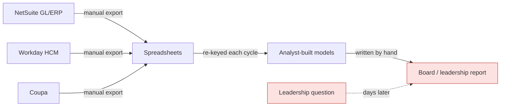
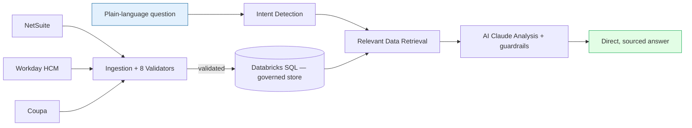

# Finance Intelligence Platform — Proposal

**Sin City Analytics · Finance Intelligence Platform (codename Nexora)**

Deliverable 05 of the 9-part Operational Delivery Framework

---

## Document Control

| Field | Value |
|---|---|
| **Document** | 05 — Proposal Template |
| **Version** | 1.0 |
| **Owner** | Sin City Analytics |
| **Audience** | Prospective Client Executive Sponsor (CFO / VP Finance / Finance Transformation Lead); Account Executive; Engagement Solution Architect |
| **Last Updated** | 2026-06-13 |
| **Status** | Template |
| **Classification** | Confidential — Client Engagement Material |
| **Upstream Input** | `01-financial-intelligence-assessment-framework.md` (Discovery), `04-solution-design-framework.md` (Target-State Design) |
| **Pricing Authority** | `06-pricing-framework.md` (commercials — this document references but never quotes) |
| **Downstream Consumers** | `09-sales-to-implementation-handoff.md`, `02-implementation-playbook.md`, `03-client-onboarding-playbook.md` |

---

## Purpose

This is the **client-facing proposal** Sin City Analytics presents to a prospective client's executive sponsor after discovery (Deliverable 01) and solution design (Deliverable 04) are complete. It is the document that converts a qualified opportunity into a signed engagement.

It does two jobs at once:

1. **It is a reusable fill-in template.** Every variable is marked `[PLACEHOLDER]`. An account team copies this file, replaces the placeholders with the specifics from discovery and the solution design, lightly edits the model prose, and ships a finished proposal — typically within one working day of solution-design sign-off.
2. **It is a model document.** Every section below is fully written in the voice and at the depth a finished proposal must hit. The sample prose is grounded in the real platform — the real modules, agents, connectors, validators, roles, and ClientConfig — so an account team is editing a correct document, not assembling one from scratch.

> **What this document promises and what it does not.** This proposal commits to **outcomes, scope, approach, and timeline**. It does **not** quote dollar figures — all commercials are governed by `06-pricing-framework.md` and presented in a separate, version-controlled commercial schedule. The Investment section here describes the *structure* of the investment and the *value* that justifies it, with `[PLACEHOLDER]` values the account team populates from the pricing framework.

> **Voice.** Write like Palantir, Databricks, and Scale AI write to executives: confident, specific, outcome-driven, and free of hyperbole. Lead with the decision the client will be able to make, not the feature that enables it. Never promise a capability the platform does not have. Never claim a connector is live when it is roadmap-staged.

---

## How to Use This Template

| Step | Action | Source |
|---|---|---|
| 1 | Copy this file to `proposals/[CLIENT-SHORTNAME]-proposal-v[N].md`. | — |
| 2 | Replace every `[PLACEHOLDER]` with engagement specifics. | Discovery (01), Solution Design (04) |
| 3 | Edit the model prose so the narrative reflects *this* client's words, sponsor, and pain points. | Discovery interview notes |
| 4 | Pull the investment-structure values and value justification from the commercial schedule. | `06-pricing-framework.md` |
| 5 | Confirm every module, agent, and connector named matches the approved solution design — and that roadmap-staged connectors are flagged as future-state. | Solution Design (04) |
| 6 | Executive-sponsor and Solutions-Architecture review, then transmit. | Internal gate |

**Convention used throughout:** the illustrative client in the model prose is **Meridian Consumer Brands (MCB)** — a mid-market CPG company, ~$420M revenue, 14-person finance team, source systems NetSuite (GL/ERP) + Workday HCM + Coupa (procurement) + spreadsheets, sponsor VP Finance. This keeps the worked example consistent with Deliverable 04. Replace MCB throughout with `[CLIENT NAME]`.

---

## 0. Cover / Transmittal Block

```text
┌─────────────────────────────────────────────────────────────────────┐
│  SIN CITY ANALYTICS                                                   │
│  Finance Intelligence Platform (codename Nexora)                      │
│                                                                       │
│  PROPOSAL — CONFIDENTIAL                                              │
│                                                                       │
│  TO:        [SPONSOR NAME], [SPONSOR TITLE]                           │
│             [CLIENT LEGAL ENTITY NAME]                                │
│  FROM:      [ACCOUNT EXECUTIVE NAME], [TITLE]                         │
│             [SOLUTION ARCHITECT NAME], Solutions Architecture         │
│             Sin City Analytics                                        │
│  DATE:      [YYYY-MM-DD]                                              │
│  RE:        Proposal to deploy the Finance Intelligence Platform for  │
│             [CLIENT NAME] — [ENGAGEMENT NAME / SCOPE HEADLINE]         │
│                                                                       │
│  PROPOSAL ID:     [PROP-CLIENT-YYYYNN]                                │
│  VALID THROUGH:   [YYYY-MM-DD]  (90 days from issue unless noted)     │
│  DISCOVERY REF:   [01 Assessment doc ID]                              │
│  DESIGN REF:      [04 Solution Design doc ID]                         │
└─────────────────────────────────────────────────────────────────────┘
```

**Transmittal note (model prose — lightly edit):**

> [SPONSOR FIRST NAME],
>
> Thank you for the access your team gave us during discovery. This proposal sets out how Sin City Analytics will stand up the Finance Intelligence Platform for [CLIENT NAME], turning the finance questions your team answers slowly today — and the ones it cannot answer in the room — into direct, sourced answers in seconds.
>
> Everything here traces back to what we heard from you and your team. It is buildable on the platform as it exists today, deployable on the timeline below, and structured so value lands in the first phase, not at go-live. We would welcome the opportunity to walk you and your leadership team through it.
>
> — [ACCOUNT EXECUTIVE NAME]

---

## 1. Executive Brief (One Page)

> **Read-in-90-seconds callout. This is the only page some executives will read. It must stand alone.**

> ### [CLIENT NAME] — Finance Intelligence Platform
>
> **The Challenge.** [CLIENT NAME]'s finance team spends [PLACEHOLDER: e.g., "11 business days closing the month"] and still cannot answer leadership's questions in the meeting where they are asked. [PLACEHOLDER: one-sentence sharpest pain point — e.g., "Variance explanations are assembled by hand across NetSuite exports and a dozen spreadsheets; by the time the answer exists, the decision has been made without it."]
>
> **The Solution.** A dedicated, secure Finance Intelligence Platform tenant that connects [CLIENT NAME]'s source systems, validates every record against [CLIENT NAME]'s own financial structure, and lets finance ask questions in plain language — answered by AI finance agents that cite the data behind every claim. Not another dashboard. A finance analyst that works at machine speed and never fabricates a number.
>
> **The Outcome.** [PLACEHOLDER: 3 quantified outcomes from the solution design, e.g.:]
> - Variance questions answered in **[under 60 seconds]**, not [two days], with the source cited.
> - Close-cycle analysis effort reduced by **[~40%]** by Phase 9.
> - **[100%]** of board-meeting finance questions answerable in-room from a single sourced platform.
>
> **The Investment.** A phased engagement structured as **[one-time implementation] + [annual platform subscription]**, sized to [CLIENT NAME]'s [PLACEHOLDER: number of modules / agents / business units] scope. Indicative investment range and structure are in Section 11; final commercials are in the accompanying commercial schedule. **First measurable value in [PLACEHOLDER: ~4–6 weeks].**

---

## 2. Executive Summary

> *How to fill it: 4–6 paragraphs. Restate the client's situation in their language, name the recommended solution at a high level, and quantify the outcome. No platform feature appears here unless it resolves a discovered pain point. This section must be readable by a board member who has never heard of Sin City Analytics.*

**Model prose:**

[CLIENT NAME] is a [PLACEHOLDER: ~$420M mid-market consumer-products company] whose finance function has outgrown its tooling. The team is capable and the data exists — but it lives across [PLACEHOLDER: NetSuite, Workday HCM, Coupa, and spreadsheets], and turning it into an answer is manual, slow, and dependent on a few key people. The result is a finance organization that reports the past competently but struggles to inform decisions in real time. During discovery, [SPONSOR TITLE] framed the problem precisely: *"[PLACEHOLDER: verbatim sponsor quote — e.g., 'The board asks me questions I know the answer is in our data, but I can't get to it before the meeting ends.']"*

Sin City Analytics proposes to deploy the **Finance Intelligence Platform** for [CLIENT NAME] — a dedicated, multi-tenant-isolated environment that does one thing the current stack cannot: it lets finance **ask a question and get a direct, sourced answer**, the way a strong analyst would deliver one. The platform follows a single flow — **User Question → Intent Detection → Relevant Data Retrieval → AI (Claude) Analysis → Direct Answer** — and is governed by guardrails that mean it never fabricates or extrapolates a number, always distinguishes fact from interpretation, and cites the data source behind every claim.

The recommended scope for [CLIENT NAME] activates [PLACEHOLDER: list the modules from the solution design — e.g., variance analysis (budget-vs-actuals), forecasting with rolling cycles, vendor spend, and executive commentary & reporting] and the [PLACEHOLDER: CFO Advisor, FP&A Specialist, and Procurement Advisor] agents. Data flows in from [PLACEHOLDER: NetSuite, Workday HCM, and Coupa] via [PLACEHOLDER: validated CSV/Excel upload today, with native connectors on the roadmap], lands in a governed Databricks SQL store, and is validated against [CLIENT NAME]'s own chart of accounts, cost centers, and departments before it can be used in an answer.

This is delivered through Sin City Analytics' canonical **10-phase implementation methodology**, sequenced so that value lands early: [CLIENT NAME] will be answering [PLACEHOLDER: variance] questions against real data by [PLACEHOLDER: end of Phase 4–5], well before formal go-live. By Phase 9, we expect [PLACEHOLDER: quantified outcome — e.g., close-cycle analysis effort reduced ~40% and 100% of board finance questions answerable in-room].

The investment is structured as a one-time implementation plus an annual platform subscription scaled to [CLIENT NAME]'s scope; structure and value justification are in Section 11, with final figures in the commercial schedule. We are confident this engagement pays for itself within [PLACEHOLDER: the first fiscal year] through reclaimed analyst capacity and faster, better-informed decisions — and we have structured the timeline so [CLIENT NAME] sees that return beginning in the first month.

---

## 3. Business Challenge

> *How to fill it: name 3–5 specific, discovery-sourced challenges. Each is a business problem (a decision delayed, a cost uncontrolled, a risk unmanaged) — not a tooling complaint. Tie each to its consequence.*

**Model prose:**

Through discovery, we identified the following challenges as the highest-leverage problems for [CLIENT NAME]'s finance function. These are the problems this proposal is designed to solve; everything downstream traces back to them.

| # | Challenge | What we heard | Business consequence |
|---|---|---|---|
| C1 | **Answers arrive after the decision** | [PLACEHOLDER: "Variance explanations take ~2 days to assemble across NetSuite exports and spreadsheets."] | Leadership decides without the finance view; finance is a scorekeeper, not a partner. |
| C2 | **Key-person dependency** | [PLACEHOLDER: "Only one FP&A analyst knows how the forecast model is wired."] | Single point of failure; analysis stops when that person is out; no scalability. |
| C3 | **No single source of truth** | [PLACEHOLDER: "Actuals, budget, and forecast live in different files with different cost-center codes."] | Reconciliation tax on every report; numbers disputed in meetings; eroded trust. |
| C4 | **Spend visibility is reactive** | [PLACEHOLDER: "Vendor and contractor overruns are found at quarter-end, not when they happen."] | Avoidable spend; weak negotiating position; surprises in the P&L. |
| C5 | **Close consumes the team** | [PLACEHOLDER: "11-business-day close leaves no capacity for forward-looking analysis."] | The team reports the past instead of shaping the future. |

The common root cause is structural, not effort: **the data exists but the path from question to sourced answer is manual.** No amount of additional reporting fixes this — it requires changing the path itself.

---

## 4. Current State

> *How to fill it: an honest, specific snapshot of how finance works today. Sourced from discovery and the solution design's current-state map. This section earns credibility — get the details right and the client trusts the rest of the document.*

**Model prose:**

Today, [CLIENT NAME]'s finance function operates as follows:

| Dimension | Current state at [CLIENT NAME] |
|---|---|
| **Source systems** | [PLACEHOLDER: NetSuite (GL/ERP); Workday HCM (headcount); Coupa (procurement); standalone spreadsheets for forecast and board reporting] |
| **Data integration** | [PLACEHOLDER: Manual exports → email → spreadsheets. No common cost-center or account mapping across systems.] |
| **Analysis method** | [PLACEHOLDER: Analyst-built spreadsheets, re-keyed each cycle. Variance narrative written by hand.] |
| **Time to answer** | [PLACEHOLDER: Hours to days for non-routine questions; many board questions unanswerable in-meeting.] |
| **Validation / data quality** | [PLACEHOLDER: Ad hoc, in-spreadsheet. Errors found late, by the people who built the file.] |
| **Close cycle** | [PLACEHOLDER: 11 business days] |
| **Team** | [PLACEHOLDER: 14 FTE — 1 VP Finance, 3 FP&A, 4 accounting, 2 procurement, 4 ops finance] |

**Current-state flow (illustrative):**



The architecture is the constraint. Every question routes through a person and a spreadsheet. This is not a criticism of the team — it is the ceiling the current tooling imposes.

---

## 5. Future State

> *How to fill it: the mirror image of Section 4 — the same dimensions, transformed. Concrete and measurable, drawn from the solution design's target-state. This is the "after" the client is buying.*

**Model prose:**

On the Finance Intelligence Platform, [CLIENT NAME]'s finance function operates as follows:

| Dimension | Future state at [CLIENT NAME] |
|---|---|
| **Source systems** | Same systems — now feeding one governed store. [PLACEHOLDER: NetSuite, Workday HCM, Coupa] flow into the platform via validated ingestion. |
| **Data integration** | [PLACEHOLDER: Validated CSV/Excel ingestion today; native connectors on the roadmap.] One canonical mapping to [CLIENT NAME]'s chart of accounts, cost centers, and departments. |
| **Analysis method** | Plain-language questions answered by AI finance agents that cite their sources. No re-keying. |
| **Time to answer** | [PLACEHOLDER: Seconds for the questions that take days today.] |
| **Validation / data quality** | Eight automated validators run on ingestion. Errors are quarantined before they can pollute an answer; warnings flag for review. |
| **Close-cycle analysis** | [PLACEHOLDER: Analysis effort reduced ~40%; capacity redirected to forward-looking work.] |
| **Team** | Same team, elevated. Analysts move from assembling answers to interrogating them. |

**Future-state flow:**



The difference is the path. The question no longer routes through a person and a spreadsheet — it routes through the platform's flow: **Question → Intent Detection → Relevant Data Retrieval → AI Analysis → Direct Answer**, with every claim sourced.

---

## 6. Recommended Solution

> *How to fill it: state the single recommended solution — not a menu. Name the exact modules and agents from the approved solution design, and tie each to the challenge (C1–C5) it resolves. This is the traceability spine: nothing appears here that does not resolve a discovered pain point.*

**Model prose:**

We recommend a dedicated Finance Intelligence Platform tenant for [CLIENT NAME], configured to the scope below. This is one opinionated recommendation, not a set of options — it is the design we are prepared to build and stand behind.

### 6.1 Recommended Modules

| Module | Why [CLIENT NAME] needs it | Resolves |
|---|---|---|
| **Variance analysis (budget-vs-actuals)** | [PLACEHOLDER: The #1 question type today; takes 2 days, will take seconds.] | C1, C3 |
| **Forecasting (rolling cycles 3+9, 6+6, 9+3)** | [PLACEHOLDER: Replaces the single key-person forecast model.] | C2, C5 |
| **Annual budget** | [PLACEHOLDER: Anchors variance and forecast to an agreed baseline.] | C3 |
| **Vendor spend** | [PLACEHOLDER: Proactive visibility into supplier spend.] | C4 |
| **External labor / contractor SOW tracking** | [PLACEHOLDER: If contractor spend is material.] | C4 |
| **Executive commentary & reporting** | [PLACEHOLDER: Board-ready narrative on demand.] | C1, C5 |

> *Activate only the modules the solution design approved. Available modules also include workforce/headcount planning, cloud spend, and the AI finance agents layer — include them only if discovery justified them.*

### 6.2 Recommended AI Finance Agents

Each agent enforces the platform's base guardrails: **never fabricate or extrapolate numbers; distinguish fact from interpretation; cite the data source for every claim; flag missing or low-confidence data before concluding; recommend follow-ups on gaps; escalate to human review when warranted.**

| Agent | Role for [CLIENT NAME] | Resolves |
|---|---|---|
| **CFO Advisor** | [PLACEHOLDER: Executive-level synthesis for the sponsor and board prep.] | C1 |
| **FP&A Specialist** | [PLACEHOLDER: Variance and forecast interrogation, the daily workhorse.] | C1, C2, C5 |
| **Procurement Advisor** | [PLACEHOLDER: Vendor and spend analysis.] | C4 |
| **Finance Business Partner** | [PLACEHOLDER: BU/cost-center-scoped answers for ops finance.] | C3 |
| **Data Quality Advisor** | [PLACEHOLDER: Surfaces validation findings before they reach an answer.] | C3 |

> *Other available agents: Workforce Finance, External Labor Advisor. Activate per the solution design only.*

### 6.3 What makes this defensible

The recommendation is buildable on the platform **as it exists today**: validated CSV/Excel ingestion into Databricks SQL, the eight-validator governance layer, the modules and agents above, and per-tenant configuration via ClientConfig. Native connectors beyond CSV/Excel and Databricks SQL are roadmap-staged and are **not** assumed in the in-scope timeline.

---

## 7. Platform Overview

> *How to fill it: a confident, architecture-grounded overview of the platform itself. Largely reusable across proposals — edit only the client-specific framing. This is where the technically literate buyer (the sponsor's architect or CIO) is convinced the platform is real and sound.*

**Model prose:**

The Finance Intelligence Platform (codename Nexora) is a multi-tenant SaaS application that behaves like a finance analyst rather than a report generator. It is built on Next.js 14 (App Router) and TypeScript, with a Databricks SQL (Delta) primary store and an in-memory fallback for resilience, deployed on Vercel.

### 7.1 The flow that defines the product


Every interaction follows this path. The platform does not start from a template and populate it — it starts from the question and finds the answer.

### 7.2 Architecture layers

| Layer | What it does | For [CLIENT NAME] |
|---|---|---|
| **Ingestion** | File (CSV/Excel) → Parser → Mapper → Validator → Writer, orchestrated by `ingestFile()`. Connector registry includes QuickBooks Online, NetSuite, Workday HCM, Beeline/Fieldglass (VMS), Databricks SQL, Coupa, Workday Adaptive Planning. | Live path today: validated CSV/Excel upload + Databricks SQL. [CLIENT NAME]'s [PLACEHOLDER: NetSuite/Workday/Coupa] native connectors are roadmap-staged. |
| **Governance** | 8 validators: required-fields, period, cost-center, account, department, duplicate, anomaly (negatives, Z>3 outliers), alignment (budget-vs-actuals threshold, forecast drift). | Cross-referenced against [CLIENT NAME]'s ClientConfig. Errors quarantine; warnings allow with review. |
| **Data model** | Dimensions (Account, CostCenter, Department, BusinessUnit, TimePeriod) + facts (ActualEntry, BudgetEntry, ForecastEntry, HeadcountRecord, ExternalLaborRecord, VendorSpendRecord, KPIRecord). Every record carries `clientId`, `period`, `source`, `validationStatus`. | Configured to [CLIENT NAME]'s structure with zero code changes. |
| **Intelligence** | Modules + AI finance agents, all enforcing base guardrails. | Per Section 6. |
| **Configuration** | `ClientConfig` — the single source of truth per tenant (branding, fiscal year, currency, periods, forecast cycles, business units, cost centers, departments, chart of accounts, active modules, enabled agents). | Onboarding [CLIENT NAME] = authoring its ClientConfig. No code changes. |
| **Security** | Roles (admin, finance_user, executive, read_only) + permission map; `clientId` row-level isolation. Target auth is Clerk (Orgs = tenants). | See Section 11 / `07-...operating-model.md`. |

### 7.3 Why "never fabricates a number" is architectural, not aspirational

The guardrails are enforced at the agent layer and backed by the validation layer: an agent answers from validated, stored records that carry a `validationStatus`, and it cites the source for every claim. Records that fail validation are quarantined before they can reach an answer. When data is missing or low-confidence, the agent says so and recommends a follow-up rather than guessing. This is the single most important property for a finance buyer — and it is built in, not bolted on.

---

## 8. Implementation Approach

> *How to fill it: map the engagement onto the canonical 10 phases. Use the EXACT phase names. For each, state the objective, the key [CLIENT NAME]-specific activities, and the exit criterion. Durations are indicative and live in Section 9.*

**Model prose:**

We deliver every engagement through the same canonical 10-phase methodology. The discipline is the point: each phase has a clear objective and an exit criterion, and value lands progressively rather than all at go-live.

| Phase | Objective for [CLIENT NAME] | Exit criterion |
|---|---|---|
| **Phase 1 — Discovery & Assessment** | Confirm and finalize the discovery findings (Deliverable 01); lock the challenges (C1–C5) and success metrics. | Signed assessment; agreed success metrics. |
| **Phase 2 — Data Assessment & Architecture** | Map [PLACEHOLDER: NetSuite/Workday/Coupa] to the data model; finalize the target-state design (Deliverable 04). | Approved solution design; data map. |
| **Phase 3 — Connection Layer & Integration** | Stand up ingestion for [CLIENT NAME]'s data — validated CSV/Excel today, into Databricks SQL. | First [CLIENT NAME] data loaded and stored. |
| **Phase 4 — Data Validation & Governance** | Activate the 8 validators against [CLIENT NAME]'s ClientConfig; quarantine/clean source data. | Clean, validated dataset; quarantine rate within target. |
| **Phase 5 — Finance Intelligence Configuration** | Configure modules and agents (Section 6) via ClientConfig; tune intent detection to [CLIENT NAME]'s vocabulary. | Agents answering real [CLIENT NAME] questions with cited sources. |
| **Phase 6 — Dashboard & Executive Experience Setup** | Configure the executive experience and branding for the sponsor and board. | Sponsor-approved executive views. |
| **Phase 7 — User Access & Security** | Configure roles, permissions, and `clientId` isolation for [CLIENT NAME]'s users. | Access model live; users provisioned. |
| **Phase 8 — Training & Adoption** | Train [PLACEHOLDER: 14] finance users on question-led analysis; embed the new workflow. | Trained users; adoption baseline set. |
| **Phase 9 — Go Live** | Cut over [CLIENT NAME] to the platform as the source of truth for in-scope analysis. | Production go-live; success metrics measured. |
| **Phase 10 — Optimization & Expansion** | Tune, measure realized value, and plan expansion (additional modules/agents/connectors). | Value-realization review; expansion roadmap. |

> **Value-landing note for the sponsor:** [CLIENT NAME] will be asking real [PLACEHOLDER: variance] questions and getting sourced answers by the **end of Phase 5** — before training and go-live. The platform proves itself with the client's own data, early.

---

## 9. Timeline

> *How to fill it: indicative phase durations from the solution design. Durations are calendar weeks and assume the staffing and data availability in Sections 12–13. Replace all bracketed weeks with the agreed plan.*

**Model prose:**

The following timeline is indicative and sized to [CLIENT NAME]'s [PLACEHOLDER: scope of N modules, M agents, K source systems]. It assumes the assumptions and dependencies in Sections 12 and 13 hold.

| Phase | Indicative duration | Cumulative | Primary [CLIENT NAME] involvement |
|---|---|---|---|
| 1 — Discovery & Assessment | [1 wk] | [Wk 1] | Sponsor, finance leads |
| 2 — Data Assessment & Architecture | [2 wks] | [Wk 3] | Finance data owner, IT |
| 3 — Connection Layer & Integration | [2 wks] | [Wk 5] | IT, data owner |
| 4 — Data Validation & Governance | [2 wks] | [Wk 7] | FP&A, accounting |
| 5 — Finance Intelligence Configuration | [2 wks] | [Wk 9] | FP&A, sponsor |
| 6 — Dashboard & Executive Experience Setup | [1 wk] | [Wk 10] | Sponsor |
| 7 — User Access & Security | [1 wk] | [Wk 11] | IT / security |
| 8 — Training & Adoption | [2 wks] | [Wk 13] | All finance users |
| 9 — Go Live | [1 wk] | [Wk 14] | All |
| 10 — Optimization & Expansion | [ongoing] | [Wk 14+] | Sponsor, FP&A |

**Timeline diagram (illustrative ~14-week core delivery):**

```mermaid
gantt
    title Finance Intelligence Platform — Indicative Delivery for [CLIENT NAME]
    dateFormat  X
    axisFormat  W%s
    section Foundation
    P1 Discovery & Assessment        :p1, 0, 1
    P2 Data Assessment & Architecture:p2, 1, 2
    section Build
    P3 Connection Layer & Integration:p3, 3, 2
    P4 Data Validation & Governance  :p4, 5, 2
    P5 Finance Intelligence Config   :p5, 7, 2
    section Experience & Launch
    P6 Dashboard & Exec Experience   :p6, 9, 1
    P7 User Access & Security        :p7, 10, 1
    P8 Training & Adoption           :p8, 11, 2
    P9 Go Live                       :milestone, p9, 13, 1
    section Sustain
    P10 Optimization & Expansion     :p10, 14, 4
```



> **First-value milestone:** end of Phase 5 ([~Wk 9]). **Go-live milestone:** end of Phase 9 ([~Wk 14]).

---

## 10. Deliverables

> *How to fill it: enumerate exactly what [CLIENT NAME] receives, mapped to phase. Distinguish a configured platform tenant from documents and training. Be specific — vagueness here causes scope disputes later.*

**Model prose:**

| # | Deliverable | Phase | Form |
|---|---|---|---|
| D1 | Confirmed assessment & success metrics | 1 | Document |
| D2 | Approved solution design & data map | 2 | Document (Deliverable 04 instance) |
| D3 | Live ingestion pipeline for [CLIENT NAME]'s sources | 3 | Configured capability |
| D4 | Validated dataset + governance configuration (8 validators against ClientConfig) | 4 | Configured capability + report |
| D5 | Configured platform tenant — modules + agents per Section 6, driven by [CLIENT NAME]'s ClientConfig | 5 | Configured tenant |
| D6 | Executive experience & branded views | 6 | Configured tenant |
| D7 | Access & security configuration (roles, permissions, `clientId` isolation) | 7 | Configured tenant |
| D8 | Training delivery + adoption materials for [PLACEHOLDER: 14] users | 8 | Training + docs |
| D9 | Production go-live + measured success metrics | 9 | Milestone + report |
| D10 | Value-realization review + expansion roadmap | 10 | Document |

**Explicitly out of scope (unless added in writing):** [PLACEHOLDER: native connector build beyond CSV/Excel + Databricks SQL; custom modules not in the catalog; data remediation in source systems; non-finance use cases.]

---

## 11. Investment

> **This document quotes no dollar figures.** All commercial values are governed by `06-pricing-framework.md` and presented in the accompanying commercial schedule. This section describes the **structure** of the investment and the **value** that justifies it. Populate `[PLACEHOLDER]` values from the commercial schedule before transmittal.

**Model prose:**

The investment for [CLIENT NAME] is structured to align cost with value: a one-time implementation that stands the platform up, plus an annual subscription that scales with the scope of what [CLIENT NAME] uses. There are no per-report or per-question charges — the platform is built to be asked questions freely.

### 11.1 Investment structure

| Component | What it covers | Basis | Value |
|---|---|---|---|
| **Implementation (one-time)** | Phases 1–9: discovery, design, ingestion, validation, configuration, experience, security, training, go-live. | Fixed-fee, scope-based. | `[PLACEHOLDER — from 06]` |
| **Platform subscription (annual)** | The [CLIENT NAME] tenant: active modules, enabled agents, Databricks store, hosting, support, platform updates. | Scaled to modules/agents/users/data volume. | `[PLACEHOLDER — from 06]` |
| **Optimization & Expansion (Phase 10)** | Ongoing value realization, tuning, and expansion enablement. | Retainer or per-engagement. | `[PLACEHOLDER — from 06]` |
| **Indicative total range (Year 1)** | Implementation + first-year subscription. | — | `[PLACEHOLDER RANGE — from 06]` |

### 11.2 Value justification

> *How to fill it: convert the Section 1 outcomes into a defensible value case. Use [CLIENT NAME]'s own numbers from discovery. The goal is a self-funding argument, not a feature list.*

| Value driver | Mechanism | Indicative annual value |
|---|---|---|
| **Reclaimed analyst capacity** | [PLACEHOLDER: ~40% of close-cycle analysis effort redirected to forward-looking work.] | `[PLACEHOLDER: e.g., X FTE-equivalents]` |
| **Faster, better decisions** | [PLACEHOLDER: variance/forecast questions answered in-meeting, in seconds.] | `[PLACEHOLDER: decision-latency value]` |
| **Avoided spend** | [PLACEHOLDER: proactive vendor/contractor visibility surfaces overruns early.] | `[PLACEHOLDER: % of addressable spend]` |
| **De-risked finance ops** | [PLACEHOLDER: eliminates key-person dependency; governed single source of truth.] | `[PLACEHOLDER: risk-reduction value]` |

> **Payback:** Based on [CLIENT NAME]'s discovery figures, we expect this engagement to pay for itself within [PLACEHOLDER: the first fiscal year]. The detailed value model is in the accompanying commercial schedule.

---

## 12. Assumptions

> *How to fill it: list the assumptions the timeline and investment depend on. Each assumption is a thing that, if false, changes scope/cost/timeline. Be specific; this section protects both parties.*

**Model prose:**

This proposal's scope, timeline, and investment assume the following. If any prove materially incorrect, we will jointly revisit the affected items.

| # | Assumption |
|---|---|
| A1 | [CLIENT NAME] can provide [PLACEHOLDER: NetSuite/Workday/Coupa] data as CSV/Excel exports in agreed formats during Phase 3. |
| A2 | Source data is reconciled and broadly trustworthy at source; the platform validates and governs but does not remediate source-system data quality. |
| A3 | [CLIENT NAME]'s financial structure (chart of accounts, cost centers, departments, business units) is stable and can be documented for ClientConfig in Phase 2. |
| A4 | A named [CLIENT NAME] sponsor and a finance data owner are available throughout per the staffing in the timeline. |
| A5 | Scope is the modules and agents in Section 6; native connectors beyond CSV/Excel + Databricks SQL are roadmap-staged and not in this engagement. |
| A6 | [PLACEHOLDER: target authentication (Clerk) and any SSO requirements are confirmed in Phase 7; today's access model is role + permission-map based with `clientId` isolation.] |
| A7 | [PLACEHOLDER: engagement-specific assumption.] |

---

## 13. Dependencies

> *How to fill it: list what Sin City Analytics needs from [CLIENT NAME], and by when, to hold the timeline. Distinguish from assumptions — these are active obligations, not states of the world.*

**Model prose:**

| # | Dependency | Owner | Needed by |
|---|---|---|---|
| DP1 | Named executive sponsor with decision authority | [CLIENT NAME] | Phase 1 |
| DP2 | Finance data owner + IT contact for exports/access | [CLIENT NAME] | Phase 2 |
| DP3 | Documented chart of accounts, cost centers, departments, business units | [CLIENT NAME] | Phase 2 |
| DP4 | Source data exports ([PLACEHOLDER: NetSuite/Workday/Coupa]) in agreed format | [CLIENT NAME] | Phase 3 |
| DP5 | List of finance users, roles, and required permissions | [CLIENT NAME] | Phase 7 |
| DP6 | [PLACEHOLDER: security/SSO requirements and any data-residency constraints] | [CLIENT NAME] | Phase 7 |
| DP7 | Trainee availability for Phase 8 sessions | [CLIENT NAME] | Phase 8 |
| DP8 | Agreed success metrics for value measurement | Joint | Phase 1 |

---

## 14. Next Steps

> *How to fill it: a clear, low-friction path to "yes." Name the immediate action, the owner, and the date. Make saying yes easy and saying nothing uncomfortable.*

**Model prose:**

We have structured this engagement to start delivering value quickly and to prove itself with [CLIENT NAME]'s own data within weeks. To move forward:

| # | Step | Owner | Target date |
|---|---|---|---|
| 1 | Executive walkthrough of this proposal with [CLIENT NAME] leadership | Sin City Analytics + Sponsor | [YYYY-MM-DD] |
| 2 | Confirm scope (Section 6) and success metrics (Section 13, DP8) | Sponsor | [YYYY-MM-DD] |
| 3 | Review commercial schedule (`06-pricing-framework.md` instance) | Sponsor + Procurement | [YYYY-MM-DD] |
| 4 | Countersign engagement; trigger `09-sales-to-implementation-handoff.md` | Both parties | [YYYY-MM-DD] |
| 5 | Kick off Phase 1 — Discovery & Assessment | Sin City Analytics | [YYYY-MM-DD] |

> **This proposal is valid through [YYYY-MM-DD].** We would welcome the opportunity to begin Phase 1 within [PLACEHOLDER: two weeks] of countersignature. To proceed, reply to [ACCOUNT EXECUTIVE NAME] at [EMAIL] or [PHONE].

---

## Appendix A — Proposal Quality Checklist (internal — remove before transmittal)

| ✔ | Check |
|---|---|
| ☐ | Every `[PLACEHOLDER]` replaced or deliberately retained. |
| ☐ | Every module/agent/connector matches the approved solution design (Deliverable 04). |
| ☐ | Roadmap-staged connectors flagged as future-state; nothing claimed live that is not. |
| ☐ | No dollar figures in this document; commercials in the separate schedule. |
| ☐ | Every challenge (C1–C5) traces to a recommended module/agent in Section 6. |
| ☐ | Quantified outcomes in Sections 1–2 match the value case in Section 11. |
| ☐ | Sponsor name, title, and verbatim quote correct. |
| ☐ | Timeline durations match the solution design and staffing assumptions. |
| ☐ | Executive Brief (Section 1) reads correctly as a standalone one-pager. |
| ☐ | Solutions-Architecture + Executive-Sponsor review complete. |

---

## Appendix B — Blank Fill-In Template (copy per engagement)

> *The same proposal rendered as a bare skeleton for rapid authoring. Paste into a new file and fill.*

```text
PROPOSAL — [CLIENT NAME] — Finance Intelligence Platform

0. COVER:        To/From/Date/Re/Proposal ID/Valid Through
1. EXEC BRIEF:   Challenge → Solution → Outcome (3 metrics) → Investment range
2. EXEC SUMMARY: Situation · Recommendation · Scope · Outcome · Payback
3. CHALLENGE:    C1..Cn (problem · what we heard · consequence)
4. CURRENT STATE: source systems · integration · analysis · time-to-answer · validation · close · team
5. FUTURE STATE: same dimensions, transformed + flow diagram
6. SOLUTION:     Modules (→ challenge) · Agents (→ challenge) · defensibility note
7. PLATFORM:     flow · architecture layers · guardrails
8. APPROACH:     10 phases (objective · exit criterion) — EXACT phase names
9. TIMELINE:     phase durations table + gantt + first-value & go-live milestones
10. DELIVERABLES: D1..Dn (mapped to phase) + out-of-scope
11. INVESTMENT:  structure table ([PLACEHOLDER] from 06) + value justification
12. ASSUMPTIONS: A1..An
13. DEPENDENCIES: DP1..DPn (owner · needed-by)
14. NEXT STEPS:  step · owner · date + validity date
```

---

*End of Deliverable 05 — Proposal Template. Commercials are governed by `06-pricing-framework.md`. This template is maintained by Sin City Analytics; do not quote dollar figures in any instance of this document.*
