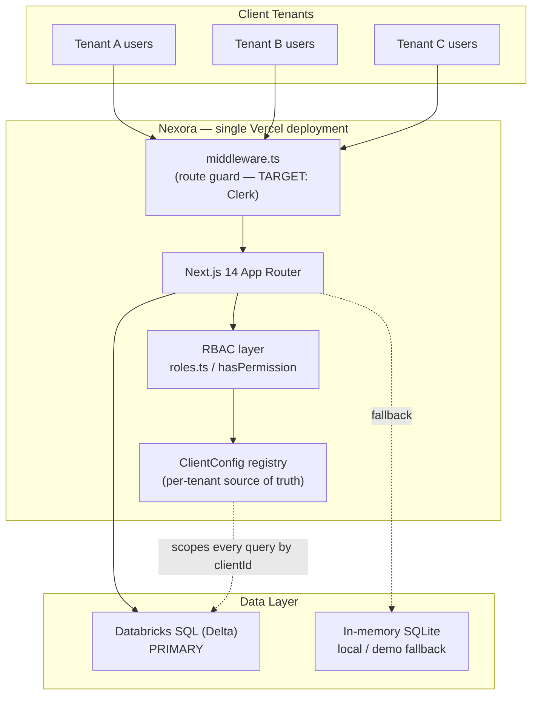
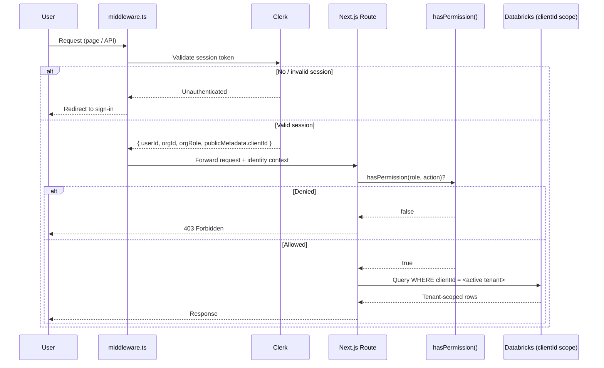
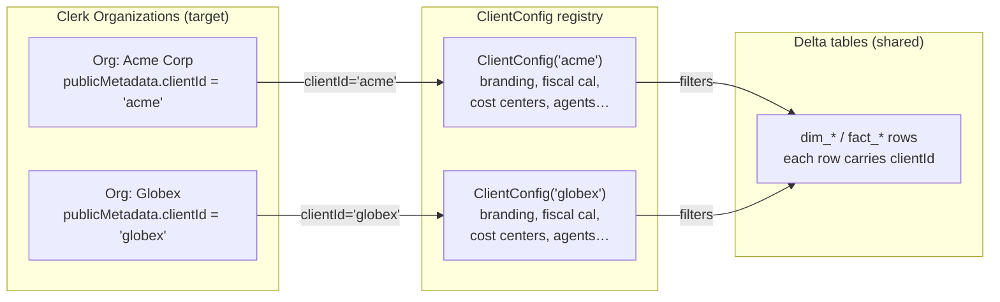
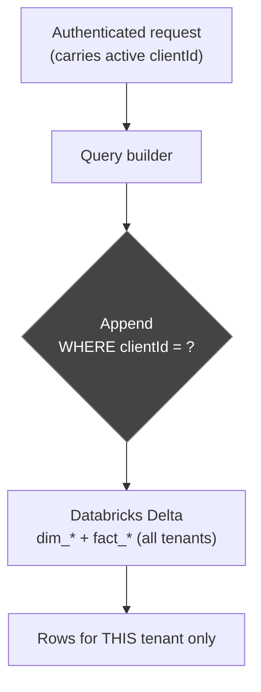
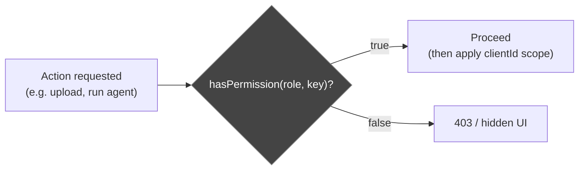
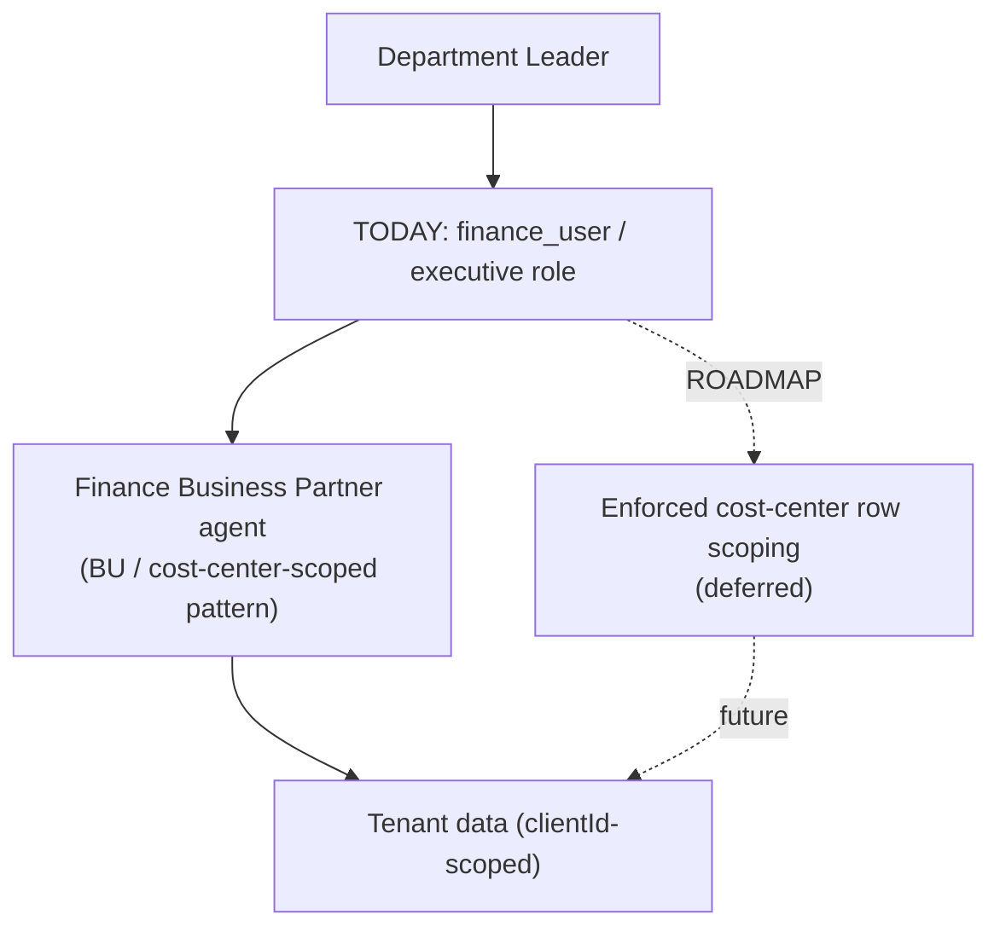
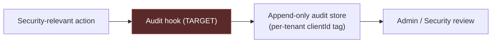
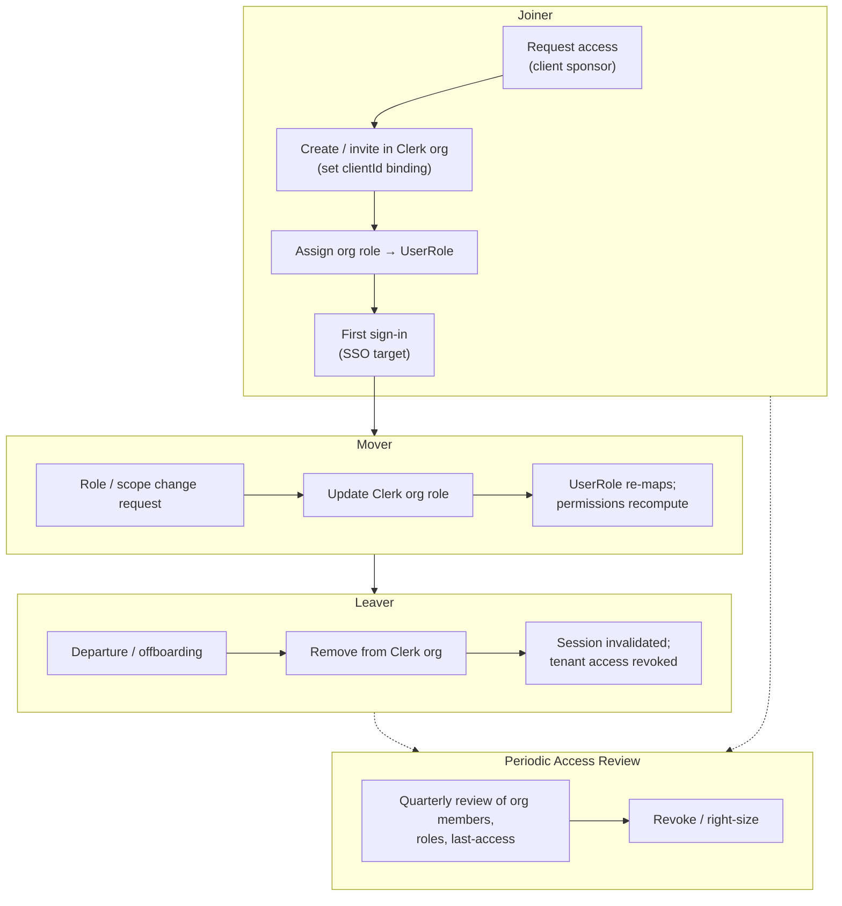

# Multi-Tenant Client Operating Model

**Finance Intelligence Platform (Nexora) — Sin City Analytics**

> Deliverable 7 of the 9-part client delivery framework. This document defines the operating model for authentication, tenant isolation, role-based access, user lifecycle, data governance, auditability, and security controls across the multi-tenant Nexora platform. It is a security-sensitive document: every claim is grounded in the platform canon, and **Implemented-today** capabilities are explicitly distinguished from **Target-state** design.

---

## Document Control

| Field | Value |
|---|---|
| Document | 07 — Multi-Tenant Client Operating Model |
| Version | 1.0 |
| Owner | Sin City Analytics — Platform / Security |
| Audience | Client IT / Security teams + Internal Platform team |
| Classification | Confidential — Security-Sensitive |
| Status | Active |
| Last Updated | 2026-06-13 |
| Related Documents | `02-implementation-playbook.md` (Phase 7 User Access & Security) · `03-client-onboarding-playbook.md` (User Provisioning, Security Review) · `04-solution-design-framework.md` (Recommended Security Model) · `09-sales-to-implementation-handoff.md` |

---

## Purpose

This document is the authoritative operating model for **how multiple client tenants safely share a single Nexora platform instance** and how users within each tenant are authenticated, authorized, governed, and managed across their lifecycle.

It serves three audiences:

1. **Client IT / Security** — to complete vendor security review, understand isolation guarantees and current gaps, and plan SSO / provisioning integration.
2. **Internal Platform / Security (Sin City Analytics)** — as the design-of-record for the auth, isolation, and access-control surfaces, including the deferred roadmap.
3. **Implementation teams** — as the reference behind Phase 7 of the implementation playbook and the security review in onboarding.

> **Maturity disclaimer.** Nexora is a Next.js 14 / TypeScript application deployed on Vercel, backed by Databricks SQL (Delta) with an in-memory SQLite fallback for local/demo. The data model and role/permission layers are implemented today. The **authentication layer (Clerk) is not yet installed** — a `middleware.ts` stub exists and the `/api/agent` route is currently public. Tenant isolation is **designed and partially implemented** (the `clientId` partition key is present on every record) but **row-level enforcement depends on the auth layer supplying the active tenant**, which is the central gap this document is honest about. Read every section's *Implemented vs Target* call-outs carefully.

---

## 1. Operating Model Overview

Nexora is a **single-instance, multi-tenant** platform. One deployment serves all client tenants. Tenant separation is **logical**, achieved through a `clientId` partition key carried on every dimension and fact record, combined with per-tenant configuration objects. There is no per-client code fork; **a new tenant is a new `ClientConfig`, with zero code changes**.

**Three control surfaces** enforce the operating model:

| Surface | Responsibility | Status |
|---|---|---|
| **Authentication** (Clerk, target) | Establish *who* the user is and *which tenant/org* they belong to | Target — stub today |
| **Authorization** (`roles.ts` + `hasPermission`) | Establish *what* the authenticated user may do | Implemented |
| **Tenant isolation** (`clientId` filtering) | Establish *which tenant's data* the request may touch | Partially implemented; enforcement depends on auth |

---

## 2. Authentication

### 2.1 Target design — Clerk

The target authentication provider is **Clerk** (`@clerk/nextjs`). Clerk is selected because its **Organizations** primitive maps cleanly to the tenant model, it handles session management natively, and it provides a roadmap to enterprise SSO/SAML without re-architecting the app.

Target authentication responsibilities:

| Capability | Clerk mechanism | Status |
|---|---|---|
| Sign-in / sign-up | Clerk hosted or embedded components | Target |
| Session management | Clerk session tokens (JWT), short-lived, auto-refresh | Target |
| Organization membership | Clerk Organizations = tenants | Target |
| Role assignment | Clerk org roles → Nexora `UserRole` | Target |
| Tenant binding | `clientId` in Clerk org `publicMetadata` | Target |
| Route protection | `middleware.ts` reads Clerk session, applies guards | Target |
| SSO / SAML | Clerk Enterprise Connections (per-org) | Roadmap |

### 2.2 Target authentication flow

### 2.3 Current state — honest assessment

> **IMPLEMENTED TODAY:** Clerk is **not yet installed**. A `middleware.ts` **stub** exists that simply forwards every request (`NextResponse.next()`); its matcher is configured for the routes that *would* be protected, but **no guard logic runs**. The `/api/agent` route is **currently public**. There is no session, no sign-in surface, and no enforced identity. Route guards are deferred.

The stub today (verbatim behavior): the middleware matches application and `/api/*` routes but returns `NextResponse.next()` unconditionally — a placeholder explicitly noting that `/api/ingest` and `/api/db/*` "would be protected once `@clerk/nextjs` is installed."

**Implication for clients:** in the current state, the platform must be operated in a trusted/controlled environment (e.g., demo, single-tenant pilot behind network controls). It is **not yet safe for untrusted multi-tenant production exposure** until the auth layer is wired. This is the headline item in the deferred roadmap (Section 12).

### 2.4 SSO / SAML readiness (roadmap)

SSO/SAML is a **roadmap** item delivered through Clerk **Enterprise Connections**, configured per Organization. Because tenants already map to Clerk Orgs, a client's IdP (Okta, Azure AD/Entra, Google Workspace) attaches to that client's org without affecting other tenants. No SSO is implemented today.

---

## 3. Organizations (Tenants)

### 3.1 Org = Tenant mapping

In the target design, **one Clerk Organization equals one Nexora tenant**. The platform's internal tenant identifier is **`clientId`**, and it is stored in the Clerk org's `publicMetadata`.

### 3.2 Org metadata contract

| Metadata | Location | Purpose | Status |
|---|---|---|---|
| `clientId` | Clerk org `publicMetadata` | Binds the org to a Nexora tenant partition + `ClientConfig` | Target |
| Org name / slug | Clerk org core | Human-readable tenant identity | Target |
| Org role per member | Clerk membership | Drives `UserRole` mapping (Section 5) | Target |

> **IMPLEMENTED TODAY:** The `clientId` partition key exists in the data model and `ClientConfig` exists as the per-tenant source of truth. The Clerk org wrapper around them is **target-state** — there are no Clerk Organizations yet.

### 3.3 ClientConfig as the tenant definition

`ClientConfig` is the **single source of truth** for a tenant and includes: `clientId`, branding, fiscal calendar, reporting periods, forecast cycles, business units, cost centers, departments, chart of accounts, active modules, and enabled agents. **Provisioning a new tenant = authoring a new `ClientConfig`** (plus, in target state, creating the Clerk org and linking `clientId`). No code changes are required.

---

## 4. Tenant Isolation

### 4.1 Model — `clientId` row-level filtering

Every dimension and fact entity in the schema carries a **`clientId`** column — the tenant partition key. Isolation is achieved by **filtering every query by the active tenant's `clientId`**. There is one logical store; tenants share tables but never share rows.

### 4.2 Isolation guarantees vs. current gaps

| Layer | Guarantee | Status |
|---|---|---|
| Schema partitioning | `clientId` present on all dim + fact entities | **Implemented** |
| Query scoping | Reads/writes filtered by active `clientId` | Implemented at the data-access layer **once the active tenant is supplied** |
| Active-tenant source | `clientId` derived from authenticated Clerk org | **Target** — depends on auth being wired |
| Cross-tenant request rejection | Reject requests whose target `clientId` ≠ session `clientId` | **Target** |

> **HONEST GAP:** Row-level isolation is only as strong as the source of the active `clientId`. Today there is **no enforced auth**, so the active tenant is not yet established by an identity layer. Until Clerk supplies and the middleware enforces the tenant binding, isolation is a **design + schema capability**, not a runtime guarantee against an untrusted caller. This must be disclosed in any security review.

### 4.3 Defense-in-depth (target)

Isolation should not rest on a single `WHERE` clause. The target posture layers controls:

1. **Identity layer** — middleware establishes `clientId` from the Clerk session; the request cannot self-assert a tenant.
2. **Application layer** — the data-access layer injects `clientId` into every query; a request for a foreign `clientId` is rejected (not silently widened).
3. **Authorization layer** — `hasPermission` gates the *action*, orthogonal to the tenant scope.
4. **Configuration layer** — `ClientConfig` constrains which modules/agents/cost centers a tenant even exposes.
5. **Data layer** — Databricks tokens scoped **read-only where possible**; least-privilege service credentials per environment.

---

## 5. Role-Based Access Control

### 5.1 Roles and the permission map

Four roles are **implemented today** in `src/lib/auth/roles.ts`. Authorization is a single gate: **`hasPermission(role, action)`**, which reads a static permission map. There are seven permission keys.

| Permission Key | `admin` | `finance_user` | `executive` | `read_only` |
|---|:---:|:---:|:---:|:---:|
| `canViewAllCostCenters` | ✅ | ✅ | ✅ | ❌ |
| `canUploadData` | ✅ | ✅ | ❌ | ❌ |
| `canRunAgents` | ✅ | ✅ | ✅ | ❌ |
| `canViewExecutiveReports` | ✅ | ✅ | ✅ | ❌ |
| `canManageConfig` | ✅ | ❌ | ❌ | ❌ |
| `canClearData` | ✅ | ❌ | ❌ | ❌ |
| `canViewValidationResults` | ✅ | ✅ | ❌ | ❌ |

> This table is drawn directly from the implemented `ROLE_PERMISSIONS` map. `hasPermission(role, action)` returns the mapped boolean (defaulting to `false`). `getRolePermissions(role)` returns the full permission set for a role.

### 5.2 Authorization gate flow

RBAC (the *action* gate) and tenant isolation (the *data scope* gate) are **independent and composed**: a `finance_user` in Tenant A who `canUploadData` may still only ever read/write rows where `clientId = 'A'`.

### 5.3 Mapping Clerk org roles → `UserRole` (target)

In target state, each Clerk Organization member has a Clerk **org role**; the middleware/app maps it to a Nexora `UserRole` before calling `hasPermission`.

| Clerk org role (example) | Nexora `UserRole` | Notes |
|---|---|---|
| `org:admin` | `admin` | Full tenant administration |
| `org:finance` | `finance_user` | Day-to-day finance operations |
| `org:executive` | `executive` | Read + analysis, no data mutation |
| `org:viewer` | `read_only` | View-restricted; no agents, no uploads |

> **Status:** The four `UserRole` values and the permission map are **implemented**. The Clerk-org-role → `UserRole` mapping is **target-state** and activates with Clerk.

---

## 6. Executive Users

**Role:** `executive`.

**Can do** (per the permission map):
- View all cost centers (`canViewAllCostCenters`).
- Run AI finance agents (`canRunAgents`) — e.g., CFO Advisor, FP&A Specialist.
- View executive reports (`canViewExecutiveReports`).

**Cannot do:**
- Upload data (`canUploadData` = ❌).
- Manage configuration (`canManageConfig` = ❌).
- Clear data (`canClearData` = ❌).
- View validation results (`canViewValidationResults` = ❌).

**Operating intent:** Executives consume **read-only dashboards and agent chat**. They get the analytical surface (ask the CFO Advisor a question, read the answer and reports) without any mutation, configuration, or data-quality administration capability. This matches Nexora's product goal of behaving like a finance analyst that answers questions directly.

---

## 7. Finance Users

**Role:** `finance_user`.

**Can do:**
- View all cost centers (`canViewAllCostCenters`).
- Upload data (`canUploadData`) — the ingestion path.
- Run AI finance agents (`canRunAgents`).
- View executive reports (`canViewExecutiveReports`).
- View validation results (`canViewValidationResults`).

**Cannot do:**
- Manage configuration (`canManageConfig` = ❌) — `ClientConfig` is admin-only.
- Clear data (`canClearData` = ❌) — destructive operations are admin-only.

**Operating intent:** The finance analyst persona. They drive the full operational loop — **ingest data, inspect validation outcomes, run agents, and read reports** — but cannot reconfigure the tenant or destroy data. The split of `canManageConfig` / `canClearData` to `admin` only is the key guardrail separating operators from administrators.

---

## 8. Department Leaders

There is **no distinct `department_leader` role** in the implemented role set. Department leaders are served through the **Finance Business Partner (FBP)** agent pattern and BU/cost-center scoping.

- The **Finance Business Partner** agent is **BU / cost-center-scoped** by design — it is the natural fit for a department leader who should see *their* unit's finances, not the whole company.
- Today, department leaders are provisioned as `finance_user` or `executive` (per their need to mutate or only read) and use the FBP agent.

> **ROADMAP:** True **cost-center-scoped access** — restricting a user to *only* their assigned cost centers in both data and agent context — is a **deferred enhancement**. The current permission model has a tenant-wide `canViewAllCostCenters` flag but **no sub-tenant (cost-center) row scoping**. Until delivered, department-leader confinement is a *product convention via the FBP agent*, not an enforced access boundary.

---

## 9. System Administrators

**Role:** `admin`. Holds **all seven permissions** (the only role with `canManageConfig`, `canClearData`).

| Administrative domain | Backed by permission | Examples |
|---|---|---|
| **Configuration management** | `canManageConfig` | Edit `ClientConfig`: branding, fiscal calendar, reporting periods, forecast cycles, business units, cost centers, departments, chart of accounts, active modules, enabled agents |
| **Data management** | `canUploadData`, `canClearData` | Upload/ingest data; clear/reset tenant data (`/api/db/clear`) |
| **Validation oversight** | `canViewValidationResults` | Review data-quality validator output |
| **Full analytical access** | `canRunAgents`, `canViewExecutiveReports`, `canViewAllCostCenters` | Operate every agent and report |
| **User administration** (target) | Clerk org admin | Invite/remove members, assign org roles → `UserRole` |

> **Status:** Config/data/validation admin capabilities are **implemented** via the permission map. **User administration** (invite, role assignment, removal) is **target-state**, delivered through Clerk org admin once installed.

---

## 10. Data Governance

### 10.1 ClientConfig as the control surface

`ClientConfig` is the governance backbone. It defines, per tenant, the **business structure** (BUs, cost centers, departments, chart of accounts), the **time structure** (fiscal calendar, reporting periods, forecast cycles), the **branding**, and the **enabled capability surface** (active modules, enabled agents). Governance changes flow through `ClientConfig` rather than code, which keeps the control surface auditable and per-tenant.

### 10.2 Validation governance

A validation layer (e.g., alignment and department validators under `src/lib/validation/validators/`) checks ingested data quality. The **Data Quality Advisor** agent surfaces these results. Access to validation output is permissioned (`canViewValidationResults`: admin + finance_user only), so data-quality posture is visible to operators and admins but not to executives or read-only users.

### 10.3 Data ownership, sensitivity, retention, change control

| Topic | Position | Status |
|---|---|---|
| **Data ownership** | The client owns its tenant data; Sin City Analytics is the processor/operator | Policy |
| **Sensitivity** | Confidential **financial** data | — |
| **PII** | **No PII in schema** — headcount uses **position IDs, not employee names** | Implemented (schema design) |
| **Secrets** | Only in environment files (`.env.local`, gitignored) — never in code or repo | Implemented |
| **Token scoping** | Databricks tokens scoped **read-only where possible** | Implemented (operational practice) |
| **Change control** | Config changes via `ClientConfig` (admin / `canManageConfig`); destructive ops gated by `canClearData` | Implemented (RBAC); audit trail is **roadmap** |
| **Retention** | Defined per client engagement; Delta tables are the system of record | Policy — formal per-tenant retention schedule is a roadmap artifact |

---

## 11. Auditability

### 11.1 Current gap

> **HONEST GAP:** There is **no audit log implemented today**. Uploads, configuration changes, data-clear operations, and access events are not yet recorded to a durable, queryable audit trail. This is on the deferred security roadmap and should be disclosed in client security review.

### 11.2 Target — what should be logged

The target audit model captures **who did what, to which tenant, when, and from where**, for the security-relevant operations:

| Event class | Trigger | Fields (target) |
|---|---|---|
| **Data upload / ingestion** | `canUploadData` actions | userId, clientId, dataset, row counts, timestamp, source |
| **Configuration change** | `canManageConfig` edits to `ClientConfig` | userId, clientId, config keys changed, before/after, timestamp |
| **Data clear / destructive** | `canClearData` (`/api/db/clear`) | userId, clientId, scope cleared, timestamp |
| **Access / authn events** | Sign-in, sign-out, role change, denied (403) | userId, orgId/clientId, role, route, result, timestamp, IP |
| **Agent runs** (optional, target) | `canRunAgents` | userId, clientId, agent, prompt metadata, timestamp |

---

## 12. Security Controls

### 12.1 Implemented controls

| Control | Detail | Status |
|---|---|---|
| **Secrets management** | Secrets only in env (`.env.local`, gitignored); never committed | Implemented |
| **Token scoping** | Databricks tokens scoped **read-only where possible** | Implemented |
| **No PII** | Schema avoids PII (position IDs, not names) | Implemented |
| **Least privilege (RBAC)** | `hasPermission` gate; only `admin` holds config/clear rights | Implemented |
| **Tenant partitioning** | `clientId` on every dim + fact record | Implemented |
| **Agent guardrails** | All seven finance agents are guardrailed | Implemented |
| **Transport** | HTTPS/TLS via Vercel platform | Implemented (platform) |
| **Environment separation** | Local/demo (SQLite) vs. production (Databricks) data stores | Implemented |

### 12.2 Deferred / roadmap controls

| Roadmap control | Why it matters | Priority |
|---|---|---|
| **Route guards on all pages** | `/api/agent` is public today; middleware is a stub | **Critical** |
| **Auth layer (Clerk) installation** | Establishes identity + active tenant — prerequisite for runtime isolation | **Critical** |
| **Cost-center-scoped access** (Finance BPs) | Confine department leaders to their units | High |
| **Audit log** (upload & config changes, access) | Forensics, compliance, change accountability | High |
| **Session timeout & token refresh** | Limit session lifetime; reduce stolen-session window | High |

> The first two roadmap items are **prerequisites for safe untrusted multi-tenant production**. Sections 2.3 and 4.2 explain why.

---

## 13. User Lifecycle Management (Joiner / Mover / Leaver)

The lifecycle is operated **per tenant** through the (target) Clerk org membership model, with role mapping into `UserRole` and `hasPermission`.

| Phase | Action | Mechanism (target) | Status |
|---|---|---|---|
| **Joiner** | Provision user, bind tenant, assign role | Clerk org invite + `publicMetadata.clientId` + org role → `UserRole` | Target (process exists in onboarding; auth tooling pending) |
| **Mover** | Role or scope change | Update Clerk org role → re-maps `UserRole` → `hasPermission` recomputes | Target |
| **Leaver** | Deprovision, revoke sessions | Remove from Clerk org; session invalidation | Target |
| **Periodic review** | Recertify membership, roles, access | Scheduled review of Clerk org members + (target) access audit | Roadmap |

> **Status:** Lifecycle *policy* is defined here and in `03-client-onboarding-playbook.md`. The *tooling* (Clerk org management, session invalidation, access-review reporting) is **target-state**; today, with no auth installed, lifecycle is a manual, environment-controlled process.

---

## 14. Implemented vs. Target-State Summary

| Capability | Implemented Today | Target-State |
|---|:---:|:---:|
| `clientId` partition key on all dim + fact records | ✅ | ✅ |
| `ClientConfig` per-tenant source of truth | ✅ | ✅ |
| Four roles + 7-key permission map (`roles.ts`) | ✅ | ✅ |
| `hasPermission(role, action)` gate | ✅ | ✅ |
| Seven guardrailed finance agents | ✅ | ✅ |
| No-PII schema (position IDs) | ✅ | ✅ |
| Secrets in env only; read-only Databricks tokens | ✅ | ✅ |
| Query scoping by active `clientId` | ⚠️ Depends on auth supplying tenant | ✅ Enforced |
| Authentication (Clerk) | ❌ Not installed (`middleware.ts` stub) | ✅ Clerk Orgs = tenants |
| Route guards (incl. `/api/agent`) | ❌ `/api/agent` public | ✅ Guarded |
| Clerk org role → `UserRole` mapping | ❌ | ✅ |
| SSO / SAML | ❌ | ✅ (Clerk Enterprise Connections) |
| Cost-center-scoped access (Finance BP) | ❌ Convention via FBP agent | ✅ Enforced row scoping |
| Audit log (upload / config / access) | ❌ | ✅ |
| Session timeout & token refresh | ❌ | ✅ |

Legend: ✅ available · ⚠️ partial / conditional · ❌ not yet.

---

## 15. Shared Responsibility Model

Security of the multi-tenant platform is **shared** between Sin City Analytics (platform operator) and the client tenant.

| Domain | Sin City Analytics (Platform) | Client Tenant |
|---|---|---|
| **Platform & hosting** | Operate Next.js/Vercel deployment, TLS, environment separation | — |
| **Authentication infra** | Install/operate Clerk (target); configure orgs; maintain middleware guards | Provide IdP details for SSO/SAML (target); enforce own IdP MFA |
| **Tenant provisioning** | Author `ClientConfig`; create + bind Clerk org (`clientId`) | Identify authorized users; approve access requests |
| **User lifecycle** | Provide org-management tooling; invalidate sessions on removal | Initiate joiner/mover/leaver requests; conduct periodic access reviews |
| **Authorization** | Maintain role/permission map; map org roles → `UserRole` | Assign appropriate org role to each user |
| **Tenant isolation** | Enforce `clientId` scoping & cross-tenant rejection; defense-in-depth | Avoid sharing credentials; report anomalies |
| **Data content & sensitivity** | Provide no-PII schema; scope tokens read-only; secret hygiene | Own data accuracy; avoid loading PII; classify sensitivity |
| **Data quality / governance** | Provide validators + Data Quality Advisor; `ClientConfig` control surface | Review validation results; govern source data; set retention needs |
| **Auditability** | Deliver audit log (roadmap); retain logs | Review audit output; recertify access |
| **Incident response** | Detect, contain, notify per agreement | Provide tenant contacts; participate in response |

---

## 16. Cross-References

- **`02-implementation-playbook.md`** — Phase 7 (User Access & Security) operationalizes Sections 2–9 and 13.
- **`03-client-onboarding-playbook.md`** — User Provisioning and Security Review execute the lifecycle (Section 13) and shared-responsibility (Section 15) intake.
- **`04-solution-design-framework.md`** — Recommended Security Model is the design rationale behind Sections 4, 5, and 12.
- **`09-sales-to-implementation-handoff.md`** — carries the Implemented-vs-Target posture (Section 14) into delivery.

---

*End of Deliverable 7 — Multi-Tenant Client Operating Model. Classification: Confidential — Security-Sensitive.*
