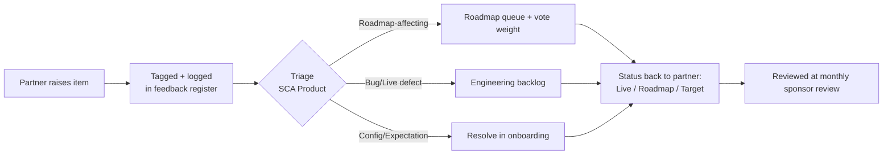

# Design Partner Program

**Deliverable 8 of the Sin City Analytics 9-Part Operational Delivery Framework**
**Product:** Finance Intelligence Platform (codename **Nexora**) — reporting that behaves like a finance analyst, not a report generator.

> A design partner is not a discounted customer. A design partner is a co-author of the product. This document defines who we invite, what we promise, what we ask in return, and how a partnership converts into a referenceable, paying customer — grounded entirely in what Nexora can do **today** versus what is **on the roadmap**.

---

## Document Control

| Field | Value |
|---|---|
| **Document** | 08 — Design Partner Program |
| **Version** | 1.0 |
| **Owner** | Sin City Analytics — Founder / GTM |
| **Audience** | Prospective Design Partners (external) + Internal GTM, Delivery, Product |
| **Classification** | Confidential — Commercial |
| **Last Updated** | 2026-06-13 |
| **Status** | Active |
| **Related Documents** | `01-financial-intelligence-assessment-framework.md` · `02-implementation-playbook.md` · `03-client-onboarding-playbook.md` · `04-solution-design-framework.md` · `05-proposal-template.md` · `06-pricing-framework.md` · `07-multi-tenant-client-operating-model.md` · `09-sales-to-implementation-handoff.md` |

---

## Purpose

This document is the **operating charter for the Nexora Design Partner Program** — the cohort of early finance organizations that adopt the Finance Intelligence Platform before general availability in exchange for influence over the roadmap, preferential commercial terms, and white-glove delivery.

It exists to do four things precisely:

1. **Define who we want.** A design partner is selected, not accepted. Section 2 is a qualification gate, not a marketing funnel.
2. **Make the exchange explicit and fair.** Partners give us access, feedback, and reference rights; we give them influence, price protection, and a senior delivery team. Sections 3–5 state both sides of the ledger so nobody is surprised.
3. **Hold both parties to commitments.** A design partnership that produces no usable product feedback and no reference is a failed engagement for both sides. Sections 6–8 instrument the relationship.
4. **Convert.** The program is a path to a paying, referenceable customer — not an indefinite free tier. Section 10 defines the conversion mechanics and ties them to `06-pricing-framework.md`.

The program's north star is identical to the product's: every partner must reach a state where a finance leader asks a real question and Nexora returns **Question → Intent Detection → Relevant Data Retrieval → AI (Claude) Analysis → Direct Answer** — grounded, cited, and trustworthy. A partnership is working when the partner trusts the answer enough to stake a decision on it.

### Honesty Principle (read before promising anything)

Every benefit, expectation, and demo in this program is bound to the same maturity discipline used in `07-multi-tenant-client-operating-model.md`. We distinguish three states and we never blur them in front of a partner:

| State | Meaning | Examples (canonical) |
|---|---|---|
| **Live today** | Working in production and demonstrable now | CSV/Excel upload ingestion, Databricks SQL (Delta) primary store, in-memory SQLite fallback, the 7 AI finance agents under `BASE_GUARDRAILS`, the 8 validators, ClientConfig-driven tenancy, all 10 modules' analytical surfaces |
| **Roadmap (staged stub)** | Designed, registered, partially scaffolded; not live | Connectors: QuickBooks Online, NetSuite, Workday HCM, Beeline/Fieldglass (VMS), Coupa, Workday Adaptive Planning |
| **Target-state** | Designed, not yet installed | Clerk authentication (Orgs = tenants), middleware route guards (today a stub; `/api/agent` is currently public) |

Design partners are explicitly told which state every capability is in. This is itself a benefit — partners influence what moves from Roadmap to Live.

---

## 1. Program Purpose

### 1.1 Why a design partner program exists

Nexora is making a deliberate category move: from **financial reporting** (generate a report, populate a template) to **decision intelligence** (ask a question, get a grounded, cited answer). That move cannot be validated in a lab. It is validated only when real finance teams point real questions at their own messy data and tell us where the answer was trusted, where it was hedged, and where it was wrong.

The Design Partner Program is how Sin City Analytics buys that validation — with influence and economics instead of cash discounting alone.

### 1.2 Strategic objectives

| # | Objective | How the program delivers it |
|---|---|---|
| O1 | **Validate the question-answering pipeline** on real, heterogeneous finance data — not synthetic seeds | Partners ingest their own actuals/budget/forecast/headcount/vendor data via CSV/Excel and run the 7 agents against it |
| O2 | **Prioritize the connector roadmap with evidence** | Partner source systems (QuickBooks/NetSuite/Workday/VMS/Coupa/Adaptive) directly rank connector build order |
| O3 | **Harden validation & governance** against real-world data quality | Partner data exercises all 8 validators; quarantine/warning behavior is tuned to real error distributions |
| O4 | **Produce 3–5 referenceable logos and quantified outcomes** | Reference rights and case-study commitments are written into the MOU (Section 9) |
| O5 | **De-risk pricing and packaging** ahead of GA | Partner usage informs `06-pricing-framework.md` module/agent/seat tiering |
| O6 | **Establish the multi-tenant operating model under load** | Multiple concurrent partner tenants stress ClientConfig isolation per `07-...operating-model.md` |

### 1.3 What this program is **not**

- Not an open beta. Cohort size is capped (Section 2.4).
- Not a free-forever tier. It is time-boxed with a defined conversion gate (Section 10).
- Not a custom-software shop. Partners influence the roadmap; they do not commission private forks. Tenancy is delivered through **ClientConfig with zero code changes** (per platform canon), not bespoke builds.
- Not a license to bypass the guardrails. The agents still enforce `BASE_GUARDRAILS` for every partner: never fabricate or extrapolate numbers, distinguish fact from interpretation, cite the source/metric for every claim, flag missing or low-confidence data before concluding, recommend follow-ups on gaps, and escalate to human review.

---

## 2. Ideal Participant Profile

A design partner is qualified along four axes: **organizational fit, data readiness, sponsorship, and motivation**. We aim for partners who are strong on at least three and acceptable on the fourth.

### 2.1 Organizational fit

| Attribute | Ideal | Acceptable | Disqualifying |
|---|---|---|---|
| **Company size** | 200–2,000 FTE; finance team of 5–40 | 50–5,000 FTE | Pre-revenue startup with no formal finance function |
| **Finance maturity** | Has a budgeting cycle, monthly close, and at least an annual forecast | Has budget + actuals, forecast ad hoc | No budget; cash-basis only |
| **Pain alignment** | Spends days assembling variance/forecast narratives manually | Reporting is slow but tolerable | No reporting pain at all |
| **Source systems** | Runs one or more of our roadmap connector targets (QuickBooks/NetSuite/Workday/VMS/Coupa/Adaptive) | Exports clean CSV/Excel from any ERP | Data locked in a system that cannot export tabular files |
| **Decision culture** | Wants analyst-grade answers, open to AI in finance | Curious but cautious | Categorically prohibits AI on financial data |

### 2.2 Data readiness

Because the **live ingestion path today is CSV/Excel upload + Databricks SQL** (connectors are staged stubs on the roadmap), data readiness is gated on the partner's ability to **export tabular files** that map to the Nexora data model:

- Dimensions: **Account** (chart of accounts), **CostCenter**, **Department**, **BusinessUnit**, **TimePeriod**.
- Facts: **ActualEntry**, **BudgetEntry**, **ForecastEntry**, **HeadcountRecord**, **ExternalLaborRecord**, **VendorSpendRecord**, **KPIRecord**.
- Every record must be reducible to a tenant key (`clientId`), an ISO month `period` (e.g. `2026-01`), a `source` (`upload|seed|connector`), and a `validationStatus`.

A partner that can produce a clean trial balance, a budget extract, and a headcount roster as CSV is ready. A partner that cannot get data out of its ERP at all is not — yet.

### 2.3 Sponsorship & motivation

- **Executive sponsor:** a CFO, VP Finance, or Head of FP&A who will personally use the platform and lend their name to a reference. No sponsor, no partnership.
- **Operational owner:** a finance manager/analyst who will do the data work and attend feedback sessions.
- **Motivation:** the partner wants to *shape* the product, not merely consume it. The best partners arrive with a list of questions they wish their current tools could answer.

### 2.4 Cohort design

| Parameter | Target |
|---|---|
| Cohort size | 5–8 partners (hard cap to protect delivery quality) |
| Segment mix | At least 3 distinct industries; at least 2 distinct ERPs to spread connector evidence |
| Module coverage | Collectively exercise **all 10 modules** and **all 7 agents** across the cohort |
| Engagement length | 90 days core program + 30-day conversion window (Section 10) |
| Concurrency | Staggered starts (max 2 new partners per fortnight) so Delivery is never overloaded |

### 2.5 Ideal-partner scorecard (internal qualification tool)

Score each axis 1–5; a total ≥ 16/25 with no axis below 2 qualifies for an intro call.

| Axis | Weight | Score (1–5) | Notes |
|---|---|---|---|
| Organizational fit | ×1 | [SCORE] | [NOTES] |
| Data readiness (CSV/Excel exportable) | ×1 | [SCORE] | [NOTES] |
| Executive sponsorship | ×1 | [SCORE] | [NOTES] |
| Motivation to co-build | ×1 | [SCORE] | [NOTES] |
| Reference willingness | ×1 | [SCORE] | [NOTES] |
| **Total** | | **[/25]** | Threshold ≥ 16 |

---

## 3. Benefits to Design Partners

Stated plainly, and bound to the Honesty Principle (Section 0/Purpose) so no benefit overstates the platform.

### 3.1 Product influence (the headline benefit)

- **Connector roadmap priority.** A partner's source system moves up the build queue. The staged-stub connectors — QuickBooks Online, NetSuite, Workday HCM, Beeline/Fieldglass (VMS), Coupa, Workday Adaptive Planning — are sequenced by **partner demand**, with design-partner systems first in line. Partners see the ranked queue and vote on it.
- **Agent behavior shaping.** Partners directly influence how the 7 agents (CFO Advisor, FP&A Specialist, Procurement Advisor, Workforce Finance, External Labor Advisor, Finance Business Partner, Data Quality Advisor) phrase analysis, what follow-ups they suggest, and where the `BASE_GUARDRAILS` thresholds (e.g., the anomaly validator's Z>3 outlier flag, the alignment validator's variance threshold) sit for their data.
- **Module prioritization.** Across forecasting (rolling 3+9, 6+6, 9+3), variance analysis, annual budget, executive commentary, workforce/headcount, vendor spend, external labor / contractor SOW tracking, and cloud spend — partners say which surfaces matter most and we build there first.
- **Named feature credit.** Where appropriate, partner-requested capabilities are credited to the partner in release notes (with consent).

### 3.2 Commercial benefits (tie to `06-pricing-framework.md`)

| Benefit | Term |
|---|---|
| **Design-partner pricing** | Per `06-pricing-framework.md` design-partner tier — see Section 10.4 for the price-lock mechanics |
| **Founding-customer rate lock** | Locked rate for **[LOCK_TERM, e.g. 24 months]** post-conversion |
| **Waived setup/onboarding fee** | Implementation per `02-implementation-playbook.md` delivered at no professional-services charge during the program |
| **Module/agent expansion at locked rate** | New modules/agents activated via ClientConfig at the locked per-unit price during the term |

> All commercial figures are placeholders here by design; the authoritative numbers live in `06-pricing-framework.md`. This document defines the **structure** of the discount, not the dollar amounts.

### 3.3 Delivery & access benefits

- **Senior, hands-on delivery.** Founder/GTM and a Solutions Architect run the engagement personally, following `03-client-onboarding-playbook.md` choreography on an accelerated cadence.
- **Direct line to product.** A shared channel with product/engineering; partner issues are triaged within **[SLA_HOURS]**.
- **Early access** to capabilities as they cross from Roadmap → Live, ahead of GA.
- **Data ownership and portability.** Partner data is theirs; it carries `clientId` isolation per `07-...operating-model.md`, and is exportable on exit.

### 3.4 Strategic & reputational benefits

- **Thought leadership.** Co-authored case study and optional conference/webinar co-presentation positioning the partner as a finance-innovation leader.
- **Peer network.** Optional partner roundtables across the cohort (under mutual NDA) to share finance-AI practices.

---

## 4. Benefits to Sin City Analytics

The program is a two-sided exchange; we state our side honestly so the relationship is balanced.

| # | Benefit to Sin City Analytics | Evidence it produces |
|---|---|---|
| B1 | **Real-data validation** of the question→answer pipeline | Logged agent transactions on heterogeneous partner data |
| B2 | **Evidence-ranked connector roadmap** | Demand signal from real partner ERPs/VMS/planning tools |
| B3 | **Validator hardening** against real error distributions | Quarantine/warning rates tuned from the 8 validators on live data |
| B4 | **3–5 referenceable logos + quantified outcomes** | Case studies, reference calls, logo rights (per MOU) |
| B5 | **Pricing & packaging signal** for GA | Module/agent/seat usage feeding `06-pricing-framework.md` |
| B6 | **Operating-model proof under multi-tenant load** | Concurrent tenants exercising ClientConfig isolation |
| B7 | **Recurring revenue pipeline** | Conversion to paying customers (Section 10) |

A partnership that yields no usable feedback **and** no reference is, by our own definition, a failed engagement — we will say so internally and either reset expectations or exit gracefully (Section 10.5).

---

## 5. Implementation Expectations

Expectations are mutual. This section is the spine of the MOU (Section 9) and maps to the onboarding choreography in `03-client-onboarding-playbook.md` and the methodology in `02-implementation-playbook.md`.

### 5.1 Mapping to the canonical 10 phases (accelerated)

| Phase | Canonical name | Design-partner expectation | Owner |
|---|---|---|---|
| 1 | Discovery & Assessment | Partner shares finance pain + question list; we run `01-...assessment-framework.md` | SCA SA + Partner sponsor |
| 2 | Data Assessment & Architecture | Partner produces CSV/Excel extracts mapped to the data model | Partner ops owner + SCA DE |
| 3 | Connection Layer & Integration | **Live = CSV/Excel + Databricks SQL.** Roadmap connectors discussed, not promised | SCA DE |
| 4 | Data Validation & Governance | All 8 validators run; quarantine/warnings reviewed jointly | SCA DE + Partner |
| 5 | Finance Intelligence Configuration | Author partner **ClientConfig** (modules, agents, fiscal year, currency, cost centers, COA) | SCA SA |
| 6 | Dashboard & Executive Experience Setup | Configure executive reporting/commentary surfaces | SCA SA |
| 7 | User Access & Security | Roles assigned (admin/finance_user/executive/read_only); **note Clerk is Target-state**, isolation is `clientId`-based per `07-...` | SCA Platform + Partner IT |
| 8 | Training & Adoption | Partner team trained on question-asking flow + agents | SCA CS |
| 9 | Go Live | Partner runs real questions in production | Partner + SCA |
| 10 | Optimization & Expansion | Feedback loop, module/agent expansion, conversion | Both |

### 5.2 Partner commitments (what we require)

- **Data:** deliver agreed CSV/Excel extracts by **[DATA_DUE_DATE]**, refreshed monthly for the program duration.
- **People:** executive sponsor available for **[N]** check-ins; operational owner available **[HOURS/WEEK]**.
- **Feedback:** attend the structured feedback sessions in Section 6 (≥ **[X]%** attendance).
- **Usage:** run a minimum of **[Q]** real finance questions/month against the 7 agents.
- **Reference:** agree to at least one reference call and one case study upon successful outcome (per MOU).
- **Confidentiality:** mutual NDA; partner does not publicly disparage pre-GA gaps that were disclosed under the Honesty Principle.

### 5.3 Sin City Analytics commitments (what we provide)

- **Delivery:** accelerated `03-...onboarding-playbook.md` cadence, senior team, waived PS fee.
- **Responsiveness:** issue triage within **[SLA_HOURS]**; roadmap status transparency (Live/Roadmap/Target).
- **Security posture:** honest disclosure of the current state per `07-...operating-model.md` — `clientId` row-level isolation present; **Clerk auth is Target-state and `/api/agent` is currently public**; partner data segregated by tenant; secrets in env only; Databricks tokens read-only where possible. No production partner data is used outside the partner's tenant.
- **Economics:** design-partner pricing and rate lock per `06-pricing-framework.md`.

### 5.4 Data & security guardrails (non-negotiable)

Because partner data is **confidential financial data**, the following hold for the entire program:

- No PII in the schema by design (position IDs, not names) — partners must extract accordingly.
- Tenant isolation via `clientId` on every record; no cross-tenant reads.
- Agents enforce `BASE_GUARDRAILS` on every answer; **no fabricated or extrapolated numbers**, ever.
- Errors block storage (quarantine); warnings allow storage with review — partners see and approve this.
- Current auth gap (`middleware.ts` stub, public `/api/agent`) is disclosed up front; partners accept the pre-GA posture in the MOU and we agree compensating controls (e.g., restricted access, non-production-critical data) for the program window.

---

## 6. Feedback Process

Feedback is the product of this program. It is structured, logged, and routed — not collected ad hoc.

### 6.1 Cadence

| Ritual | Frequency | Participants | Output |
|---|---|---|---|
| **Onboarding retro** | Once, end of week 2 | SCA SA/CS + Partner owner | Data-readiness & setup friction log |
| **Weekly working session** | Weekly (30 min) | SCA SA + Partner owner | Question/answer review; agent behavior notes |
| **Monthly sponsor review** | Monthly (45 min) | SCA Founder + Partner sponsor | Outcome check, roadmap voting, NPS |
| **Mid-program checkpoint** | Day 45 | Full both-side teams | Go/adjust decision; conversion preview |
| **Conversion review** | Day 90 | SCA Founder/GTM + Partner sponsor | Conversion decision (Section 10) |

### 6.2 Feedback channels & taxonomy

All feedback is tagged so product can prioritize:

| Tag | Meaning | Example |
|---|---|---|
| `pipeline` | Question→answer quality | "FP&A agent hedged when the data was actually present" |
| `agent` | Specific agent behavior | "Procurement Advisor should cite vendor record date" |
| `validator` | Data quality / governance | "Anomaly validator over-flagged legitimate one-time accruals" |
| `connector` | Roadmap connector demand | "We need NetSuite live to avoid monthly CSV pulls" |
| `module` | Module functionality | "Need 6+6 rolling forecast cycle, not just 3+9" |
| `config` | ClientConfig / onboarding | "Fiscal year start handling for non-calendar FY" |
| `security` | Access/isolation/auth | "Need SSO before we expand seats" (→ Clerk Target-state) |
| `ux` | Experience | "Executive commentary needs a tighter summary" |

### 6.3 Feedback lifecycle



### 6.4 Feedback log template

| Date | Partner | Tag | Item | Severity (1–4) | Affected module/agent/validator | Disposition | Status (Open/Triaged/Shipped) |
|---|---|---|---|---|---|---|---|
| [DATE] | [PARTNER] | [TAG] | [ITEM] | [SEV] | [TARGET] | [DISPOSITION] | [STATUS] |

---

## 7. Success Metrics

The program is instrumented for both the partner's outcome and Sin City Analytics' learning. Metrics are reviewed at every monthly sponsor review and finalized at the Day-90 conversion review.

### 7.1 Partner-outcome metrics

| Metric | Definition | Target |
|---|---|---|
| **Time-to-first-trusted-answer** | Days from kickoff to the partner staking a real decision on a Nexora answer | ≤ 30 days |
| **Question volume** | Real finance questions/month run against the 7 agents | ≥ [Q]/month |
| **Answer trust rate** | % of agent answers the partner rates as decision-ready (no rework) | ≥ 70% by Day 90 |
| **Cycle-time reduction** | Reduction in time to produce variance/forecast narrative vs. baseline | ≥ [TARGET]% |
| **Module adoption** | # of the 10 modules actively used | ≥ [N] |
| **Sponsor NPS** | Monthly sponsor satisfaction | ≥ [NPS] |

### 7.2 Program-learning metrics (Sin City Analytics)

| Metric | Definition | Target |
|---|---|---|
| **Validator signal quality** | Quarantine vs. warning vs. clean rates across the 8 validators; false-positive rate on anomaly/alignment | Trend to < [X]% false positives |
| **Connector demand index** | Weighted votes per roadmap connector | Produce a ranked GA build order |
| **Pipeline defect rate** | Answers flagged by partners as ungrounded/hedged-when-data-present | ↓ each month |
| **Reference yield** | # of referenceable partners / cohort | ≥ 3 of cohort |
| **Conversion rate** | Partners converting to paid / cohort | ≥ [CONV_TARGET]% |

### 7.3 Cohort scorecard (rolled up at Day 90)

| Partner | Trusted-answer (d) | Trust rate | Modules used | Sponsor NPS | Reference? | Convert? |
|---|---|---|---|---|---|---|
| [PARTNER A] | [d] | [%] | [n/10] | [nps] | [Y/N] | [Y/N] |
| [PARTNER B] | [d] | [%] | [n/10] | [nps] | [Y/N] | [Y/N] |

---

## 8. Conversion Path to Paying Customer

(Overview here; mechanics in Section 10.)

A design partnership is explicitly a **funnel to a paying, referenceable customer**. The conversion is earned through demonstrated value, not assumed. The path:

```text
Qualified (Sec 2) → Onboarded (Phases 1–9, accelerated) → Value Proven (Sec 7 targets)
   → Day-45 Checkpoint (go/adjust) → Day-90 Conversion Review → Paid Customer (locked rate)
   → Reference + Case Study → Expansion (modules/agents/seats via ClientConfig)
```

The conversion conversation is not a surprise: it is previewed at the Day-45 checkpoint and decided at Day 90, against the partner-outcome metrics in Section 7.1 and the commercial terms in `06-pricing-framework.md`.

---

## 9. Design-Partner Agreement / MOU Outline

> A lightweight Memorandum of Understanding, not a master agreement. It is intentionally short, mutual, and honest about pre-GA state. Legal review required before execution. All bracketed terms are placeholders.

### 9.1 MOU structure

```text
MEMORANDUM OF UNDERSTANDING — NEXORA DESIGN PARTNER PROGRAM

1. PARTIES
   - Sin City Analytics, Inc. ("SCA"), and
   - [PARTNER LEGAL NAME] ("Partner"), tenant clientId: [CLIENT_ID]

2. PURPOSE
   - Partner adopts the Finance Intelligence Platform (Nexora) pre-GA to co-develop
     the product in exchange for design-partner terms.

3. TERM
   - Effective [START_DATE]; core program [90] days; conversion window [30] days.
   - Either party may exit per Section 11 (Exit) on [NOTICE_DAYS] notice.

4. SCOPE OF ACCESS (LIVE TODAY)
   - Modules: [financial_reporting | forecast | actuals | budget | executive_reporting
     | headcount | vendors | external_labor | cloud_spend | agents]
   - Agents (BASE_GUARDRAILS enforced): [CFO | FP&A | Procurement | Workforce Finance
     | External Labor | Finance Business Partner | Data Quality]
   - Ingestion: CSV/Excel upload + Databricks SQL (Delta). 
   - Roadmap connectors [QuickBooks | NetSuite | Workday HCM | VMS | Coupa | Adaptive]
     are STAGED STUBS — discussed, prioritized, NOT warranted as live.

5. PRE-GA DISCLOSURES (HONESTY PRINCIPLE)
   - Authentication (Clerk) is Target-state, NOT installed; middleware is a stub;
     /api/agent is currently public. Compensating controls for the program window:
     [CONTROLS, e.g. restricted user list, non-critical data set].
   - Tenant isolation via clientId is present; row-level enforcement depends on the
     forthcoming auth layer (per 07-multi-tenant-client-operating-model.md).
   - Confidential financial data; no PII in schema; secrets in env only.

6. PARTNER COMMITMENTS
   - Data extracts by [DATA_DUE_DATE], refreshed monthly.
   - Sponsor + operational owner availability ([HOURS]).
   - Feedback session attendance ≥ [X]%; ≥ [Q] real questions/month.
   - At least [1] reference call and [1] case study on successful outcome.
   - Mutual confidentiality; no public disparagement of disclosed pre-GA gaps.

7. SCA COMMITMENTS
   - Accelerated onboarding (per 02/03), senior delivery, waived PS fee.
   - Issue triage within [SLA_HOURS]; roadmap status transparency.
   - Design-partner pricing + rate lock per 06-pricing-framework.md.
   - Data ownership remains Partner's; export on exit.

8. COMMERCIAL TERMS
   - Program fee: [PROGRAM_FEE or $0].
   - Post-conversion rate: [RATE] locked for [LOCK_TERM] (per 06-...).
   - Expansion pricing: [PER_UNIT] for added modules/agents/seats during term.

9. INTELLECTUAL PROPERTY & FEEDBACK
   - SCA owns the platform and all improvements.
   - Partner grants SCA a perpetual, royalty-free license to use feedback.
   - Partner data remains Partner's; SCA processes it solely to provide the service.

10. PUBLICITY & REFERENCE
   - Logo + case-study rights granted on [MILESTONE], subject to Partner approval
     of quotes and figures.

11. EXIT
   - Either party may exit on [NOTICE_DAYS]; Partner data exported and deleted on
     request within [DELETE_DAYS].

12. SIGNATURES
   - SCA: [NAME, TITLE] ____________  Date: ______
   - Partner: [NAME, TITLE] ________  Date: ______
```

### 9.2 MOU term sheet (quick-reference)

| Term | Placeholder |
|---|---|
| Program length | [90] days + [30] conversion |
| Program fee | [PROGRAM_FEE or $0] |
| Post-conversion rate | [RATE], locked [LOCK_TERM] |
| Min. questions/month | [Q] |
| Feedback attendance | ≥ [X]% |
| Reference obligation | [1] call + [1] case study |
| Triage SLA | [SLA_HOURS] |
| Data deletion on exit | [DELETE_DAYS] |

---

## 10. Conversion Mechanics & Commercials

### 10.1 Conversion gate (Day-90 review)

A partner converts when **all** of the following hold, evaluated against Section 7.1:

- Time-to-first-trusted-answer achieved (≤ 30 days), AND
- Answer trust rate ≥ 70%, AND
- ≥ [N] modules in active use, AND
- Sponsor NPS ≥ [NPS], AND
- Reference + case study agreed.

### 10.2 Conversion outcomes

| Outcome | Trigger | Action |
|---|---|---|
| **Convert** | Gate met | Move to paid at locked rate per `06-pricing-framework.md`; transition to standard `03-...onboarding` steady-state + `07-...operating-model` |
| **Extend** | Close but value not yet proven | One-time [30]-day extension with a corrective plan |
| **Graceful exit** | Gate not met / poor fit | Data export + deletion; capture lessons; no reference obligation |

### 10.3 Pricing linkage

All commercial terms defer to **`06-pricing-framework.md`**. This program defines only the *structure*: design-partner tier → founding-customer rate lock → module/agent/seat expansion via ClientConfig at the locked unit price. No dollar amounts are set here.

### 10.4 Price-lock mechanics

- Rate locked at conversion for **[LOCK_TERM]**.
- Modules/agents activated during the term inherit the locked per-unit price.
- Lock survives GA list-price increases; renewal at then-current founding-customer terms.

### 10.5 Handoff to steady-state

On conversion, the engagement transitions from program-mode to standard operations:

- Onboarding tail completed per `03-client-onboarding-playbook.md` (training, hypercare).
- Tenancy governed by `07-multi-tenant-client-operating-model.md` (roles, isolation, and Clerk once Live).
- Account managed under the standard operating model; feedback continues through normal product channels.

---

## 11. Participant Messaging

> Real, ready-to-send copy. Keep `[PLACEHOLDER]`s. Voice: senior, specific, honest about pre-GA state, outcome-led. Never overstate connectors or auth.

### 11.1 Cold outreach email

```text
Subject: Co-build the finance analyst your team wishes it had

Hi [FIRST_NAME],

I'm [SENDER_NAME], [TITLE] at Sin City Analytics. We build Nexora — a Finance
Intelligence Platform that behaves like a finance analyst, not a report generator.
You ask a question ("Why is [DEPARTMENT] over budget in [PERIOD]?") and it returns
a grounded, cited answer from your own data — not a template you still have to read.

We're selecting [N] design partners to shape Nexora before general availability.
I'm reaching out to [COMPANY] because [SPECIFIC_REASON — e.g. "you run NetSuite and
a monthly close that your team clearly takes seriously"].

What a design partner gets:
- Direct influence over our roadmap — including which ERP/VMS connector we build next.
- Founding-customer pricing, locked for [LOCK_TERM].
- A senior team (me included) running your onboarding personally.

What we ask:
- Your real finance data via CSV/Excel (our live ingestion path today), refreshed monthly.
- ~[HOURS] of your team's time and honest feedback.
- A reference if — and only if — we earn it.

I'll be straight about what's live today (CSV/Excel + Databricks, 7 AI finance agents
under strict no-fabrication guardrails) versus what's on the roadmap (native ERP
connectors). No vaporware.

Worth a 20-minute intro call? Here's my calendar: [CALENDAR_LINK].

Best,
[SENDER_NAME]
[TITLE], Sin City Analytics
[EMAIL] · [PHONE]
```

### 11.2 Warm outreach email (referred / prior contact)

```text
Subject: The finance-AI thing I mentioned — we're picking design partners

Hi [FIRST_NAME],

Following up from [CONTEXT — e.g. "our chat at [EVENT]" / "[REFERRER]'s intro"].
We're opening a small design-partner cohort for Nexora and I immediately thought
of [COMPANY] given [SPECIFIC_PAIN — e.g. "how much manual work goes into your
variance narrative each month"].

The short version: you ask Nexora a finance question, it pulls the relevant data,
Claude analyzes it under strict guardrails (it will not fabricate a number — it
flags missing data instead), and you get a direct, cited answer. Today that runs
on data you upload as CSV/Excel into Databricks; native [QuickBooks/NetSuite/Workday]
connectors are on the roadmap and design partners set the order.

As a design partner you'd get founding-customer pricing (locked [LOCK_TERM]), a
direct line to product, and a senior delivery team. In return we'd ask for your
data, your honest feedback, and — if we earn it — a reference.

Can I grab 20 minutes this week? [CALENDAR_LINK]

Talk soon,
[SENDER_NAME]
```

### 11.3 Follow-up nudge (no reply)

```text
Subject: Re: design partner spots — [N] left

Hi [FIRST_NAME], quick nudge — we're holding the cohort to [N] partners and a
couple of spots are spoken for. If finance reporting is eating your team's time,
a 20-minute call is the cheapest way to find out if Nexora helps. [CALENDAR_LINK].
If now isn't right, just say the word and I'll close the loop. — [SENDER_NAME]
```

### 11.4 Program one-pager

```text
┌──────────────────────────────────────────────────────────────────────┐
│  NEXORA DESIGN PARTNER PROGRAM                       Sin City Analytics │
│  Co-build the finance analyst your team wishes it had.                  │
├──────────────────────────────────────────────────────────────────────┤
│  THE SHIFT                                                              │
│  From reporting → decision intelligence. Ask a question, get a          │
│  grounded, cited answer:                                                │
│     Question → Intent Detection → Relevant Data → Claude Analysis →     │
│     Direct Answer                                                       │
│                                                                         │
│  WHAT'S LIVE TODAY                                                      │
│   • CSV/Excel ingestion → Databricks SQL (Delta)                        │
│   • 7 AI finance agents (CFO, FP&A, Procurement, Workforce Finance,     │
│     External Labor, Finance Business Partner, Data Quality) — all under │
│     strict guardrails: never fabricate numbers, always cite the source  │
│   • 10 modules: reporting, forecasting (3+9/6+6/9+3), variance, budget, │
│     executive commentary, headcount, vendor spend, external labor,      │
│     cloud spend, AI agents                                              │
│   • 8 validators enforcing data quality & governance                    │
│                                                                         │
│  ON THE ROADMAP (you set the order)                                     │
│   • Native connectors: QuickBooks · NetSuite · Workday HCM · VMS ·      │
│     Coupa · Workday Adaptive Planning                                   │
│   • SSO/Clerk authentication                                            │
│                                                                         │
│  YOU GET                          │  WE ASK                             │
│   • Roadmap influence             │   • Your data (CSV/Excel, monthly)  │
│   • Founding pricing, locked      │   • ~[HOURS] + honest feedback      │
│   • Senior, hands-on delivery     │   • A reference, if we earn it      │
│   • Early access pre-GA           │   • [90]-day program commitment     │
│                                                                         │
│  COHORT: [N] partners · [90] days + [30]-day conversion                 │
│  CONTACT: [SENDER_NAME] · [EMAIL] · [CALENDAR_LINK]                     │
└──────────────────────────────────────────────────────────────────────┘
```

---

## 12. Onboarding Materials

### 12.1 Design-partner onboarding checklist

Aligned to the accelerated 10-phase path (Section 5.1) and `03-client-onboarding-playbook.md`.

**Phase 1 — Discovery & Assessment**
- [ ] Intro + qualification call held; scorecard ≥ 16 (Section 2.5)
- [ ] MOU executed (Section 9)
- [ ] Executive sponsor + operational owner named
- [ ] Partner's top 10 finance questions captured
- [ ] Assessment run per `01-...assessment-framework.md`

**Phase 2 — Data Assessment & Architecture**
- [ ] Source systems inventoried (for connector roadmap voting)
- [ ] CSV/Excel extracts identified for each fact/dimension
- [ ] Field-to-model mapping drafted (Account, CostCenter, Department, BusinessUnit, TimePeriod / Actual, Budget, Forecast, Headcount, ExternalLabor, VendorSpend, KPI)

**Phase 3 — Connection Layer & Integration**
- [ ] First CSV/Excel upload completed (live path)
- [ ] Databricks SQL tenant target confirmed (`clientId`)
- [ ] Roadmap-connector expectations set (staged stubs, not live)

**Phase 4 — Data Validation & Governance**
- [ ] All 8 validators run; quarantine + warnings reviewed jointly
- [ ] Anomaly (negatives, Z>3) and alignment (variance/forecast drift) thresholds tuned to partner data

**Phase 5 — Finance Intelligence Configuration**
- [ ] Partner **ClientConfig** authored (branding, fiscalYearStart, reportingCurrency, reportingPeriods, forecastCycles, businessUnits, costCenters, departments, chartOfAccounts)
- [ ] `activeModules` and enabled agents set
- [ ] Zero code changes confirmed (config-only tenancy)

**Phase 6 — Dashboard & Executive Experience**
- [ ] Executive reporting/commentary surfaces configured
- [ ] First executive summary generated (only on request — not by default)

**Phase 7 — User Access & Security**
- [ ] Roles assigned (admin / finance_user / executive / read_only)
- [ ] Permission map reviewed (canUploadData, canRunAgents, canViewExecutiveReports, canViewValidationResults, etc.)
- [ ] Pre-GA auth posture disclosed + compensating controls agreed (Clerk Target-state; `/api/agent` public)

**Phase 8 — Training & Adoption**
- [ ] Team trained on the question-asking flow (not template-filling)
- [ ] Agent guardrails (`BASE_GUARDRAILS`) explained — why answers flag/hedge
- [ ] Feedback taxonomy + channel introduced (Section 6.2)

**Phase 9 — Go Live**
- [ ] Partner runs real questions in production
- [ ] First trusted-answer logged (success metric)

**Phase 10 — Optimization & Expansion**
- [ ] Weekly/monthly feedback cadence running
- [ ] Day-45 checkpoint scheduled
- [ ] Day-90 conversion review scheduled

### 12.2 Kickoff session outline (60 minutes)

| Time | Segment | Lead | Outcome |
|---|---|---|---|
| 0:00–0:05 | Welcome & program intent | SCA Founder/GTM | Shared "co-build" framing |
| 0:05–0:15 | The shift: reporting → decision intelligence; the question→answer flow | SCA SA | Aligned product vision |
| 0:15–0:25 | Live-today vs Roadmap vs Target-state (Honesty Principle) | SCA SA | No false expectations on connectors/auth |
| 0:25–0:35 | Partner's top finance questions → which agents/modules map | SCA SA + Partner | Concrete first-use scenarios |
| 0:35–0:45 | Data plan: what CSV/Excel, by when, refresh cadence | SCA DE + Partner owner | Data due dates owned |
| 0:45–0:52 | Feedback process, cadence, success metrics | SCA CS | Cadence + metrics accepted |
| 0:52–1:00 | Commitments, MOU recap, next 2 weeks | SCA Founder | Action owners + dates |

**Kickoff entry criteria:** MOU executed · sponsor + owner named · scorecard ≥ 16 · top-questions list received.
**Kickoff exit artifacts:** data plan with dates · mapped first-use scenarios · feedback cadence on calendars · Day-45 and Day-90 reviews booked.

### 12.3 Welcome email (post-kickoff)

```text
Subject: Welcome to the Nexora Design Partner Program, [COMPANY]

Hi [FIRST_NAME] and team,

Thrilled to have [COMPANY] in the cohort. Here's where we go from here:

1. Data: please send the agreed CSV/Excel extracts by [DATA_DUE_DATE]
   (mapping sheet attached). Live path today is upload → Databricks.
2. Questions: keep adding to your top-questions list — these drive which
   agents and modules we light up first.
3. Cadence: weekly working session [DAY/TIME]; monthly sponsor review with
   [SPONSOR]; Day-45 checkpoint [DATE]; Day-90 conversion review [DATE].
4. Feedback: your shared channel is [CHANNEL]; we triage within [SLA_HOURS].

A reminder of how we work: the agents will never invent a number. If your
data is missing or low-confidence, Nexora flags it before concluding — that's
a feature, and we want your reaction when it happens.

Onward,
[SENDER_NAME]
[TITLE], Sin City Analytics
```

---

## 13. Internal Operating Notes (Sin City Analytics)

- **Owner of record:** Founder/GTM owns the program; Solutions Architect owns delivery; Customer Success owns cadence and metrics.
- **Cap discipline:** do not exceed the cohort cap to chase logos — delivery quality is the product validation; an overloaded team produces bad feedback.
- **Honesty discipline:** every external artifact passes the Live/Roadmap/Target test before it ships. A single over-claimed connector erodes the trust the whole program is built to earn.
- **Feedback-to-roadmap loop:** the feedback register (Section 6.4) is reviewed in product planning weekly; connector demand index (Section 7.2) is the single ranked input to GA connector sequencing.
- **Conversion accountability:** Day-45 and Day-90 reviews are non-optional; an unconverted, unreferenced partner is logged as a learning, not buried.

---

## Appendix A — Cross-Document Map

| This document references | For |
|---|---|
| `01-financial-intelligence-assessment-framework.md` | Discovery/assessment at Phase 1 |
| `02-implementation-playbook.md` | The 10-phase methodology (accelerated here) |
| `03-client-onboarding-playbook.md` | Onboarding choreography + steady-state handoff |
| `04-solution-design-framework.md` | Module/agent scope + security model |
| `06-pricing-framework.md` | Authoritative design-partner pricing & rate lock |
| `07-multi-tenant-client-operating-model.md` | Tenancy, roles, isolation, auth (Clerk) state |
| `09-sales-to-implementation-handoff.md` | Handoff at conversion to steady-state |

## Appendix B — Glossary (program-specific)

| Term | Meaning |
|---|---|
| **Design partner** | A selected early customer co-developing Nexora pre-GA under the MOU |
| **Honesty Principle** | The rule that every capability is labeled Live / Roadmap / Target-state |
| **Conversion gate** | The Day-90 criteria (Section 10.1) for moving to paid |
| **Trusted answer** | An agent answer the partner stakes a real decision on |
| **Connector demand index** | Weighted partner votes ranking roadmap connector build order |
| **BASE_GUARDRAILS** | The non-negotiable agent rules (no fabrication, cite sources, flag gaps, escalate) |
