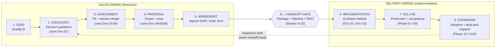

# Sales to Implementation Handoff Process

**Deliverable 9 of the Sin City Analytics 9-Part Operational Delivery Framework**
**Product:** Finance Intelligence Platform (codename **Nexora**) — reporting that behaves like a finance analyst, not a report generator.

---

## Document Control

| Field | Value |
|---|---|
| **Document** | 09 — Sales to Implementation Handoff Process |
| **Version** | 1.0 |
| **Owner** | Sin City Analytics — Revenue Operations + Delivery Operations (joint) |
| **Audience** | Sales (Account Executives, Solutions Engineers, Sales Leadership, RevOps) and Delivery (Engagement Leads, Solutions Architects, Data Engineers, Finance Configuration Analysts, Customer Success, Delivery Ops) |
| **Last Updated** | 2026-06-13 |
| **Status** | Active |
| **Related Documents** | `01-financial-intelligence-assessment-framework.md` · `02-implementation-playbook.md` · `03-client-onboarding-playbook.md` · `04-solution-design-framework.md` · `05-proposal-template.md` · `06-pricing-framework.md` · `07-multi-tenant-client-operating-model.md` · `08-design-partner-program.md` |

---

## Purpose

This document defines the **end-to-end revenue-to-delivery pipeline** for the Finance Intelligence Platform (Nexora) and — most importantly — the **explicit, no-gaps handoff** between Sales activities and Implementation activities.

The single failure mode this document exists to prevent is the **cold start**: a Delivery team learning about scope, data sources, stakeholders, or commercial commitments for the first time *after* the contract is signed. A cold start burns the first two weeks of every engagement re-discovering what Sales already knew, erodes client trust during the highest-risk window, and inflates time-to-first-value.

The governing principle is simple and enforced:

> **Nothing crosses from Sales to Delivery on trust. It crosses on a complete, verifiable handoff package, ratified in a handoff meeting, against an explicit gate.**

This document is operational, not aspirational. A RevOps administrator should be able to configure the CRM stages from Section 11; an Account Executive should be able to assemble the handoff package from Section 9; and an Engagement Lead should be able to accept or reject the handoff from the gate criteria in Sections 9 and 10. Every artifact, owner, gate, SLA, and field below is real and immediately usable.

It also anchors to the product's north star. Nexora wins deals by promising a specific experience — **User Question → Intent Detection → Relevant Data Retrieval → AI (Claude) Analysis → Direct Answer**. The handoff exists to make sure Delivery can *keep that promise*, because they receive everything Sales learned about the client's questions, data, and decision rights.

---

## How to Use This Document

- **Sales / RevOps:** Sections 2–9 are your operating manual. Section 11 (CRM) is mandatory; Section 9 (Handoff Package) is your deliverable to Delivery.
- **Delivery / Delivery Ops:** Sections 9–10 define what you can demand before accepting an account, and Section 12 maps every inbound artifact to the 10-phase implementation methodology in `02-implementation-playbook.md`.
- **Leadership:** Section 10 (Handoff RACI + SLA) and Section 13 (Metrics & Governance) are the control surface for pipeline health and handoff quality.

Throughout, the **canonical 10 implementation phases** and their gates (G1–G10) are owned by `02-implementation-playbook.md`; the **discovery method** is owned by `01-financial-intelligence-assessment-framework.md`; the **solution design** artifact by `04-solution-design-framework.md`; and the **proposal** by `05-proposal-template.md`. This document orchestrates *how those artifacts move through the funnel and across the handoff line* — it does not restate their internal methodology.

---

## 1. End-to-End Pipeline Overview

The revenue-to-delivery lifecycle is eight stages. The first five are Sales-owned, the **Sales → Implementation Handoff** is the joint gate, and the last three are Delivery-owned (with Sales/Account retaining the commercial relationship).



### 1.1 Stage-to-Owner-to-Gate Summary

| # | Stage | Primary Owner | Exit Gate | Hands To |
|---|---|---|---|---|
| 1 | **Lead** | Sales (AE / SDR) | **S1 — Qualified** | Discovery |
| 2 | **Discovery** | Sales (AE + Solutions Engineer) | **S2 — Discovery Complete** | Assessment |
| 3 | **Assessment** | Sales (Solutions Engineer + Solution Architect, advisory) | **S3 — Fit & Shape Validated** | Proposal |
| 4 | **Proposal** | Sales (AE + Deal Desk) | **S4 — Proposal Accepted (verbal)** | Agreement |
| 5 | **Agreement** | Sales (AE + Legal/Deal Desk) | **S5 — Closed-Won** | **Handoff Gate** |
| — | **S→I Handoff** | **Joint (RevOps + Delivery Ops)** | **H0 — Handoff Accepted** | Implementation |
| 6 | **Implementation** | Delivery (Engagement Lead) | **G9 — Production Accepted** (per Doc 02) | Go Live |
| 7 | **Go Live** | Delivery (Engagement Lead) | **G9 confirmed + Hypercare exit** | Expansion |
| 8 | **Expansion** | Customer Success + Account | **G10 — Value Realized** (recurring QBR) | (loops to Discovery for new scope) |

> **Naming convention.** Sales-stage gates are **S1–S5**; the joint handoff gate is **H0**; implementation phase gates are **G1–G10** and are defined canonically in `02-implementation-playbook.md`. H0 is the *only* gate co-owned by Sales and Delivery, and it is the subject of Sections 9–10.

---

## 2. Stage 1 — Lead

| Attribute | Detail |
|---|---|
| **Purpose** | Determine whether a prospect is worth Sales investment: a finance organization with a reporting-to-decision-intelligence gap that Nexora's real modules can close. |
| **Primary Owner** | Account Executive (with SDR sourcing) |
| **Supporting** | RevOps (routing, scoring), Marketing (inbound) |
| **CRM Stage** | `01 — Lead` |

### 2.1 Entry Criteria (S0 → Lead)

- An inbound or outbound contact exists with a named company and at least one finance-function contact.
- Basic firmographics captured: company, industry, approximate revenue/headcount, region.

### 2.2 Key Activities

- Initial qualification against the **Nexora ICP** (see 2.4).
- Identify the likely **decision questions** the prospect cannot answer today (e.g., "Where is our budget-vs-actuals variance concentrated this quarter?").
- Confirm a finance pain that maps to a real module: financial reporting, forecasting (rolling 3+9 / 6+6 / 9+3), variance analysis (actuals vs budget), annual budget, executive reporting, headcount planning, vendor spend, external labor / contractor SOW tracking, or cloud spend.
- Route to the correct AE / segment via RevOps rules.

### 2.3 Exit Gate — **S1 (Qualified)**

| Gate Check | Required |
|---|---|
| Named finance stakeholder identified (title-level) | ✅ |
| Pain maps to ≥1 Nexora module (no module = no fit) | ✅ |
| Budget authority or path to it identified | ✅ |
| Not disqualified by ICP exclusions (2.4) | ✅ |
| BANT-lite or equivalent captured in CRM | ✅ |

### 2.4 Artifacts Produced

| Artifact | Stored In | Notes |
|---|---|---|
| Lead record | CRM | Required fields per Section 11 |
| Qualification note | CRM activity | Pain → module mapping in one line |
| ICP fit flag | CRM field | `icp_fit` = High / Medium / Low / Excluded |

> **Nexora ICP (reference).** Finance/FP&A teams in mid-market to enterprise that (a) run periodic close and forecasting, (b) struggle to get *answers* (not just reports) from existing BI, and (c) have at least one structured data source we ingest today: **CSV/Excel upload or Databricks SQL** (the live path). Prospects whose only viable path depends on a connector that is currently a **staged stub** (QuickBooks Online, NetSuite, Workday HCM, Beeline/Fieldglass, Coupa, Workday Adaptive Planning) are *not disqualified*, but the dependency must be flagged at Lead and carried explicitly through Discovery (it materially affects scope and timeline). **Exclusions:** prospects requiring PII-level employee data in-platform (Nexora's schema is position-ID based, no names), or requiring a live connector with no CSV/Databricks fallback before contract.

---

## 3. Stage 2 — Discovery

| Attribute | Detail |
|---|---|
| **Purpose** | Understand the prospect's finance operating reality deeply enough to shape a solution: their decision questions, data sources, organizational structure, and the gap between reporting and decision intelligence. |
| **Primary Owner** | Account Executive |
| **Supporting** | Solutions Engineer (technical discovery), Solution Architect (advisory on complex data estates) |
| **CRM Stage** | `02 — Discovery` |
| **Method Source** | **`01-financial-intelligence-assessment-framework.md`** governs the discovery questionnaire, maturity model, and scoring. This stage *executes* that framework. |

### 3.1 Entry Criteria (S1 → Discovery)

- S1 gate passed; lead is Qualified.
- A discovery session is scheduled with at least one finance decision-maker.

### 3.2 Key Activities

- Run the **Financial Intelligence Assessment** (Doc 01): capture current-state reporting, pain points, and decision questions.
- Inventory **data sources** at a level sufficient to predict the ingestion path: file-based (CSV/Excel) vs Databricks SQL vs a connector on the roadmap.
- Map the prospect's **organizational dimensions** to the Nexora data model: chart of accounts (Account), CostCenter, Department, BusinessUnit, TimePeriod (fiscal calendar).
- Identify candidate **modules** and **AI agents** (CFO Advisor, FP&A Specialist, Procurement Advisor, Workforce Finance, External Labor Advisor, Finance Business Partner, Data Quality Advisor).
- Capture **fiscal/operational constraints**: fiscal year start, reporting currency, reporting periods, forecast cycles, close timing.
- Identify decision rights and likely Nexora roles (admin / finance_user / executive / read_only).

### 3.3 Exit Gate — **S2 (Discovery Complete)**

| Gate Check | Required |
|---|---|
| Doc 01 assessment completed and scored | ✅ |
| ≥3 concrete decision questions captured verbatim | ✅ |
| Data-source inventory with ingestion-path hypothesis | ✅ |
| Org dimensions mapped to data model (draft) | ✅ |
| Economic buyer + champion identified | ✅ |

### 3.4 Artifacts Produced

| Artifact | Source / Template | Carried Into Handoff? |
|---|---|---|
| Completed Assessment & maturity score | Doc 01 | **Yes** |
| Decision Questions list (verbatim) | CRM + Assessment | **Yes** |
| Data Source Inventory (draft) | Doc 01 §data assessment | **Yes** |
| Org-dimension mapping (draft) | Doc 04 §1 Current State | **Yes** |
| Stakeholder & decision-rights map (draft) | CRM | **Yes** |

> **Why verbatim decision questions matter.** Nexora's value is proven when it answers the client's *actual* questions through the **Question → Data → Claude Analysis → Direct Answer** flow. If Discovery records "they want better reporting," Delivery has nothing to test against at Go Live. If it records "Show me where Q3 cloud spend exceeded budget by cost center, and explain why," Delivery has an acceptance test. Discovery must capture the questions in the client's own words.

---

## 4. Stage 3 — Assessment

| Attribute | Detail |
|---|---|
| **Purpose** | Convert discovery findings into a validated **fit decision** and a **solution shape**: confirm Nexora can deliver the prospect's decision questions on their real data, and outline the architecture, modules, agents, integrations, and effort. |
| **Primary Owner** | Solutions Engineer |
| **Supporting** | Solution Architect (architecture validation), AE (commercial framing) |
| **CRM Stage** | `03 — Assessment / Solution Design` |
| **Method Source** | Scoring per **`01`**; solution shape drafted against **`04-solution-design-framework.md`**. |

### 4.1 Entry Criteria (S2 → Assessment)

- S2 gate passed; assessment scored; decision questions captured.
- Data-source inventory sufficient to choose a target store hypothesis (Databricks SQL primary vs in-memory SQLite fallback).

### 4.2 Key Activities

- Produce a **draft Solution Design** (Doc 04): current state, pain points, opportunity areas, recommended architecture, integrations, skills (agents), dashboards, governance, security, roadmap, expected outcomes, risks.
- Validate the **ingestion path** is real and live: confirm whether the client can deliver CSV/Excel or Databricks SQL access for the initial load. Any reliance on a roadmap connector (QuickBooks, NetSuite, Workday HCM, Beeline/Fieldglass, Coupa, Adaptive Planning) is explicitly flagged as a staged dependency, not a live capability.
- Validate **validators & governance** expectations: required-fields, period, cost-center, account, department, duplicate, anomaly (negatives, Z>3 outliers), alignment (budget-vs-actuals variance threshold, forecast drift). Confirm error-blocks-storage / warning-allows-storage policy fits the client's data quality reality.
- Confirm a **ClientConfig sketch** is feasible (the onboarding will be configuration, not code).
- Surface and log **risks**: data quality, source access, security/auth posture (Clerk target; today middleware is a stub), tenancy.

### 4.3 Exit Gate — **S3 (Fit & Shape Validated)**

| Gate Check | Required |
|---|---|
| Draft Solution Design (Doc 04) reviewed by a Solution Architect | ✅ |
| Ingestion path confirmed as **live** (CSV/Excel or Databricks) for initial value | ✅ |
| Each in-scope decision question traced to module + agent + data source | ✅ |
| Roadmap-connector dependencies flagged with workaround | ✅ |
| Effort/timeline aligned to the 10-phase model (Doc 02) | ✅ |
| Open risks logged with mitigation owners | ✅ |

### 4.4 Artifacts Produced

| Artifact | Source / Template | Carried Into Handoff? |
|---|---|---|
| Draft Solution Design | Doc 04 | **Yes (primary)** |
| Decision-question → module/agent/source trace matrix | This doc, §4.5 | **Yes** |
| Target-store recommendation (Databricks vs SQLite) | Doc 04 §4 | **Yes** |
| Risk register (commercial + technical) | CRM + Doc 04 §12 | **Yes** |

### 4.5 Decision-Question Traceability Matrix (template)

This matrix is the connective tissue of the entire engagement. It is started in Discovery, completed in Assessment, ratified in the Proposal, and **becomes the Go-Live acceptance test**.

| # | Decision Question (verbatim) | Module | AI Agent | Data Source(s) | Live Path? | Acceptance Test at Go-Live |
|---|---|---|---|---|---|---|
| 1 | [e.g., "Where is Q3 actuals over budget by cost center?"] | actuals | FP&A Specialist | ActualEntry + BudgetEntry (CSV / Databricks) | Yes | Agent returns cited variance answer for ≥1 cost center |
| 2 | [e.g., "Is our vendor spend concentrated in one supplier?"] | vendors | Procurement Advisor | VendorSpendRecord | Yes | Cited concentration answer with source metric |
| 3 | [PLACEHOLDER] | [module] | [agent] | [entity / source] | [Yes/Staged] | [PLACEHOLDER] |

---

## 5. Stage 4 — Proposal

| Attribute | Detail |
|---|---|
| **Purpose** | Present a scoped, priced, outcome-anchored proposal that the economic buyer can approve. |
| **Primary Owner** | Account Executive |
| **Supporting** | Deal Desk / RevOps (pricing, terms), Solutions Engineer (scope accuracy) |
| **CRM Stage** | `04 — Proposal` |
| **Method Source** | **`05-proposal-template.md`** (structure) and **`06-pricing-framework.md`** (pricing). Scope grounded in the Doc 04 solution design. |

### 5.1 Entry Criteria (S3 → Proposal)

- S3 gate passed; solution shape validated; fit confirmed.

### 5.2 Key Activities

- Assemble the proposal (Doc 05): outcomes, in-scope modules and agents, integration plan, governance & security model, implementation roadmap (mapped to Doc 02's 10 phases), pricing (Doc 06), and assumptions/exclusions.
- Lock **scope boundaries** explicitly — in-scope modules, enabled agents, number of tenants/business units/cost centers, data sources, and roadmap-connector exclusions.
- Confirm **commercial terms**: term length, pricing model, payment schedule, and any design-partner terms (`08-design-partner-program.md`).
- Define **success metrics** tied to decision questions (the Go-Live acceptance test from §4.5).

### 5.3 Exit Gate — **S4 (Proposal Accepted — verbal)**

| Gate Check | Required |
|---|---|
| Proposal delivered to economic buyer | ✅ |
| Scope, price, and timeline verbally accepted | ✅ |
| Success metrics agreed and tied to decision questions | ✅ |
| No unresolved scope ambiguity (every line is in or out) | ✅ |

### 5.4 Artifacts Produced

| Artifact | Source / Template | Carried Into Handoff? |
|---|---|---|
| Final Proposal | Doc 05 | **Yes** |
| Locked scope statement (modules, agents, tenants, sources) | Doc 05 §scope | **Yes (critical)** |
| Pricing & commercial terms | Doc 06 | **Yes** |
| Agreed success metrics | This doc §4.5 | **Yes** |

---

## 6. Stage 5 — Agreement

| Attribute | Detail |
|---|---|
| **Purpose** | Convert a verbally accepted proposal into a signed, countersigned commercial agreement and trigger the handoff. |
| **Primary Owner** | Account Executive |
| **Supporting** | Legal, Deal Desk, RevOps, Finance (billing setup) |
| **CRM Stage** | `05 — Agreement / Closing` |

### 6.1 Entry Criteria (S4 → Agreement)

- S4 gate passed; proposal verbally accepted.

### 6.2 Key Activities

- Issue order form / SOW (and MSA if net-new logo).
- Negotiate and resolve legal/security redlines (data processing, Databricks token handling, confidentiality of financial data).
- Obtain signatures; set up billing.
- **Pre-stage the handoff package** (Section 9) — do not wait for signature to start assembling it. The package should be ~80% complete at S4 and finalized at S5.

### 6.3 Exit Gate — **S5 (Closed-Won)**

| Gate Check | Required |
|---|---|
| Order form / SOW fully executed | ✅ |
| Billing set up; finance notified | ✅ |
| Security/legal redlines resolved and logged | ✅ |
| Handoff package assembled and ready for H0 | ✅ |
| Opportunity marked **Closed-Won** in CRM | ✅ |

### 6.4 Artifacts Produced

| Artifact | Stored In | Carried Into Handoff? |
|---|---|---|
| Signed order form / SOW (+ MSA) | CRM / Contract repo | **Yes** |
| Final scope, price, term | CRM | **Yes** |
| Security/legal commitments log | CRM / Legal repo | **Yes** |
| Completed Handoff Package (Section 9) | Shared engagement workspace | **Yes (the deliverable)** |

> **Trigger rule.** Marking an opportunity **Closed-Won** in the CRM is the system event that **starts the Handoff SLA clock** (Section 10.3). RevOps automation should fire a notification to Delivery Ops on this transition.

---

## 7. Stage 6 — Implementation

| Attribute | Detail |
|---|---|
| **Purpose** | Stand up Nexora for the client through the canonical 10-phase methodology, delivering the **Question → Data → Claude Analysis → Direct Answer** experience on the client's real data. |
| **Primary Owner** | Engagement Lead (Delivery) |
| **Supporting** | Solution Architect, Data Engineer, Finance Configuration Analyst, Platform Engineer, Customer Success |
| **CRM / Delivery Stage** | `06 — Implementation` (CRM mirrors Delivery system) |
| **Method Source** | **`02-implementation-playbook.md`** (the 10-phase method and gates G1–G10) and **`03-client-onboarding-playbook.md`** (human choreography, kickoff). |

### 7.1 Entry Criteria — **H0 (Handoff Accepted)**

This stage **cannot begin** until the Handoff Gate H0 is passed (Section 9.4). The handoff package and meeting are the entry criteria. This is the hard line the entire document protects.

### 7.2 Key Activities (summary — owned by Doc 02)

The Engagement Lead runs the 10 phases. This document does not restate them; it confirms the handoff *feeds* them:

| Implementation Phase (Doc 02) | Primary Handoff Input It Consumes |
|---|---|
| Phase 1 — Discovery & Assessment | Doc 01 assessment, decision questions, stakeholder map |
| Phase 2 — Data Assessment & Architecture | Data source inventory, target-store recommendation |
| Phase 3 — Connection Layer & Integration | Ingestion path, source access credentials/plan |
| Phase 4 — Data Validation & Governance | Validator/threshold expectations from Assessment |
| Phase 5 — Finance Intelligence Configuration | ClientConfig sketch, modules + agents scope |
| Phase 6 — Dashboard & Executive Experience Setup | Dashboard/executive-reporting expectations |
| Phase 7 — User Access & Security | Roles, permission map, tenancy, security commitments |
| Phase 8 — Training & Adoption | Stakeholder/user cohorts, adoption goals |
| Phase 9 — Go Live | Success metrics / acceptance test (§4.5) |
| Phase 10 — Optimization & Expansion | Expansion signals flagged by Sales |

### 7.3 Exit Gate

- **G9 — Production Accepted** (defined in Doc 02). Production cutover complete, hypercare underway, client sign-off obtained.

### 7.4 Artifacts Produced

- Authored `ClientConfig`, live modules and agents, validated data pipeline, dashboards, secured access — all per Doc 02. Engagement Charter and logs per Doc 03.

---

## 8. Stage 7 — Go Live

| Attribute | Detail |
|---|---|
| **Purpose** | Move the client into trusted production use and prove the platform answers their real decision questions. |
| **Primary Owner** | Engagement Lead (Delivery) |
| **Supporting** | Customer Success, Data Quality Advisor (agent), Client Sponsor |
| **Gate** | **G9 — Production Accepted** (Doc 02) |

### 8.1 Entry Criteria

- All implementation phase gates G1–G8 passed (per Doc 02).

### 8.2 Key Activities

- Production cutover; final data load validated through the 8 validators (errors quarantined, warnings reviewed).
- Run the **acceptance test**: each in-scope decision question from §4.5 returns a cited, grounded answer through the product flow, with BASE_GUARDRAILS observed (no fabricated numbers, fact vs interpretation distinguished, source/metric cited, low-confidence flagged).
- Hypercare period; sign-off.

### 8.3 Exit Gate

- **G9 confirmed + Hypercare exit.** Signed acceptance; transition of day-to-day relationship to Customer Success.

### 8.4 Artifacts Produced

- Acceptance sign-off, hypercare log, baseline adoption metrics, transition-to-CS record.

---

## 9. Stage 8 — Expansion

| Attribute | Detail |
|---|---|
| **Purpose** | Realize and grow value: drive adoption, add modules/agents/business units, and surface new decision questions that become new scope. |
| **Primary Owner** | Customer Success + Account (commercial) |
| **Supporting** | Solution Architect (expansion design), AE (commercial) |
| **Gate** | **G10 — Value Realized** (recurring QBR, Doc 02) |

### 9.1 Entry Criteria

- G9 passed; client in production with baseline adoption.

### 9.2 Key Activities

- Quarterly Business Reviews against the success metrics.
- Adoption uplift; enable additional modules/agents (configuration, not code — new `ClientConfig` toggles).
- Activate roadmap connectors as they ship; expand to additional business units / tenants (see `07-multi-tenant-client-operating-model.md`).
- Identify **expansion leads** — these loop back to **Discovery** as warm opportunities (the dotted return path in §1).

### 9.3 Exit Gate

- **G10 — Value Realized** (recurring). Renewal posture healthy; expansion pipeline identified.

### 9.4 Artifacts Produced

- QBR deck, adoption report, expansion opportunity records (re-entering the pipeline at Discovery).

> **Expansion is a warm handoff back to Sales.** When Customer Success identifies expansion scope, it must hand a mini-package to the AE: the new decision questions, the affected modules/agents, and any new data sources. This is a lightweight version of Section 9's package and prevents the same cold-start failure on growth deals.

---

# THE SALES → IMPLEMENTATION HANDOFF (Core Section)

This is the central deliverable of this document: the explicit, no-gaps transfer of an account from Sales to Delivery. It comprises five mandatory components — the **Handoff Package** (what Sales captures), the **Handoff Meeting** (where it is ratified), the **Handoff RACI** (who is accountable), the **Handoff SLA** (when it happens), and the **Account-Team Transition** (how the relationship changes). The CRM definitions (Section 11) enforce the data discipline that makes all five possible.

---

## 10. The Handoff Package

The handoff package is the **single source of truth** Delivery receives at Closed-Won. It is assembled progressively across the Sales stages (started at Discovery, ~80% at Proposal, finalized at Agreement) and lives in the shared engagement workspace. **Delivery may reject the handoff (fail gate H0) if any "Required at H0" item is missing or unverified.**

### 10.1 Handoff Package Contents

| # | Package Item | Source Stage / Doc | Owner (Sales) | Required at H0 | Why Delivery Needs It |
|---|---|---|---|---|---|
| 1 | **Signed order form / SOW + MSA** | Agreement (Doc 06) | AE | ✅ | Authority to begin; scope of record |
| 2 | **Locked scope statement** — in-scope modules, enabled agents, # tenants/BUs/cost centers, data sources | Proposal (Doc 05) | AE / SE | ✅ | Defines ClientConfig and effort |
| 3 | **Completed Financial Intelligence Assessment + maturity score** | Discovery (Doc 01) | SE | ✅ | Feeds Phase 1 without re-discovery |
| 4 | **Decision Questions (verbatim) + Traceability Matrix (§4.5)** | Discovery/Assessment | SE | ✅ | The Go-Live acceptance test |
| 5 | **Data Source Inventory** — each source, format, owner, access method, live vs staged | Discovery/Assessment | SE | ✅ | Feeds Phases 2–3 |
| 6 | **Target-store recommendation** (Databricks SQL vs in-memory SQLite) | Assessment (Doc 04) | SA | ✅ | Architecture decision (G2) |
| 7 | **Ingestion-path confirmation** — CSV/Excel and/or Databricks confirmed live; roadmap-connector dependencies flagged | Assessment | SE/SA | ✅ | Prevents Phase 3 surprise |
| 8 | **Org-dimension mapping** — Account/CoA, CostCenter, Department, BusinessUnit, TimePeriod | Discovery/Assessment | SE | ✅ | Seeds data model + ClientConfig |
| 9 | **Fiscal & config parameters** — fiscalYearStart, reportingCurrency, reportingPeriods, forecastCycles (3+9/6+6/9+3) | Discovery | SE | ✅ | Direct ClientConfig inputs |
| 10 | **Draft ClientConfig sketch** | Assessment (Doc 04) | SA | ☑ (strongly preferred) | Accelerates Phase 5 |
| 11 | **Stakeholder & decision-rights map** — sponsor, champion, SMEs per domain, email domains | Discovery | AE | ✅ | Phase 1 + Phase 7 (Clerk orgs/roles) |
| 12 | **Role/permission expectations** — who needs admin / finance_user / executive / read_only; canUploadData, canRunAgents, canViewExecutiveReports, canManageConfig, canClearData, canViewValidationResults | Discovery/Assessment | SE | ✅ | Phase 7 access design |
| 13 | **Security & legal commitments log** — data handling, Databricks token posture (read-only where possible), confidentiality, no-PII confirmation | Agreement | AE/Legal | ✅ | Phase 7; honors what Sales promised |
| 14 | **Validation/governance expectations** — anomaly/alignment thresholds, error-block vs warning-allow tolerance | Assessment | SE | ☑ | Phase 4 tuning |
| 15 | **Agreed success metrics** | Proposal | AE | ✅ | G9 acceptance |
| 16 | **Commercial summary** — term, price, payment schedule, renewal/expansion notes, design-partner terms (Doc 08) if any | Agreement | AE/Deal Desk | ✅ | Account team + expansion |
| 17 | **Risk register** — open commercial + technical risks with owners | All | SE/AE | ✅ | Delivery inherits known risks, not surprises |
| 18 | **Expansion signals** — known future scope (modules/BUs/connectors the client wants next) | Discovery–Agreement | AE | ☑ | Phase 10 land-and-expand |

> Legend: ✅ = mandatory to pass H0 · ☑ = strongly preferred (its absence is logged as a handoff risk, not necessarily a hard block, at the Engagement Lead's discretion).

### 10.2 Handoff Package Template (fill-in)

```text
NEXORA SALES → IMPLEMENTATION HANDOFF PACKAGE
=============================================
Client / Logo:                [CLIENT NAME]
Proposed tenant clientId:     [CLIENT_ID]
Opportunity ID (CRM):         [OPP_ID]
Closed-Won date:              [YYYY-MM-DD]
AE (handing off):             [NAME]
SE (handing off):             [NAME]
Engagement Lead (receiving):  [NAME]

1. CONTRACT
   - SOW/Order form link:     [LINK]   Signed: [Y/N]
   - Term / Price:            [TERM] / [PRICE]   Payment: [SCHEDULE]
   - Design-partner terms:    [N/A | LINK to Doc 08 terms]

2. SCOPE (LOCKED)
   - In-scope modules:        [financial_reporting | forecast | actuals | budget |
                               executive_reporting | headcount | vendors |
                               external_labor | cloud_spend | agents]
   - Enabled agents:          [CFO Advisor | FP&A Specialist | Procurement Advisor |
                               Workforce Finance | External Labor Advisor |
                               Finance Business Partner | Data Quality Advisor]
   - Tenants / BUs / cost centers: [#] / [#] / [#]
   - Out of scope:            [LIST]

3. DECISION QUESTIONS (verbatim) + ACCEPTANCE TESTS
   - See attached Traceability Matrix (§4.5):  [LINK]
   - Q1: [verbatim] → [module/agent/source] → [acceptance test]
   - Q2: ...

4. DATA
   - Source inventory:        [LINK]
   - Target store:            [Databricks SQL | in-memory SQLite]   Rationale: [...]
   - Ingestion path (live):   [CSV/Excel | Databricks]   Confirmed: [Y/N]
   - Roadmap-connector deps:  [NONE | which + workaround]
   - Org dimensions mapped:   [LINK]

5. CONFIG PARAMETERS
   - fiscalYearStart:         [MM-DD]
   - reportingCurrency:       [ISO]
   - reportingPeriods:        [list]
   - forecastCycles:          [3+9 | 6+6 | 9+3 | none]
   - Draft ClientConfig:      [LINK | not yet drafted]

6. PEOPLE & ACCESS
   - Sponsor / Champion:      [NAME, TITLE] / [NAME, TITLE]
   - SMEs (by domain):        GL:[..] FP&A:[..] Procurement:[..] HR/Headcount:[..] Cloud:[..]
   - Org email domain(s):     [domain] (for Clerk org)
   - Role map:                [admin: .. | finance_user: .. | executive: .. | read_only: ..]

7. SECURITY & LEGAL COMMITMENTS
   - Data handling:           [summary]
   - Databricks token posture:[read-only where possible? Y/N]
   - No-PII confirmed:        [Y/N]   Open redlines: [NONE | list]

8. SUCCESS METRICS:          [LINK / list]

9. RISKS (open):             [list with owner]

10. EXPANSION SIGNALS:       [list]

HANDOFF GATE H0:  Accepted [ ]   Accepted with conditions [ ]   Rejected [ ]
Engagement Lead sign-off:    [NAME / DATE]
Conditions / gaps to close:  [...]
```

### 10.3 Handoff Quality Definition of Done

The package passes H0 when: every ✅ item is present and verifiable; the traceability matrix has at least the contracted decision questions with acceptance tests; the ingestion path is confirmed **live**; and the Engagement Lead signs off (Accepted or Accepted-with-conditions). A single missing ✅ item is grounds for **Rejected** or **Accepted-with-conditions** (with a dated remediation owner).

---

## 11. The Handoff Meeting

The handoff meeting is the live ratification of the package. It is mandatory; **email-only handoffs are not permitted** for any contracted engagement.

### 11.1 Meeting Parameters

| Attribute | Detail |
|---|---|
| **Trigger** | Closed-Won (S5) recorded in CRM |
| **Timing** | Within **3 business days** of Closed-Won (see SLA, §12.3) |
| **Duration** | 60 minutes |
| **Chair** | Delivery Ops (neutral owner of the gate) |
| **Mandatory attendees** | AE, SE, receiving Engagement Lead, Solution Architect |
| **Optional attendees** | Customer Success, Data Engineer, RevOps, Deal Desk |
| **Pre-read** | Completed Handoff Package circulated ≥24h before |
| **Output** | H0 decision: Accepted / Accepted-with-conditions / Rejected |

### 11.2 Handoff Meeting Agenda (60 minutes)

| Time | Segment | Lead | Outcome |
|---|---|---|---|
| 0:00–0:05 | Purpose, package confirmation (pre-read done?) | Delivery Ops | Confirm readiness to proceed |
| 0:05–0:15 | Client context & decision questions (verbatim) | AE | Delivery understands *why* client bought |
| 0:15–0:25 | Scope walkthrough — modules, agents, tenants, exclusions | SE | Scope ratified vs SOW; no ambiguity |
| 0:25–0:35 | Data & architecture — sources, ingestion path, target store, roadmap deps | SA | Phase 2–3 inputs validated |
| 0:35–0:42 | People, roles, security commitments | AE | Phase 7 inputs validated |
| 0:42–0:50 | Risks & open items | SE/SA | Risk register transferred with owners |
| 0:50–0:57 | Success metrics & acceptance tests | AE | G9 criteria agreed |
| 0:57–1:00 | **H0 decision** + conditions + next step (kickoff date) | Engagement Lead | Gate ratified; kickoff scheduled |

### 11.3 Decision Outcomes

| Outcome | Meaning | Next Action |
|---|---|---|
| **Accepted** | All ✅ items present & clear | Engagement Lead owns account; schedule client kickoff (Doc 03 §1) |
| **Accepted with conditions** | Minor gaps; engagement starts | Conditions logged with Sales owner + due date; tracked to closure |
| **Rejected** | Material ✅ item(s) missing | Returned to Sales; re-handoff scheduled within 2 business days; escalation per §13 |

---

## 12. The Handoff RACI, SLA & Timing

### 12.1 Handoff RACI

Across the handoff activity (assembling the package, running the meeting, accepting the account).

| Activity | AE | SE | RevOps | Solution Architect | Engagement Lead | Delivery Ops | Customer Success |
|---|---|---|---|---|---|---|---|
| Assemble handoff package | **A/R** | **R** | C | C | I | C | I |
| Ensure CRM required fields complete | **A/R** | C | **R** | I | I | C | I |
| Verify package completeness pre-meeting | C | C | I | C | I | **A/R** | I |
| Schedule handoff meeting (≤3 bd of Closed-Won) | C | I | **R** | I | I | **A** | I |
| Chair handoff meeting | I | I | I | C | C | **A/R** | I |
| Present client context & decision questions | **A/R** | C | I | I | I | I | I |
| Validate data/architecture inputs | I | **R** | I | **A/R** | C | I | I |
| **Make H0 accept/reject decision** | C | C | I | C | **A/R** | C | I |
| Log conditions & track to closure | C | **R** | C | I | **A** | C | I |
| Schedule client kickoff (Doc 03) | C | I | I | I | **A/R** | C | C |
| Transition relationship to Delivery/CS | **R** | C | I | I | **A** | C | **R** |

> Legend: **R** = Responsible · **A** = Accountable · **C** = Consulted · **I** = Informed. Each row has exactly one **A**.

### 12.2 Handoff RACI — Narrative on Single-Threaded Ownership

- **Sales (AE) is Accountable for the package being complete and true.** They sold it; they own the inputs.
- **Delivery Ops is Accountable for the *process* of handoff** — scheduling, completeness verification, chairing — as a neutral party so neither Sales nor Delivery can shortcut the gate.
- **The Engagement Lead is Accountable for the accept/reject *decision*.** They, and only they, take the account. This prevents accounts from being "thrown over the wall" — someone must actively catch.

### 12.3 Handoff SLA & Timing

| Milestone | SLA | Clock Starts | Owner |
|---|---|---|---|
| Notify Delivery Ops of Closed-Won | **Same business day** (automated on CRM stage change) | Closed-Won recorded | RevOps automation |
| Handoff package finalized | **Within 2 business days** of Closed-Won | Closed-Won | AE / SE |
| Handoff meeting held | **Within 3 business days** of Closed-Won | Closed-Won | Delivery Ops |
| H0 decision recorded | **At meeting** | Meeting held | Engagement Lead |
| Re-handoff (if Rejected) | **Within 2 business days** of rejection | Rejection logged | AE + Delivery Ops |
| Client kickoff scheduled | **Within 5 business days** of H0 Accepted | H0 Accepted | Engagement Lead |
| Client kickoff held | **Within 10 business days** of H0 Accepted | H0 Accepted | Engagement Lead (per Doc 03 §1) |

> **Breach handling.** Any SLA breach raises a RevOps/Delivery-Ops flag and is reviewed in the weekly pipeline-health meeting (§13). Repeated breaches by stage indicate a process defect, not a people defect.

### 12.4 Timing Diagram

```text
DAY 0          DAY 2              DAY 3            DAY ≤8            DAY ≤13
Closed-Won --> Package final --> Handoff mtg --> Kickoff sched --> Kickoff held
   |              (AE/SE)          (H0 gate)       (Eng Lead)        (Doc 03 §1)
   └─ auto-notify Delivery Ops (same day)
   [If Rejected at H0: re-handoff within +2 bd, then resume]
```

---

## 13. Account-Team Transition

The handoff is not only data — it is a relationship transfer. The client must experience continuity, not a dropped baton.

### 13.1 Who Owns the Client, When

| Phase | Primary Client-Facing Owner | Sales Role | Delivery/CS Role |
|---|---|---|---|
| Lead → Agreement | **AE** | Owns relationship | Advisory (SE/SA in Discovery/Assessment) |
| Handoff (H0) | **Joint** | AE introduces successor | Engagement Lead steps forward |
| Implementation → Go Live | **Engagement Lead** | AE informed; commercial only | Engagement Lead owns delivery |
| Post Go-Live → Expansion | **Customer Success** | AE re-engages for expansion | CS owns adoption & renewal |

### 13.2 Continuity Rules

- **No silent disappearance of the AE.** The AE personally introduces the Engagement Lead to the client at kickoff (Doc 03 §1) and remains the commercial owner. The client should never wonder "who do I talk to now?"
- **The AE stays warm for expansion.** Commercial relationship is retained by Sales/Account; delivery relationship moves to Delivery then CS.
- **Customer Success is introduced before Go-Live**, not after, so the adoption relationship predates the support need.
- **Expansion loops back to the AE** as a warm handoff (the §1 return path); CS hands the AE the mini-package (new decision questions, modules, sources).

### 13.3 Transition Communication Template (client-facing)

```text
Subject: Your Nexora team — introducing your Engagement Lead

[CLIENT SPONSOR],

Now that we're underway, I'm delighted to introduce [ENGAGEMENT LEAD],
who will lead your Nexora implementation. [ENGAGEMENT LEAD] has the full
picture of what we discussed — your priority questions ([1-LINE EXAMPLE]),
your data sources, and your target outcomes — so we start fast, not from scratch.

I'll stay close as your commercial point of contact, and you'll meet
[CUSTOMER SUCCESS] ahead of go-live. Kickoff is scheduled for [DATE].

[AE NAME]
```

---

## 14. CRM Stage Definitions & Required Fields

The CRM is the system of record that makes the handoff enforceable. Stages mirror Sections 2–9; required fields guarantee the handoff package can be assembled without re-interviewing the client.

### 14.1 CRM Stage Definitions

| CRM Stage | Maps to Pipeline Stage | Entry Gate | Exit Gate | Forecast Category |
|---|---|---|---|---|
| `01 — Lead` | Lead | Lead created | S1 — Qualified | Pipeline (uncommitted) |
| `02 — Discovery` | Discovery | S1 passed | S2 — Discovery Complete | Pipeline |
| `03 — Assessment / Solution Design` | Assessment | S2 passed | S3 — Fit & Shape Validated | Best Case |
| `04 — Proposal` | Proposal | S3 passed | S4 — Proposal Accepted | Commit |
| `05 — Agreement / Closing` | Agreement | S4 passed | S5 — Closed-Won | Commit |
| `06 — Closed-Won → Handoff` | S→I Handoff | S5 passed | **H0 — Handoff Accepted** | Closed-Won |
| `07 — Implementation` | Implementation | H0 passed | G9 (Doc 02) | Closed-Won (delivery) |
| `08 — Live / Expansion` | Go Live + Expansion | G9 passed | G10 recurring | Closed-Won (CS-owned) |
| `Closed-Lost` | — | any | — | Lost |

### 14.2 Required Fields by Stage (validation enforced)

The CRM must **block stage progression** if required fields for the *target* stage are empty. This is the data-discipline equivalent of Nexora's own validators blocking storage on errors.

| Field | `01` | `02` | `03` | `04` | `05` | `06 (H0)` |
|---|---|---|---|---|---|---|
| Company, primary finance contact, title | ✅ | ✅ | ✅ | ✅ | ✅ | ✅ |
| `icp_fit` (High/Med/Low/Excluded) | ✅ | ✅ | ✅ | ✅ | ✅ | ✅ |
| Pain → module mapping | ✅ | ✅ | ✅ | ✅ | ✅ | ✅ |
| Economic buyer identified | | ✅ | ✅ | ✅ | ✅ | ✅ |
| Decision questions (verbatim, ≥3) | | ✅ | ✅ | ✅ | ✅ | ✅ |
| Doc 01 assessment link + score | | ✅ | ✅ | ✅ | ✅ | ✅ |
| Data source inventory link | | ✅ | ✅ | ✅ | ✅ | ✅ |
| Ingestion path (live: CSV/Databricks) | | | ✅ | ✅ | ✅ | ✅ |
| Target store (Databricks/SQLite) | | | ✅ | ✅ | ✅ | ✅ |
| In-scope modules (multi-select) | | | ✅ | ✅ | ✅ | ✅ |
| Enabled agents (multi-select) | | | ✅ | ✅ | ✅ | ✅ |
| Traceability matrix link | | | ✅ | ✅ | ✅ | ✅ |
| Solution Design (Doc 04) link | | | ✅ | ✅ | ✅ | ✅ |
| Proposal (Doc 05) link | | | | ✅ | ✅ | ✅ |
| Price / term / payment schedule | | | | ✅ | ✅ | ✅ |
| Success metrics | | | | ✅ | ✅ | ✅ |
| Signed SOW/order form link | | | | | ✅ | ✅ |
| Security/legal commitments log | | | | | ✅ | ✅ |
| Role/permission expectations | | | | | ✅ | ✅ |
| Fiscal/config params (FY start, currency, periods, cycles) | | | | | ✅ | ✅ |
| Stakeholder & decision-rights map | | | ✅ | ✅ | ✅ | ✅ |
| Risk register link | | | ✅ | ✅ | ✅ | ✅ |
| **Handoff Package link** | | | | | | ✅ |
| **H0 decision (Accepted/Conditions/Rejected)** | | | | | | ✅ |
| Engagement Lead assigned | | | | | | ✅ |

### 14.3 CRM Field Type Reference

| Field | Type | Picklist / Format |
|---|---|---|
| `icp_fit` | Picklist | High · Medium · Low · Excluded |
| `in_scope_modules` | Multi-select | financial_reporting, forecast, actuals, budget, executive_reporting, headcount, vendors, external_labor, cloud_spend, agents |
| `enabled_agents` | Multi-select | cfo, fpa, procurement, headcount, external-labor, finance-bp, validation |
| `ingestion_path` | Picklist | csv_excel · databricks · csv_then_connector(staged) |
| `target_store` | Picklist | databricks_sql · sqlite_fallback |
| `forecast_cycles` | Multi-select | 3+9 · 6+6 · 9+3 · none |
| `h0_decision` | Picklist | Accepted · Accepted-with-conditions · Rejected |
| `decision_questions` | Long text | Verbatim, one per line |
| Document links (assessment, design, proposal, SOW, handoff package, traceability, risk) | URL | Shared workspace links |

---

## 15. Stage-to-Framework Cross-Reference Map

This section satisfies the requirement to map pipeline stages to the discovery (01), solution design (04), proposal (05), and the 10-phase implementation (02) frameworks.

### 15.1 Master Crosswalk

| Pipeline Stage | Owns / Produces | Primary Framework Doc | Implementation Phase Fed (Doc 02) |
|---|---|---|---|
| **Lead** | Qualification, ICP fit | — (this doc §2) | — |
| **Discovery** | Assessment, decision questions, source inventory (draft) | **01** Financial Intelligence Assessment | Phase 1 (Discovery & Assessment) |
| **Assessment** | Solution shape, architecture, traceability matrix | **04** Solution Design Framework | Phases 2–4 inputs (Data Assessment & Architecture; Connection Layer; Validation & Governance) |
| **Proposal** | Scope, price, success metrics | **05** Proposal Template · **06** Pricing | Phases 5–6 scope (Finance Intelligence Config; Dashboard & Executive Experience) |
| **Agreement** | Signed SOW, commitments, handoff package | **06** Pricing · **08** Design Partner (if applicable) | Trigger for all phases |
| **S→I Handoff (H0)** | Ratified handoff package | **THIS DOC** (§10–14) · feeds **02**, **03** | Gate into Phase 1 kickoff (Doc 03 §1) |
| **Implementation** | 10-phase delivery | **02** Implementation Playbook · **03** Onboarding | Phases 1–9 (G1–G9) |
| **Go Live** | Production acceptance | **02** (Phase 9 / G9) | Phase 9 |
| **Expansion** | Adoption, growth, multi-tenant | **02** (Phase 10) · **07** Multi-Tenant Operating Model | Phase 10 (G10) |

### 15.2 Phase-Input Provenance (where every Phase-1 input came from)

```mermaid
flowchart TD
    DQ["Decision Questions (verbatim)"] -->|Discovery| P1[Phase 1: Discovery & Assessment]
    AS["Doc 01 Assessment + score"] -->|Discovery| P1
    SM["Stakeholder & decision-rights map"] -->|Discovery| P1
    DI["Data Source Inventory"] -->|Discovery/Assessment| P2[Phase 2: Data Assessment & Architecture]
    TS["Target store recommendation"] -->|Assessment| P2
    IP["Ingestion path (live)"] -->|Assessment| P3[Phase 3: Connection Layer]
    VG["Validator/threshold expectations"] -->|Assessment| P4[Phase 4: Validation & Governance]
    CC["ClientConfig sketch + modules/agents"] -->|Assessment/Proposal| P5[Phase 5: Finance Intelligence Config]
    RP["Role/permission expectations + security log"] -->|Discovery/Agreement| P7[Phase 7: User Access & Security]
    SUC["Success metrics / acceptance test"] -->|Proposal| P9[Phase 9: Go Live]
```



> **The point of this map:** there is no Phase-1 input that *originates* in Delivery. Everything Delivery needs to start was learned by Sales and transferred at H0. That is the definition of a no-gaps handoff.

---

## 16. Handoff Metrics, Governance & Anti-Patterns

### 16.1 Handoff Health Metrics

| Metric | Definition | Target |
|---|---|---|
| **Handoff package completeness** | % of ✅ items present at H0 | 100% |
| **First-pass H0 acceptance rate** | % handoffs Accepted (not Rejected/Conditions) on first meeting | ≥85% |
| **Handoff cycle time** | Closed-Won → H0 Accepted | ≤3 business days |
| **Cold-start incidents** | Phase 1 activities re-discovering known facts | 0 |
| **Time-to-kickoff** | H0 Accepted → kickoff held | ≤10 business days |
| **Condition closure time** | Accepted-with-conditions → conditions cleared | ≤5 business days |
| **Re-handoff rate** | % of accounts requiring a second handoff meeting | ≤15% |

### 16.2 Governance Cadence

| Forum | Frequency | Owner | Agenda |
|---|---|---|---|
| Pipeline-health review | Weekly | RevOps + Delivery Ops | SLA breaches, stuck stages, upcoming handoffs |
| Handoff retrospective | Per engagement (at G1 close) | Engagement Lead | What was missing/strong in the package |
| Handoff process review | Quarterly | RevOps + Delivery Ops leadership | Metrics trends, field/gate changes |

### 16.3 Anti-Patterns (explicitly prohibited)

| Anti-Pattern | Why It's Banned | Enforcement |
|---|---|---|
| "Throw it over the wall" (email-only handoff) | Produces cold starts | H0 meeting is mandatory |
| Closing a deal scoped on a **staged connector** as if it were live | Breaks the live-path promise; Phase 3 fails | Ingestion-path field must be `csv_excel` or `databricks` to pass H0; staged deps flagged |
| Vague decision questions ("better reporting") | No acceptance test possible | Verbatim ≥3 questions required at S2 |
| Promising capabilities beyond canon (e.g., PII, unbuilt connectors live) | Undeliverable; erodes trust | Scope validated by SA at S3; security log at S5 |
| Skipping the traceability matrix | Go-Live has no acceptance criteria | Required at H0 |
| No named Engagement Lead at H0 | Account un-owned ("nobody caught") | H0 cannot be Accepted without assignment |

---

## 17. Roles & Acronyms

| Term | Meaning |
|---|---|
| **AE** | Account Executive (Sales, owns the deal) |
| **SE** | Solutions Engineer (Sales, technical discovery/assessment) |
| **SA** | Solution Architect (Delivery, advisory in Sales stages) |
| **RevOps** | Revenue Operations (CRM, scoring, routing, SLAs) |
| **Delivery Ops** | Delivery Operations (neutral owner of the handoff gate) |
| **Engagement Lead** | Delivery owner of an implementation (per Doc 02/03) |
| **CS** | Customer Success (adoption, renewal, expansion) |
| **S1–S5** | Sales-stage exit gates |
| **H0** | Sales→Implementation handoff acceptance gate (this doc) |
| **G1–G10** | Implementation phase gates (Doc 02) |
| **ICP** | Ideal Customer Profile |
| **SOW** | Statement of Work |
| **ClientConfig** | Per-tenant single source of truth; onboarding = authoring it, zero code |
| **BASE_GUARDRAILS** | Agent rules: no fabrication, fact vs interpretation, cite source, flag low-confidence, escalate |

---

## Appendix A — One-Page Handoff Checklist (printable)

```text
[ ] Opportunity marked Closed-Won; Delivery Ops auto-notified (same day)
[ ] Signed SOW/order form attached
[ ] Locked scope: modules + agents + tenants/BUs/cost centers + exclusions
[ ] Doc 01 assessment + maturity score linked
[ ] ≥3 verbatim decision questions + traceability matrix (with acceptance tests)
[ ] Data source inventory (format, owner, access, live vs staged)
[ ] Ingestion path confirmed LIVE (csv_excel | databricks)
[ ] Target store decided (databricks_sql | sqlite_fallback)
[ ] Org dimensions mapped (Account/CoA, CostCenter, Dept, BU, TimePeriod)
[ ] Fiscal/config params (FY start, currency, periods, forecast cycles)
[ ] Draft ClientConfig sketch (preferred)
[ ] Stakeholder & decision-rights map + email domains
[ ] Role/permission expectations (admin/finance_user/executive/read_only)
[ ] Security & legal commitments log (incl. no-PII, Databricks token posture)
[ ] Success metrics (= Go-Live acceptance test)
[ ] Risk register with owners
[ ] Expansion signals captured
[ ] Handoff meeting held within 3 business days
[ ] Engagement Lead assigned; H0 decision recorded
[ ] Kickoff scheduled within 5 business days of H0 Accepted
```

## Appendix B — Document Cross-Reference Quick Index

| Need | Go To |
|---|---|
| Discovery method & maturity scoring | `01-financial-intelligence-assessment-framework.md` |
| 10-phase method & gates G1–G10 | `02-implementation-playbook.md` |
| Kickoff & onboarding choreography | `03-client-onboarding-playbook.md` |
| Solution design structure | `04-solution-design-framework.md` |
| Proposal structure | `05-proposal-template.md` |
| Pricing | `06-pricing-framework.md` |
| Multi-tenant operating model & expansion | `07-multi-tenant-client-operating-model.md` |
| Design-partner terms | `08-design-partner-program.md` |
| **This document — S→I handoff** | `09-sales-to-implementation-handoff.md` |

---

*End of Document 09 — Sales to Implementation Handoff Process. Version 1.0 · Status: Active · Owner: Sin City Analytics Revenue + Delivery Ops · Last Updated 2026-06-13.*
