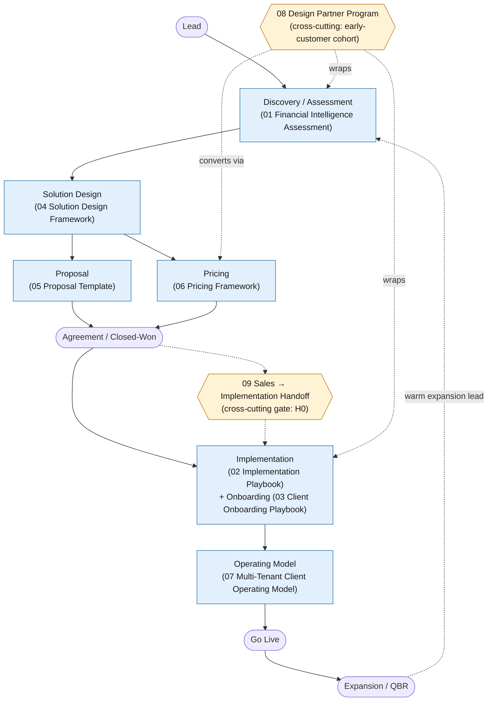

# Sin City Analytics — Operational Delivery Framework

**Finance Intelligence Platform (codename Nexora)** — the reporting platform that behaves like a finance analyst, not a report generator.

> This README is the master index for the 9-part Operational Delivery Framework. It frames what the framework is, shows how the nine documents fit together across the client lifecycle, catalogs each deliverable, proves coverage of every required section, and defines the conventions and ownership that keep the set coherent.

---

## Document Control

| Field | Value |
|---|---|
| **Document** | 00 — Operational Delivery Framework — Master Index / README |
| **Version** | 1.0 |
| **Owner** | Sin City Analytics — Delivery Operations |
| **Audience** | Sales, RevOps, Delivery (Engagement Leads, Solution Architects, Data Engineers, Finance Configuration Analysts), Customer Success, Commercial, Product / GTM leadership; and client sponsors as a guided reference |
| **Product** | Finance Intelligence Platform (codename Nexora) |
| **Last Updated** | 2026-06-13 |
| **Status** | Active |

---

## 1. What This Framework Is

This is the **operating playbook of a software company** — not the methodology of a consulting practice. Sin City Analytics builds and operates a single product, the **Finance Intelligence Platform (codename Nexora)**, and sells, delivers, and grows it as a **multi-tenant SaaS** offering. The nine documents in this directory are the repeatable system by which a finance organization moves from a qualified lead to a referenceable, expanding customer — and, with them, from financial **reporting** to financial **decision intelligence**.

The product's north star is the contract every document serves. Nexora does not start from a template and populate it; it starts from the question and finds the answer:

```text
User Question → Intent Detection → Relevant Data Retrieval → AI (Claude) Analysis → Direct Answer
```

Three product facts give this framework its spine, and every deliverable is judged against them:

- **Configuration, not custom code.** Onboarding a tenant is authoring its `ClientConfig` (the single source of truth per tenant). A correctly executed engagement introduces **zero client-specific code changes** to the platform.
- **Honesty about maturity.** The live ingestion path today is **CSV/Excel upload + Databricks SQL (Delta)**, with an in-memory SQLite fallback. Native connectors (QuickBooks, NetSuite, Workday HCM, Beeline/Fieldglass, Coupa, Workday Adaptive Planning) are **roadmap-staged stubs**. The Clerk authentication layer (Orgs = tenants) is **target-state** — today `middleware.ts` is a stub, `/api/agent` is public, and route guards are deferred; tenant isolation rests on `clientId` row-level scoping. No document represents staged or target-state capability as live.
- **Guardrailed intelligence.** The seven AI finance agents all enforce **BASE_GUARDRAILS**: never fabricate or extrapolate numbers; distinguish fact from interpretation; cite the data source/metric for every claim; flag missing or low-confidence data before concluding; recommend follow-ups on gaps; escalate to human review.

**Who uses it:** Sales and RevOps run the funnel (Documents 01, 04, 05, 06, 09). Delivery and Customer Success run the build and the relationship (Documents 02, 03, 07). Commercial governs pricing (Document 06). GTM runs the early-customer motion (Document 08). The whole set is anchored to the **canonical 10 implementation phases** owned by Document 02 and the **product canon** referenced throughout.

---

## 2. How the Documents Fit Together

The framework spans the full client lifecycle. The Sales motion (lead → agreement) feeds an explicit, no-gaps handoff into Delivery (implementation → go live → expansion). Two documents are **cross-cutting**: the Design Partner Program (08) wraps the early-customer cohort, and the Sales→Implementation Handoff (09) is the gate that connects every Sales artifact to every Delivery phase.



**Lifecycle in one line:** Lead → **Discovery/Assessment (01)** → **Solution Design (04)** → **Proposal (05) + Pricing (06)** → Agreement → **Implementation (02) + Onboarding (03)** → **Operating Model (07)** → Go Live → Expansion — with the **Design Partner Program (08)** and the **Sales→Implementation Handoff (09)** running cross-cutting across the whole flow.

> The canonical 10 implementation phases (owned by Document 02) sequence the build inside the Implementation/Onboarding band: **Phase 1 Discovery & Assessment · Phase 2 Data Assessment & Architecture · Phase 3 Connection Layer & Integration · Phase 4 Data Validation & Governance · Phase 5 Finance Intelligence Configuration · Phase 6 Dashboard & Executive Experience Setup · Phase 7 User Access & Security · Phase 8 Training & Adoption · Phase 9 Go Live · Phase 10 Optimization & Expansion.**

---

## 3. The Nine Documents

| # | Title | File | Purpose | Primary Owner / Audience |
|---|---|---|---|---|
| 01 | Financial Intelligence Assessment Framework | [01-financial-intelligence-assessment-framework.md](01-financial-intelligence-assessment-framework.md) | The discovery front door: working sessions, scoring instruments, and artifacts that establish whether and how a client moves from reporting to decision intelligence; produces the inputs to `ClientConfig`, module/agent scope, and success criteria. | Delivery — Delivery Lead, Solution Architect; client sponsor & finance stakeholders |
| 02 | Implementation Playbook | [02-implementation-playbook.md](02-implementation-playbook.md) | **Owns the canonical 10-phase delivery methodology**, stage-gates (G1–G10), RACI, timelines, and sizing modifiers. The authoritative build method all siblings reference. | Delivery — Delivery Leads, Solution Architects, Data Engineers, Finance Config Analysts, Customer Success |
| 03 | Client Onboarding Playbook | [03-client-onboarding-playbook.md](03-client-onboarding-playbook.md) | The week-by-week human choreography of onboarding: kickoff, stakeholder alignment, data access, configuration workshops, training, go-live prep, and hypercare. Orchestrates the people side of Document 02's method. | Delivery — Engagement Leads, Solutions Architects, Customer Success; client project teams |
| 04 | Solution Design Framework | [04-solution-design-framework.md](04-solution-design-framework.md) | Converts discovery findings into one opinionated, buildable target-state design (architecture, integrations, agents, dashboards, governance, security, roadmap, outcomes), with every recommendation traced to a pain point. Worked example + reusable template. | Delivery — Solutions Architecture; client finance sponsor, Account Executive |
| 05 | Proposal Template | [05-proposal-template.md](05-proposal-template.md) | The client-facing proposal that converts a qualified opportunity into a signed engagement — outcomes, scope, approach, timeline. Fill-in template + model prose. Quotes no dollar figures. | Sales — Account Executive, Solution Architect; prospective client executive sponsor |
| 06 | Pricing Framework | [06-pricing-framework.md](06-pricing-framework.md) | The commercial decision system: pricing philosophy, service lines, subscription tiering, packaging, decision matrix, and discount guardrails. Carries no final dollar values (those live in the controlled rate card). | Commercial — Sales, Delivery Leadership, Finance/RevOps (internal only) |
| 07 | Multi-Tenant Client Operating Model | [07-multi-tenant-client-operating-model.md](07-multi-tenant-client-operating-model.md) | The authoritative operating model for authentication, tenant isolation, RBAC, user lifecycle, governance, auditability, and security — with explicit Implemented-vs-Target call-outs. | Platform / Security; client IT/security teams; implementation teams |
| 08 | Design Partner Program | [08-design-partner-program.md](08-design-partner-program.md) | The operating charter for the early-customer cohort: who we invite, the mutual exchange, expectations, feedback loop, success metrics, conversion mechanics, MOU, and outreach copy. | GTM / Founder; prospective design partners; internal GTM, Delivery, Product |
| 09 | Sales to Implementation Handoff Process | [09-sales-to-implementation-handoff.md](09-sales-to-implementation-handoff.md) | The end-to-end revenue-to-delivery pipeline and the explicit no-gaps handoff (package, meeting, RACI, SLA, transition) that prevents the cold-start failure mode; defines CRM stages and required fields. | Joint — Revenue Operations + Delivery Operations; Sales and Delivery teams |

---

## 4. Coverage Matrix

Each deliverable was audited against its required sub-sections. The matrix below records, per deliverable, the key required sections and the audited coverage status. **Status legend:** ✅ Covered (complete) · ◑ Covered with remediation applied. The audit verdict and coverage percentage are the ground-truth digest from the framework audit.

| # | Deliverable | Key Required Sections | Audit Verdict | Coverage | Covered |
|---|---|---|---|---|---|
| 01 | Financial Intelligence Assessment Framework | Assessment objectives; stakeholder identification & RACI; meeting structure; current-state, reporting, forecasting, executive-reporting, data-landscape, data-quality assessments; pain-point framework; future-state visioning; success criteria; deliverables; reusable templates | pass | 98% | ✅ |
| 02 | Implementation Playbook | 10-phase model (canonical names); stage-gate governance (G1–G10); per-phase objectives/inputs/activities/outputs/risks/success-criteria/responsibilities; full-program RACI; sizing modifiers; phase/gate/deliverable quick reference | pass | 98% | ✅ |
| 03 | Client Onboarding Playbook | Kickoff; stakeholder alignment; data access; system inventory; security review; user provisioning; configuration workshops; training; go-live prep; post-go-live/hypercare; master checklist; RACI; cadence; timeline; definition of done | major | 88% | ◑ (remediated) |
| 04 | Solution Design Framework | Current state; pain points (scored); opportunity areas; recommended architecture; integrations; skills (agents); dashboards; governance model; security model; implementation roadmap; expected outcomes; risk considerations; reusable template | minor | 100% | ◑ (remediated) |
| 05 | Proposal Template | Cover/transmittal; executive brief & summary; business challenge; current & future state; recommended solution; platform overview; implementation approach (10 phases); timeline; deliverables; investment (structure, no figures); assumptions; dependencies; next steps; quality checklist | minor | 100% | ✅ |
| 06 | Pricing Framework | Pricing philosophy; land-and-expand; pricing dimensions/drivers; service lines (Discovery, Foundation, Advanced, Integration, Managed Intelligence, Support, Advisory); subscription tiering matrix; packaging/bundling; decision matrix & guardrails; value/ROI; quote process; worksheet; governance | pass | 100% | ✅ |
| 07 | Multi-Tenant Client Operating Model | Operating model overview; authentication (Clerk target); organizations/tenants; tenant isolation; RBAC & permission map; executive/finance/department/admin users; data governance; auditability; security controls; user lifecycle; implemented-vs-target summary; shared responsibility | pass | 100% | ✅ |
| 08 | Design Partner Program | Program purpose & objectives; ideal participant profile; benefits (both sides); implementation expectations; feedback process; success metrics; conversion path; MOU/agreement outline; conversion mechanics & commercials; participant messaging; onboarding materials; honesty principle | minor | 99% | ✅ |
| 09 | Sales to Implementation Handoff Process | End-to-end pipeline (8 stages, S1–S5/H0); per-stage gates & artifacts; the handoff package/meeting/RACI/SLA; account-team transition; CRM stage definitions & required fields; stage-to-framework crosswalk; metrics, governance & anti-patterns | pass | 100% | ✅ |

> **Audit summary:** all nine deliverables are Covered. Documents 03 and 04 reached their covered state through applied remediation (03 lifted from a `major` finding at 88%; 04 closed `minor` findings to 100%). No deliverable carries an open blocking gap.

---

## 5. Document Conventions

All nine documents follow a shared set of conventions so they read as one coherent system.

- **Document Control header.** Every document opens with a Document Control table (Document, Version, Owner, Audience, Last Updated, Status, and — where relevant — Classification, Related Documents, Upstream Inputs, Downstream Consumers). This README carries the same header.
- **Versioning.** Semantic version, starting at **1.0**. Structural changes (a new service line, phase, gate, role, or section) require the owning function's approval and a version bump. The current set is **Version 1.0 · Last Updated 2026-06-13 · Status: Active** (Document 05 is a `Template`; Document 06 is internal-only `Confidential — Commercial`).
- **`[PLACEHOLDER]` usage.** Square-bracketed tokens (`[PLACEHOLDER]`, `[CLIENT NAME]`, `[YYYY-MM-DD]`, `[N%]`, `[$ / period]`, etc.) mark per-engagement variables to be replaced when a document is copied into a client-specific or opportunity-specific working file. Reusable templates instruct authors to replace every placeholder and to preserve scoring scales and decision tables that standardize cross-client comparison. **No dollar figures appear in Document 06 by design** — all monetary values live in the controlled rate card (`06a-rate-card.xlsx`); a hard number in that file is a defect.
- **Canon discipline.** Capabilities are always labeled **Live today**, **Roadmap (staged stub)**, or **Target-state**. The live path (CSV/Excel + Databricks SQL), staged connectors, the Clerk auth gap, the 8 validators, the 7 guardrailed agents, the data model, roles/permission map, and the `ClientConfig` model are used with their exact canonical names. Nothing staged or target-state is ever represented as live.
- **Phase names.** The canonical 10 phase names (Section 2) are used verbatim across every document; gate identifiers are **S1–S5** (Sales), **H0** (handoff), and **G1–G10** (implementation).

---

## 6. Maintenance & Ownership

- **Single methodology owner.** Document 02 (Implementation Playbook) owns the canonical 10-phase model, gates, and RACI. Any change to phase names, gate criteria, or the methodology originates there; siblings reference it rather than restating it. Document 06 owns commercial structure (with the rate card as the number-of-record); Document 07 owns the security/operating model.
- **Framework custodian.** Sin City Analytics **Delivery Operations** owns this README and the coherence of the set. RevOps + Delivery Ops jointly own the handoff process (09); Commercial owns pricing (06); Platform/Security owns the operating model (07); GTM/Founder owns the design partner program (08).
- **Change control.** Edits are versioned and logged. A change that affects multiple documents (e.g., a new module, agent, validator, connector status change, or the installation of Clerk) must be propagated across all affected files in the same revision, and this README's framing, conventions, and coverage matrix updated to match.
- **Cross-reference integrity.** Documents link to each other by filename; when a file is renamed or a section is restructured, update the Related Documents tables, cross-reference appendices, and the document table in Section 3 of this README.
- **Audit cadence.** The coverage matrix (Section 4) reflects the latest framework audit. Re-run the section-level audit on any major revision and whenever a deliverable's status changes; record remediation in the matrix.

---

*End of Master Index — Sin City Analytics Operational Delivery Framework. Version 1.0 · Owner: Sin City Analytics Delivery Operations · Last Updated 2026-06-13 · Status: Active.*
